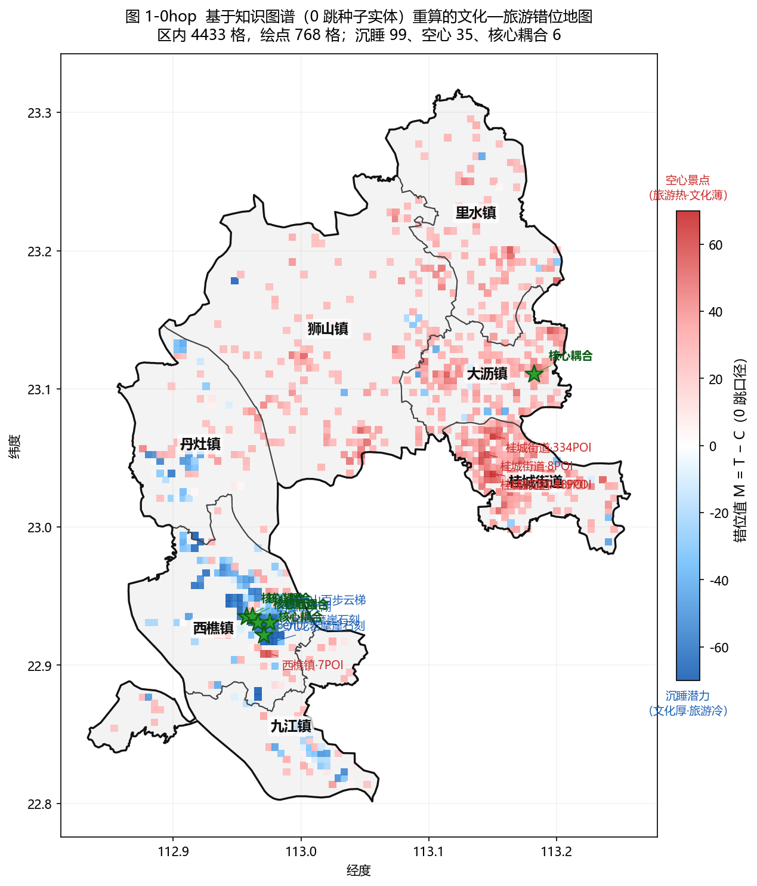
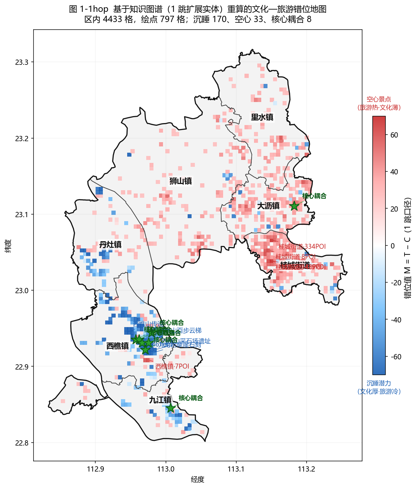
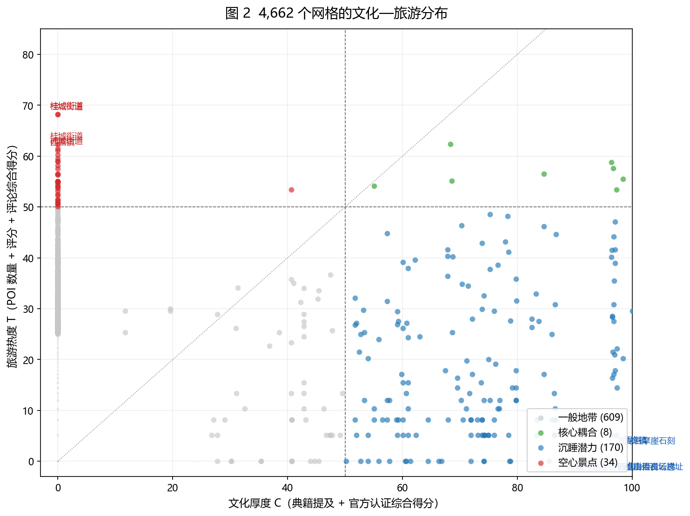
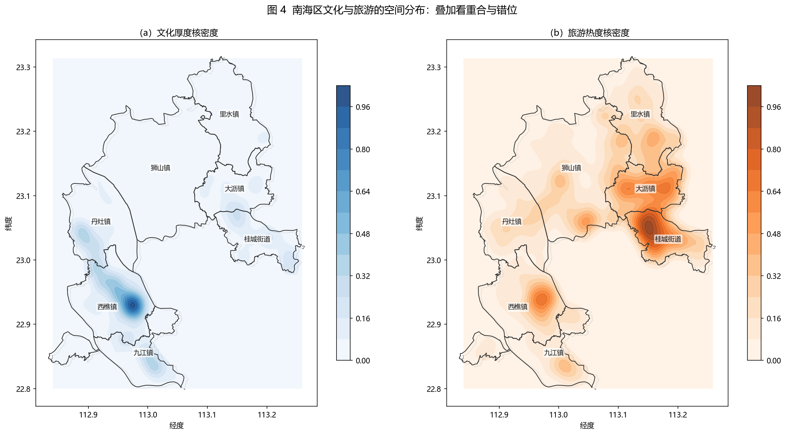

# 2026-04-21

## 一、桥梁设定

以具备明确空间载体的物质性文化载体为主桥梁，以能落实到具体地点的非遗项目为补充桥接层。

- 主桥梁：不可移动文物 80、文化景观 19、历史文化名村与传统村落 12、圩市街区 18，均分布于西樵、九江、丹灶；桂城、大沥、里水、狮山在原始数据源中无对应物质载体录入。
- 补充桥梁：区级以上非遗 91 项全量纳入。
- 软连接层：无稳定空间载体的非遗与典籍知识，仅进入文本与关系图层，不参与空间匹配。

## 二、口径

- 0 跳 C：POI → anchor → entity 的种子实体集合。
- 1 跳 C：种子 + 关系图上扩 1 步的邻居实体。
- 旅游热度 T：POI 密度 + 平均评分 + 评论量，来源独立于文化侧。
- 错位 M = T − C。
- 分类规则：C ≥ 50 且 T ≥ 50 → 核心耦合；C ≥ 50 → 沉睡潜力；T ≥ 50 → 空心景点；C、T 均 < 25 → 双低空白；其余 → 一般地带。

## 三、图

### 图 1 全区错位（0 跳 / 1 跳）

<figure><figcaption>0 跳：POI 直接触达的种子实体</figcaption></figure>
<figure><figcaption>1 跳：种子 + 关系图扩 1 步邻居</figcaption></figure>

| 口径 | 双低空白 | 一般地带 | 沉睡潜力 | 空心景点 | 核心耦合 |
|------|-------:|-------:|-------:|-------:|-------:|
| 0 跳 | 3,870 | 651 | 99 | 36 | 6 |
| 1 跳 | 3,841 | 609 | 170 | 34 | 8 |

两张图把"文化—旅游错位值 M"画在 500 m 网格上，红色为旅游远高于文化（空心景点），蓝色为文化远高于旅游（沉睡潜力）。扩到 1 跳后，西樵—九江—丹灶一线由关系图带出的文化格明显增多，沉睡潜力由 99 升到 170，核心耦合由 6 升到 8。

### 图 2 网格文化 × 旅游分布

每个点是一个网格，横轴文化、纵轴旅游，虚线为 50 分位线。四象限分布清晰：左上红色是桂城、大沥的空心景点；右下蓝色是西樵、九江、丹灶的沉睡潜力；右上绿色即核心耦合，数量少，说明文化与旅游的高值区在空间上重合有限。

### 图 3 文化 × 旅游双核密度

左图文化核密度，集中在西樵山—九江沿江—丹灶仙岗一带；右图旅游核密度，集中在桂城—大沥—里水组团。两张高值区不重合，是"文化偏西南、旅游偏东北"错位格局的空间证据。

## 四、结论

1. 文化厚度高值区集中在西樵、九江、丹灶沿线，旅游高值区集中在桂城、大沥、里水组团，空间上呈错位。
2. 0 跳 → 1 跳后，沉睡潜力 99 → 170，核心耦合 6 → 8（西樵 6、九江 1、大沥 1）。
3. 桂城无物质桥梁、非遗数量有限，高旅游格远多于文化格，整体呈**空心景点为主 + 7 格沉睡潜力**的结构；该结构是原始数据中桂城物质载体缺失的直接反映，非处理遗漏。
