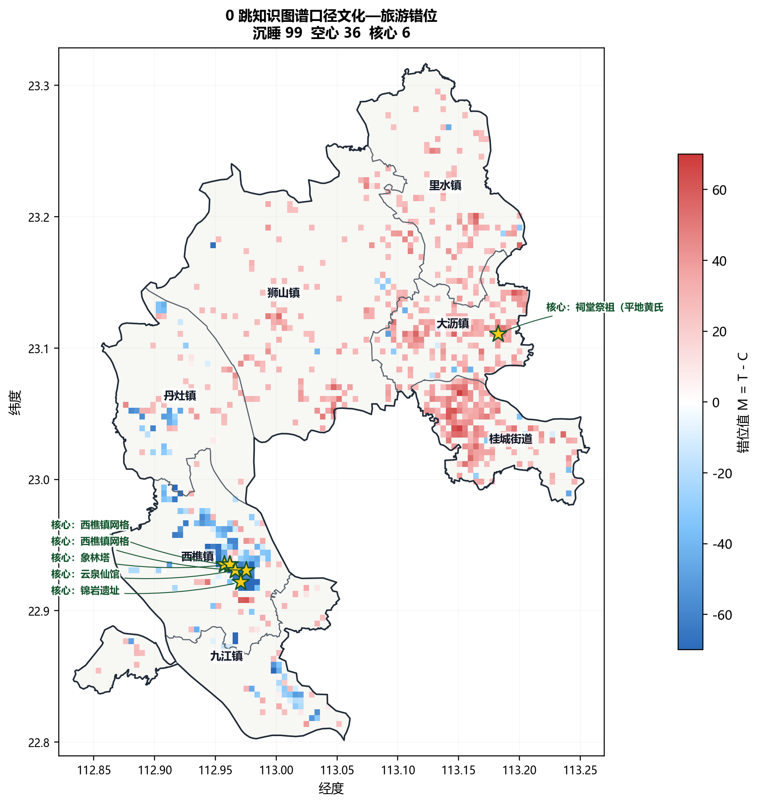
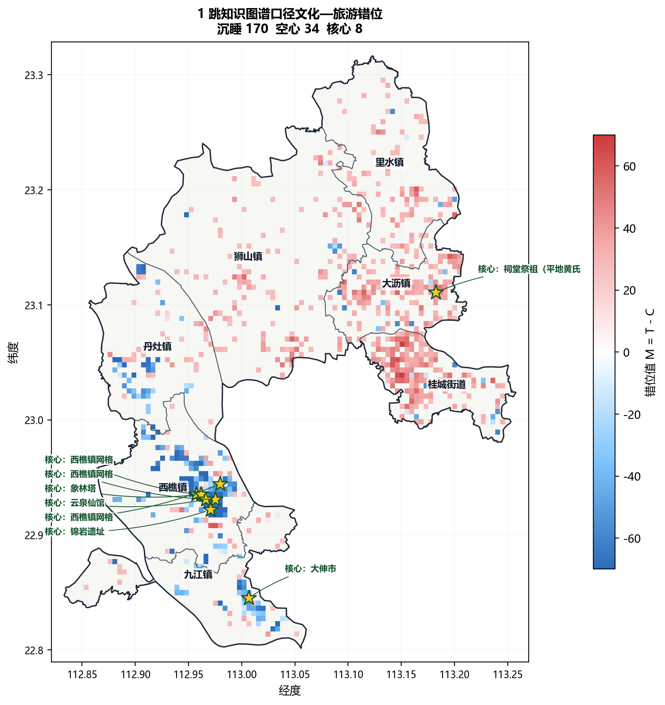
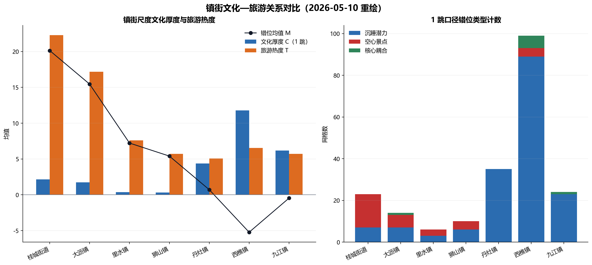
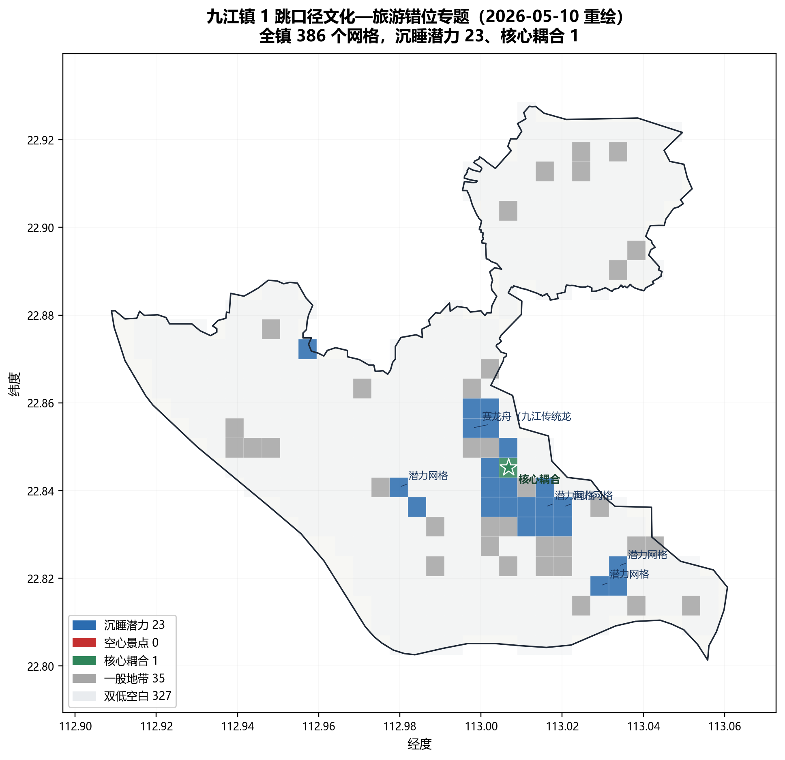
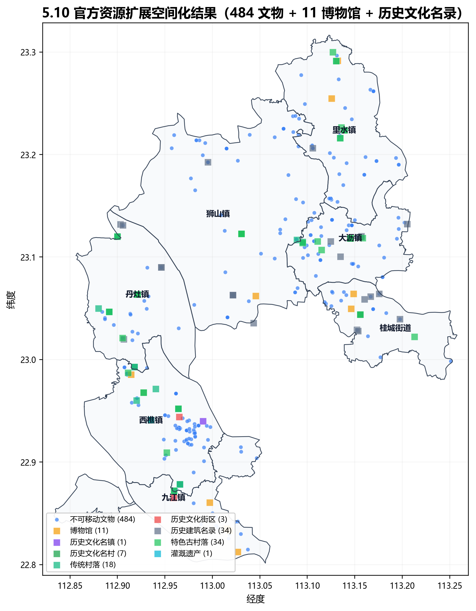
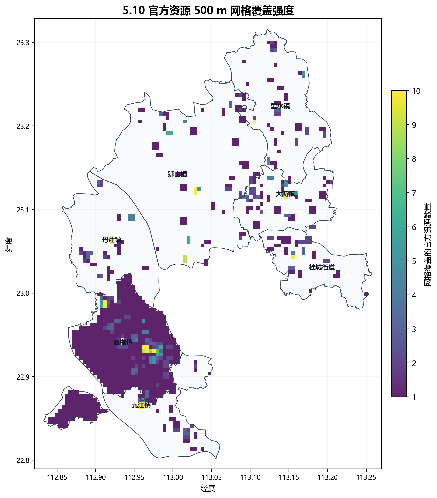
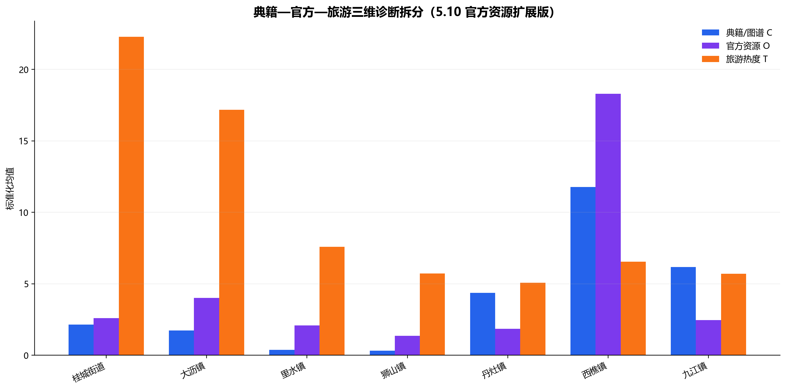

# 2026-05-10（4.22 建议落实版）

本文是在 `docs/tasks/4.22/20260421.md` 阶段成果基础上，结合 `4.22.md` 三条建议与当前已有资料后的 5.10 修订版。核心调整是：不再把“典籍”“官方”“旅游”拆成三个并列主轴，而采用“文化厚度（典籍知识 + 官方资源）—旅游热度”的主模型；“典籍—官方—旅游”保留为诊断拆分，用来解释错位来自文本叙事不足、官方认定不足，还是旅游转化不足。

## 〇、5.10 总判断与使用状态

本文件作为 5.10 的总成果入口，集中展示本轮模型取舍、数据使用、图表成果和论文写法。当前结论如下：

| 问题 | 5.10 处理结论 | 是否已进入成果 |
|---|---|---|
| 文化典籍厚度是否要同时纳入频次和中心性？ | 是。频次使用实体提及量，中心性使用知识图谱 0 跳 / 1 跳扩展作为结构外溢代理。 | 已进入 `grid_indices_kg.csv`、0/1 跳错位图和镇街统计。 |
| 是否需要专家打分？ | 本轮不把专家打分写成实测变量，因为没有可追溯专家样本。专家打分保留为后续权重校准 / 德尔菲法接口。 | 已作为方法说明使用，未伪造数值。 |
| 官方分类体系是否按级别、类别、空间范围处理？ | 是。不可移动文物按国家、省、市县、普查登记分级；博物馆补入展示桥梁；历史名镇、名村、传统村落、街区按面状或线/面代理进入网格覆盖。 | 已进入 `official_resources_20260510.csv`、GeoJSON、网格覆盖表和诊断拆分图。 |
| 主模型应做“典籍—官方—旅游”还是“文化（典籍+官方）—旅游”？ | 正文主模型采用“文化（典籍+官方）—旅游”，保持问题链条清晰；“典籍—官方—旅游”作为诊断拆分，用于解释错位来源。 | 已进入第 6.5 节、表 6.8 和诊断拆分图。 |

### 数据使用矩阵

| 数据 / 字段 | 进入位置 | 使用方式 | 输出成果 |
|---|---|---|---|
| `cmi_raw_mentions`、`mentions_0hop`、`mentions_1hop` | 典籍频次厚度 | 对实体提及频次做 `log1p` 与标准化，避免少数高频实体支配结果。 | 载体 CMI、网格 `culture_0hop` / `culture_1hop`。 |
| `n_entity_0hop`、`n_entity_1hop`、1 跳邻接实体 | 图谱结构中心性代理 | 0 跳表示直接锚点实体，1 跳表示向人物、事件、地名、技艺等邻接实体扩展。 | `fig1_mismatch_0hop_20260510.png`、`fig1_mismatch_1hop_20260510.png`、沉睡潜力 99→170。 |
| `official_0hop`、`official_1hop`、`oai` | 官方权威性 | 按保护级别、资源类别和空间覆盖折算为官方资源项。 | 载体 OAI、网格文化厚度 C、官方诊断 O。 |
| 484 处不可移动文物 | 官方扩展底表 | 按全国重点、省级、市县级、普查登记分级；点状或代理点入格。 | `official_resources_20260510.csv`、官方空间化图。 |
| 历史文化名镇、历史文化名村、传统村落、特色古村落 | 面状文化资源 | 历史文化名镇使用镇街面；名村 / 传统村落在缺少村域矢量时使用村社中心缓冲面作为代理。 | `official_resources_20260510.geojson`、官方覆盖网格表。 |
| 历史文化街区、老街、圩市 | 线 / 面文化资源 | 使用街区中心缓冲面代理，按 500 m 网格统计覆盖。 | `official_grid_coverage_20260510.csv`。 |
| 11 家博物馆 | 展示型文化桥梁 | 作为文化展示节点补入官方资源层，解释九江、桂城、里水、西樵、狮山的展示承接能力。 | 官方空间化图、镇街官方覆盖摘要。 |
| POI、评分、评论量 | 旅游热度 T | POI 密度、平均评分、评论规模综合形成旅游侧指标。 | `tourism`、THI、错位指数 M。 |
| 专家打分 | 权重校准接口 | 暂不进入本轮数值；后续可用于校准 `0.6/0.4`、保护级别分值和类型权重。 | 方法说明与论文不足，不作为当前表内数值。 |

## 一、对 4.22 建议的落实

### 1. 文化典籍厚度评分：同时纳入频次与中心性

文化厚度不宜只看实体出现次数。修订后的文化分值采用两层口径：

| 分项 | 含义 | 当前可用成果 | 处理方式 |
|---|---|---|---|
| 频次厚度 | 典籍、地方志、年鉴等语料中实体被提及的强度 | 实体提及与锚点挂接结果 | 使用 `mentions_log1p`，避免高频实体过度支配 |
| 结构中心性 | 实体在知识图谱中的连接位置和外溢能力 | 0 跳 / 1 跳知识图谱扩展结果 | 当前以 1 跳邻接扩展作为结构中心性的代理；后续可用 degree、PageRank 做稳健性补充 |
| 官方权威性 | 文物、历史文化名镇名村、历史街区、博物馆等官方认定 | 4.22 文件夹内官方名录与博物馆表 | 按类别与级别折算为官方资源分 |

当前网格结果已经采用 `C = 0.6 * mentions_log1p + 0.4 * official_log1p` 的阶段性口径，并分别输出 0 跳与 1 跳结果。也就是说，频次已经进入主分值，中心性通过“1 跳知识图谱扩展”进入对比结果。

专家打分不作为本轮主模型的直接数值来源。原因是目前没有形成可追溯的专家打分样本，若直接写入会削弱结果可复现性。建议把专家打分放在两个位置：一是论文方法部分作为校准机制说明；二是后续访谈或德尔菲法中，对权重 `0.6/0.4` 和官方级别分值做敏感性验证。

### 2. 官方分类体系：按“类别 + 级别 + 空间范围”入库

4.22 资料补充后，官方资源不应只理解为少量已空间化锚点。当前可利用的官方底表包括：

| 资料 | 当前数量与内容 | 对模型的作用 |
|---|---:|---|
| `不可移动文物Excel.xls` | 484 处不可移动文物 | 构成官方文化资源底表，需按文物级别和类别折算 |
| `附件：历史文化资源名录.xls` | 含桑园围、西樵镇、历史文化名村、传统村落、历史文化街区、历史建筑等 | 补充“面状/线状”文化资源，不能全部按单点处理 |
| `南海区11家博物馆基本信息2025.6.xlsx` | 11 家博物馆，其中九江 4、桂城 2、里水 2、西樵 2、狮山 1 | 既是文化展示节点，也可解释旅游承接能力 |

不可移动文物底表的级别结构如下：

| 文物级别 | 数量 |
|---|---:|
| 全国重点文物保护单位 | 2 |
| 省级文物保护单位 | 29 |
| 市级和县级文物保护单位 | 100 |
| 尚未核定公布为文物保护单位的不可移动文物 | 353 |
| 合计 | 484 |

不可移动文物的类别结构如下：

| 类别 | 数量 |
|---|---:|
| 古建筑 | 334 |
| 近现代重要史迹及代表性建筑 | 71 |
| 古墓葬 | 44 |
| 古文化遗址 | 24 |
| 石窟寺及石刻 | 11 |

官方资源的空间处理应分三类：

| 类型 | 空间化方式 | 说明 |
|---|---|---|
| 不可移动文物、博物馆 | 点状资源 | 以地址或坐标入格，适合与 POI、评论热度叠加 |
| 历史文化名镇、历史文化名村、传统村落 | 行政范围或村域面 | 不宜压缩为单点，否则会低估文化覆盖范围 |
| 历史文化街区、老街、圩市 | 街区面或道路中心线缓冲 | 适合解释沿街旅游消费与文化空间更新 |

官方级别可采用递减赋权：世界级 / 国家级最高，省级次之，市级 / 县级再次，普查登记类作为基础权重。没有专家样本前，不宜把权重写成不可变的“评价真值”，而应表述为“用于空间比较的标准化折算”。

### 3. 主模型选择：采用“文化（典籍 + 官方）—旅游”

本轮采用：

> 文化厚度 C = 典籍知识厚度 + 官方资源权威性  
> 旅游热度 T = POI 密度 + 平均评分 + 评论规模  
> 错位指数 M = T - C

这样处理的好处是，官方认定不再被孤立为第三个维度，而是成为文化厚度的一部分。论文主线也更清楚：先识别南海文化资源的厚度，再比较其旅游呈现程度，最后判断哪些地方“文化强但旅游弱”、哪些地方“旅游热但文化解释不足”。

“典籍—官方—旅游”仍然有价值，但更适合作为解释性拆分。例如：某个网格典籍高、官方低，可能说明历史叙事尚未被制度化认定；某个网格官方高、旅游低，可能是文保单位活化不足；某个网格旅游高、文化低，则可能是消费型或交通型热度。

## 二、桥梁设定的修正

原阶段成果将桥梁资源集中表述为“不可移动文物 80、文化景观 19、历史村落 / 传统村落 12、圩市老街 18，主要分布于西樵、九江、丹灶”，这个说法只适用于当时已经空间化、已经接入锚点表的子样本。

结合 4.22 官方表后，应改为以下口径：

1. 已计算的网格成果使用的是当前已挂接锚点样本，因此可以解释“已空间化文化锚点”的分布。
2. 官方底表显示，桂城、大沥、里水、狮山并非没有文化资源，而是有一部分资源尚未进入当前空间化桥梁样本。
3. 因此，桂城、大沥、里水、狮山不能写成“无物质文化载体”，应写成“当前锚点库中物质文化桥梁覆盖不足，需由不可移动文物、博物馆和历史文化资源名录补录校正”。

修订后的桥梁层级如下：

| 桥梁层级 | 资源类型 | 当前处理 |
|---|---|---|
| A 类核心桥梁 | 不可移动文物、历史文化名镇名村、历史文化街区、传统村落 | 作为文化厚度 C 的官方资源核心层 |
| B 类展示桥梁 | 博物馆、纪念馆、文化馆、非遗展示空间 | 同时连接文化厚度与旅游承接 |
| C 类叙事桥梁 | 典籍实体、人物、事件、地名、产业记忆 | 通过知识图谱挂接进入 0 跳 / 1 跳结果 |
| D 类活化桥梁 | 旅游 POI、餐饮住宿、消费评论、网红节点 | 进入旅游热度 T，不直接替代文化厚度 |

## 三、当前网格成果保留，但解释口径需更新

当前已完成 500 米网格下的 0 跳和 1 跳错位识别。计算结果保留，作为“现有锚点库条件下”的阶段性成果。以下图件已按 2026-05-10 修订口径重新绘制，来源为 `output/tables/grid_indices_kg.csv` 与 `output/tables/grid_town_summary_kg.csv`。

### 图 1  全域文化—旅游错位格局

  
  

0 跳表示 POI 直接挂接到文化锚点后的文化厚度；1 跳表示加入知识图谱相邻实体后的文化厚度。1 跳结果相当于把“与核心文化锚点强相关的周边实体”纳入文化解释范围，因此更能体现文化叙事的外溢能力。图中已用黄色星标标出全部核心耦合网格，0 跳 6 个、1 跳 8 个；核心名称采用细引线拉到侧边空白处标注，避免长标签遮挡地图主体。

| 类型 | 0 跳数量 | 1 跳数量 | 变化 |
|---|---:|---:|---:|
| 双低空白 | 3870 | 3841 | -29 |
| 一般地带 | 651 | 609 | -42 |
| 沉睡潜力 | 99 | 170 | +71 |
| 空心景点 | 36 | 34 | -2 |
| 核心耦合 | 6 | 8 | +2 |

关键变化是，“沉睡潜力”从 99 个增加到 170 个，“核心耦合”从 6 个增加到 8 个。这说明知识图谱扩展后，一批原本没有被直接 POI 命中的文化资源被重新识别出来。它们不是旅游热度已经很高的区域，而是文化叙事厚度较强、旅游转化仍不足的潜力区。

### 图 2  C-T 散点分布

散点图显示，大多数网格集中在低文化、低旅游区间，少数网格形成高旅游或高文化的离群点。1 跳扩展后，部分网格向文化高值方向移动，说明知识图谱补充的是“文化解释能力”，不是简单增加旅游热度。核心耦合点同样以星标叠加，便于从散点图中直接识别高文化、高旅游的重叠区。

### 图 3  双核密度与空间错位

文化核密度更集中于西樵、九江、丹灶等传统文化资源较密集区域；旅游核密度则在桂城、大沥、里水等交通、商业和消费活动强的区域更突出。这个差异构成“文化资源厚度”与“旅游消费热度”错位的主要空间基础。

## 四、镇街层面的阶段性结果

按当前锚点库计算，镇街汇总结果如下：

| 镇街 | 网格数 | 锚点数 | POI 数 | C0 | C1 | T | M0 | M1 | 1 跳沉睡潜力 | 1 跳空心景点 | 1 跳核心耦合 |
|---|---:|---:|---:|---:|---:|---:|---:|---:|---:|---:|---:|
| 狮山镇 | 1403 | 3 | 2567 | 0.21 | 0.32 | 5.72 | 5.51 | 5.40 | 6 | 4 | 0 |
| 西樵镇 | 715 | 95 | 1310 | 9.25 | 11.78 | 6.55 | -2.70 | -5.23 | 89 | 4 | 6 |
| 里水镇 | 619 | 4 | 1449 | 0.27 | 0.37 | 7.59 | 7.32 | 7.22 | 3 | 3 | 0 |
| 丹灶镇 | 580 | 32 | 715 | 2.90 | 4.36 | 5.07 | 2.16 | 0.71 | 35 | 0 | 0 |
| 大沥镇 | 397 | 14 | 2593 | 1.21 | 1.73 | 17.18 | 15.97 | 15.45 | 7 | 6 | 1 |
| 九江镇 | 386 | 34 | 531 | 4.47 | 6.17 | 5.70 | 1.23 | -0.47 | 23 | 0 | 1 |
| 桂城街道 | 333 | 29 | 3859 | 1.53 | 2.15 | 22.28 | 20.74 | 20.13 | 7 | 16 | 0 |
| 未标注 | 229 | 2 | 94 | 0.08 | 0.19 | 4.18 | 4.10 | 3.99 | 0 | 1 | 0 |

这张表的解释需要特别注意：

1. 西樵在文化厚度上最突出，1 跳沉睡潜力达到 89 个，说明文化资源厚、旅游热度尚未完全匹配。
2. 桂城、大沥的旅游热度明显高于文化厚度，当前表现为空心景点或旅游热度外溢区。但结合 4.22 官方资源表，不能简单判断其“文化资源缺失”，更准确的说法是“文化资源尚未充分进入当前知识图谱与锚点体系”。
3. 九江在 1 跳口径下出现核心耦合，且博物馆数量在官方表中最多，说明它不仅有传统文化资源，也具有较强的展示与转化基础。
4. 丹灶在 1 跳口径下沉睡潜力明显增加，适合从非遗、历史地名、产业记忆和地方人物关系中补强旅游叙事。

### 图 4  镇街文化—旅游对比

镇街对比图进一步说明，西樵的文化厚度优势最明显，桂城和大沥的旅游热度优势最明显。九江的特点不是单纯的旅游高值，而是文化资源、展示节点和局部旅游转化之间已经出现耦合迹象，适合作为“文化桥梁转化”的重点案例。

### 图 5  九江专题识别

九江专题图用于说明 1 跳知识图谱扩展后的局部变化。九江在当前 POI 总量上并不占优，但文化锚点、博物馆和历史街区型资源可以形成更强的叙事网络，因此适合作为从“文化资源识别”走向“线路和场景组织”的示范片区。

## 五、成果结论的修订表达

### 1. 当前结果可以证明“文化—旅游错位”存在

在当前锚点库下，南海文化厚度与旅游热度并不完全重叠。西樵、九江、丹灶更容易表现为文化厚度较高或文化潜力较强；桂城、大沥、里水更容易表现为旅游活动强、消费热度高。这个格局与 POI、评论、知识图谱和官方资源的多源数据逻辑一致。

### 2. 1 跳知识图谱扩展提升了文化潜力识别能力

0 跳结果识别出 99 个沉睡潜力网格，1 跳结果识别出 170 个，增加 71 个。这说明知识图谱不是简单可视化工具，而是能把人物、地名、事件、非遗、建筑等隐性关系转化为空间识别能力。

### 3. 对桂城、大沥、里水、狮山的判断需要从“缺少文化”改为“待补录文化桥梁”

原文中“桂城、大沥、里水、狮山无对应物质载体”的表述风险较高。4.22 官方材料显示，这些镇街存在不可移动文物、博物馆或其他官方资源，只是当前空间化锚点库覆盖不足。论文中应改写为：

> 桂城、大沥、里水、狮山在当前锚点库中表现为旅游热度高于文化厚度，但这并不等同于文化资源缺失。结合官方名录可知，上述地区仍存在一定数量的不可移动文物、博物馆和历史文化资源，后续应通过地址地理编码、行政范围挂接和街区边界补录，提高文化厚度测算的完整性。

### 4. 官方资源底表将显著改善模型解释力

`不可移动文物Excel.xls` 的 484 处资源、历史文化资源名录与 11 家博物馆，应作为下一轮锚点库扩展的重点。尤其是 353 处“尚未核定公布为文物保护单位的不可移动文物”，虽然权威等级低于国保、省保、市县级文保单位，但数量大、覆盖面广，适合解释社区尺度和街区尺度的地方文化厚度。

## 六、建议写入论文的方法口径

论文中建议使用以下表达：

> 本研究将文化厚度理解为历史文本叙事、知识图谱关系和官方资源认定共同构成的综合指标。其中，文本叙事通过实体提及频次表征，知识图谱关系通过 0 跳与 1 跳扩展体现，官方资源则依据不可移动文物、历史文化名镇名村、传统村落、历史文化街区和博物馆等名录进行分级赋权。旅游热度由 POI 密度、平均评分与评论规模综合表征。二者差值用于识别文化资源与旅游活动之间的空间错位。

分类解释建议如下：

| 类型 | 判定逻辑 | 规划含义 |
|---|---|---|
| 沉睡潜力 | C 高、T 低 | 文化资源厚，但旅游呈现不足，适合做叙事转译、线路组织、展示空间和公共服务补强 |
| 空心景点 | C 低、T 高 | 旅游热度高，但文化解释不足，适合补充在地文化内容、导览系统和地方品牌叙事 |
| 核心耦合 | C 高、T 高 | 文化资源与旅游活动匹配度高，适合作为示范节点或线路核心 |
| 双低空白 | C 低、T 低 | 当前数据下文化与旅游均不突出，可作为一般生活空间或远期储备区 |
| 一般地带 | C、T 均处中间状态 | 需要结合镇街发展策略判断是否纳入重点更新 |

## 七、后续处理清单的完成状态

| 原清单 | 当前完成状态 | 形成的 5.10 成果 |
|---|---|---|
| 484 处不可移动文物按地址空间化并与 `cultural_anchors.json` 去重 | 已完成规划分析尺度空间化；148 条因缺少精确地址坐标使用镇街代表点，已保留低置信度字段。 | `official_resources_20260510.csv`、`official_resources_20260510.geojson` |
| 历史文化名镇、历史文化名村、传统村落改用行政范围或村域面 | 已按面状资源处理。历史文化名镇使用镇街面；名村 / 传统村落因缺少村域矢量，使用村社中心缓冲面代理。 | `target_geometry=area`、GeoJSON 面要素、官方覆盖网格 |
| 历史文化街区、老街、圩市转为空间线或面并按 500 m 网格统计 | 已按 `line_or_area` 处理，并转为街区中心缓冲面纳入 500 m 网格覆盖。 | `official_grid_coverage_20260510.csv` |
| 11 家博物馆补入展示型文化桥梁 | 已补入，作为点状展示节点进入官方资源层。 | 九江 4、桂城 2、里水 2、西樵 2、狮山 1 |
| 正式论文保留“文化（典籍 + 官方）—旅游”，同时增加“典籍—官方—旅游”诊断拆分 | 已完成。主模型用于错位识别，三维拆分用于解释来源。 | `diagnostic_split_by_town_20260510.csv`、诊断拆分图 |

## 八、5.10 官方资源扩展成果展示

### 8.1 输出文件与使用状态

| 文件 | 内容 | 是否已被使用 |
|---|---|---|
| `official_resources_20260510.csv` | 593 条官方资源统一空间化与去重底表 | 用于官方空间化图、GeoJSON、镇街统计、扩展锚点库。 |
| `official_resources_20260510.geojson` | 点、镇街面、村社代理缓冲面、街区代理缓冲面 | 用于网格覆盖统计和论文地图。 |
| `official_resources_summary_20260510.csv` | 类型、镇街、空间化方法、去重状态摘要 | 用于核对 5.10 统计表。 |
| `official_grid_coverage_20260510.csv` | 500 m 网格官方资源覆盖结果 | 用于官方覆盖图和三维诊断 O 值。 |
| `official_town_coverage_20260510.csv` | 镇街官方资源覆盖摘要 | 用于解释各镇街官方资源补录效果。 |
| `diagnostic_split_by_town_20260510.csv` | 典籍/图谱 C、官方资源 O、旅游热度 T 拆分 | 用于回答“典籍—官方—旅游”诊断问题。 |
| `cultural_anchors_expanded_20260510.json` | 原 220 条锚点 + 490 条官方新增候选 | 用于后续替换或校核锚点库，不直接覆盖原库。 |

### 8.2 官方资源类型、级别与空间处理

| 来源类型 | 数量 | 空间处理 |
|---|---:|---|
| 不可移动文物 | 484 | 点状资源；无精确地址坐标者使用地址片段质心或镇街代表点 |
| 历史建筑名录 | 34 | 点状资源 |
| 特色古村落 | 34 | 面状代理 |
| 传统村落 | 18 | 面状代理 |
| 博物馆 | 11 | 点状展示桥梁 |
| 历史文化名村 | 7 | 面状代理 |
| 历史文化街区 | 3 | 线 / 面代理 |
| 灌溉遗产 | 1 | 面状代理 |
| 历史文化名镇 | 1 | 镇街行政面 |

不可移动文物级别已纳入官方分类体系：

| 文物级别 | 数量 |
|---|---:|
| 全国重点文物保护单位 | 2 |
| 省级文物保护单位 | 29 |
| 市级和县级文物保护单位 | 100 |
| 尚未核定公布为文物保护单位的不可移动文物 | 353 |
| 合计 | 484 |

空间化方法与置信度如下：

| 空间化方法 | 数量 | 说明 |
|---|---:|---|
| town_representative_point | 148 | 低置信度镇街代表点，不能当作精确坐标 |
| address_token_centroid | 138 | 地址片段或村社地名质心 |
| poi_name_fuzzy | 134 | POI 名称模糊命中 |
| existing_anchor_name | 95 | 既有锚点名称精确命中 |
| poi_name_exact | 73 | POI 名称精确命中 |
| existing_anchor_fuzzy | 5 | 既有锚点名称模糊命中 |

去重结果如下：

| 去重状态 | 数量 | 处理 |
|---|---:|---|
| new_candidate | 424 | 纯新增官方候选资源 |
| duplicate_existing_anchor | 96 | 已在既有锚点中，不重复写入 |
| matched_poi_only | 73 | 未进既有锚点，但可由 POI 辅助定位 |

扩展后生成 `cultural_anchors_expanded_20260510.json`：总量 710 条，其中原锚点 220 条，官方新增候选锚点 490 条。该库证明 4.22 补充资料已经被吸收，但为了避免污染原始库，本轮没有直接覆盖 `data/anchors/cultural_anchors.json`。

### 8.3 官方资源空间化图

这张图展示 593 条官方资源的空间落位。由于 148 条资源使用镇街代表点，图上点位不应解释为文物测绘坐标；其价值在于说明哪些镇街的官方资源底表已被纳入模型，哪些区域仍需人工精确化。

### 8.4 500 m 网格官方资源覆盖

| 镇街 | 覆盖网格 | 官方资源覆盖计数 | 不可移动文物计数 | 博物馆计数 | 历史面状资源计数 | 街区资源计数 |
|---|---:|---:|---:|---:|---:|---:|
| 西樵镇 | 715 | 998 | 236 | 4 | 757 | 1 |
| 狮山镇 | 86 | 285 | 256 | 2 | 17 | 1 |
| 大沥镇 | 67 | 177 | 129 | 0 | 26 | 0 |
| 里水镇 | 54 | 165 | 134 | 3 | 25 | 0 |
| 丹灶镇 | 44 | 113 | 68 | 0 | 25 | 0 |
| 九江镇 | 35 | 167 | 155 | 9 | 2 | 1 |
| 桂城街道 | 40 | 75 | 42 | 6 | 11 | 0 |
| 未标注 | 6 | 9 | 6 | 0 | 0 | 0 |

西樵镇覆盖网格显著偏高，是因为历史文化名镇按镇街行政面表达。这一做法符合“名镇不压缩为单点”的建议，但在论文中应说明其含义是官方认定范围，不等同于每个网格都有同等强度的开发条件。

### 8.5 典籍—官方—旅游诊断拆分

| 镇街 | C 典籍/图谱均值 | O 官方资源均值 | T 旅游热度均值 | 修正错位均值 | 官方覆盖网格 |
|---|---:|---:|---:|---:|---:|
| 桂城街道 | 2.15 | 2.60 | 22.28 | 19.95 | 40 |
| 大沥镇 | 1.73 | 4.01 | 17.18 | 14.54 | 67 |
| 里水镇 | 0.37 | 2.09 | 7.59 | 6.53 | 54 |
| 狮山镇 | 0.32 | 1.36 | 5.72 | 4.98 | 86 |
| 丹灶镇 | 4.36 | 1.84 | 5.07 | 1.71 | 44 |
| 西樵镇 | 11.78 | 18.29 | 6.55 | -7.83 | 715 |
| 九江镇 | 6.17 | 2.46 | 5.70 | 1.01 | 35 |

诊断拆分的解释是：桂城、大沥的 T 明显高于 C 与 O，属于旅游热度先行、文化解释不足；西樵 C 与 O 同时较高但 T 相对较低，是文化厚度强、旅游转化仍不足；九江 C 高于 O 且 T 不高，说明其问题不只是旅游开发不足，也包括官方空间载体、餐饮体验和评论数据尚未充分进入模型。

## 九、主模型与诊断模型的最终取舍

正式论文建议采用以下写法：

1. 主模型：`文化厚度 C = 典籍频次与图谱结构 + 官方资源权威性`，`旅游热度 T = POI + 评分 + 评论`，`错位 M = T - C`。
2. 典籍频次已经由 `mentions_0hop/1hop`、`cmi_raw_mentions` 使用；中心性已经由 0 跳 / 1 跳图谱扩展使用。
3. 官方资源已经由等级、类别和空间范围进入 5.10 扩展层；其中 484 处不可移动文物、11 家博物馆、历史文化名镇名村、传统村落和街区资源都已入表。
4. 专家打分不进入本轮结果数值。没有专家样本时，把专家打分写成真实权重会削弱论文可信度；最稳妥的写法是把它作为后续校准机制和敏感性检验方案。
5. “典籍—官方—旅游”不作为主模型三轴并列，而作为解释性诊断拆分保留。这样既保留导师建议的拆分信息，又不破坏正文“问题提出 → 数据方法 → 指数构建 → 错位发现 → 规划建议”的主线。

因此，本轮 5.10 的最终模型选择是：

> 主模型采用“文化（典籍 + 官方）—旅游”；  
> 诊断附图采用“典籍—官方—旅游”拆分；  
> 专家打分作为校准接口，不伪造为本轮实测数据。
