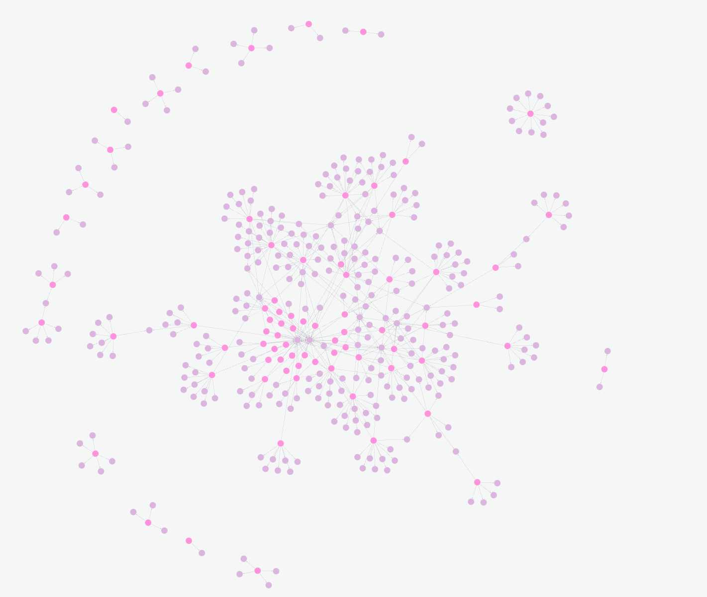
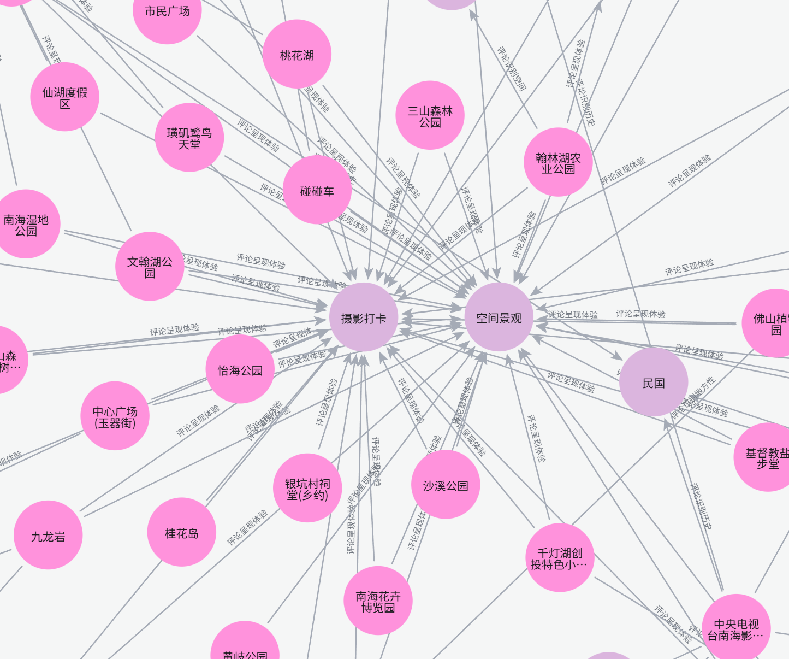
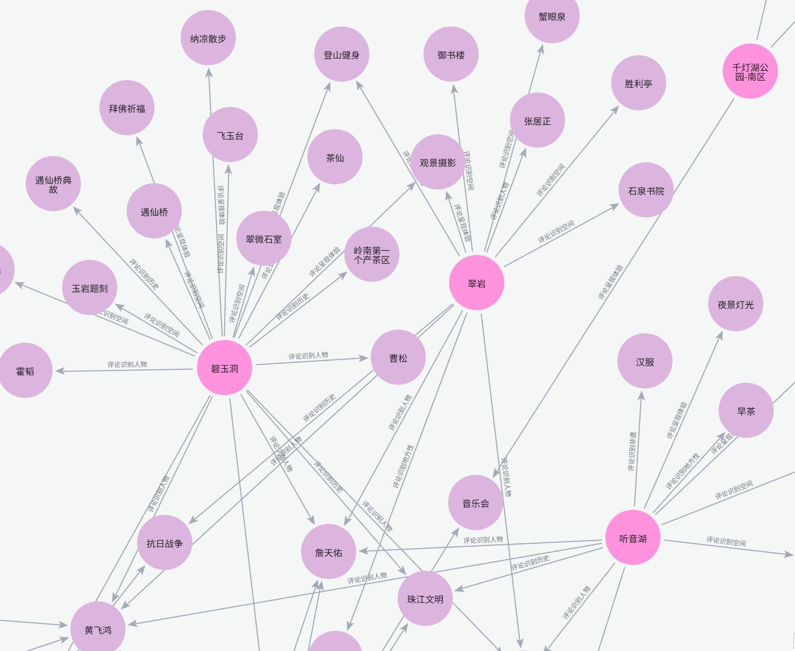
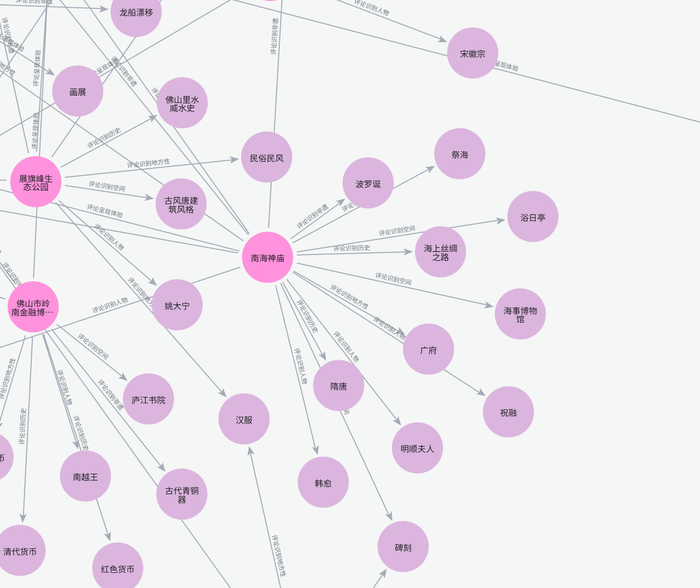

# 5.18 游客评论知识图谱完整成果

> 本文件为 5.18 老师意见的独立补充成果，主要回应“旅游侧不能只看热度，还应观察游客评论中是否真正识别到文化内容”的问题。本文件不修改论文正文、不改动原始数据，只整理已经完成的评论知识图谱流程、结果、图件和可写入论文的分析判断。

## 一、任务目标

老师指出，现有论文中的旅游侧指标主要使用 POI 数量、评分和评论量，反映的是旅游热度或平台可见度，但不能直接说明游客是否围绕地方文化形成了识别、理解和传播。换言之，文化资源强、旅游热度高，并不必然说明文旅融合已经成熟；更稳妥的判断是，这类地点具有继续深化文旅融合的基础和潜力。

因此，本次补充工作的目标是：在不改动原文和源数据的前提下，利用已经匹配到 POI 的游客评论，构建一个“以地点为中心、以评论语义实体为外延”的评论知识图谱，用来观察游客评论中出现了哪些文化实体、体验主题和地方性叙事，并进一步判断各 POI 的评论文化识别度。

## 二、工作边界

本次成果只在以下路径中整理：

```text
C:\Users\ms\Desktop\thesis\ms_thesis\docs\tasks\5.18
```

评论知识图谱实际运行项目位于：

```text
C:\Users\ms\Desktop\knowledge_graph_extraction
```

本次没有改动论文正文，没有改动 `ms_thuthesis` 中的 LaTeX 文件，也没有改动原始评论数据。图谱流程使用现成的评论匹配表，路径为：

```text
C:\Users\ms\Desktop\thesis\ms_thesis\output\tables\review_poi_matched.csv
```

为了避免和早先试验脚本混淆，本次正式图谱结果已经另存到：

```text
C:\Users\ms\Desktop\thesis\ms_thesis\docs\tasks\5.18\commentgraph_outputs
```

其中 `docs\tasks\5.18\comment_kg` 是较早的试验目录，不作为本次正式成果依据；本文件和 `commentgraph_outputs` 才是本次整理后的正式版本。

## 三、数据来源与筛选

本次流程没有重新 OCR，也没有重新下载评论，而是直接读取已经匹配到 POI 的游客评论数据。为了避免把不相关地点或泛商业评论带入图谱，流程做了较严格的筛选：

| 项目 | 数量或设置 |
|---|---:|
| 原始评论行数 | 15,443 |
| 已匹配评论行数 | 2,872 |
| 严格匹配后评论行数 | 1,257 |
| 严格匹配 POI 数 | 117 |
| 匹配方式 | exact、core_exact |
| 每个地点最多抽取评论 | 16 条 |
| 每个地点最多输入字符 | 5,200 字 |
| 最低实体置信度 | 0.65 |

严格匹配后的评论在镇街上的分布如下：

| 镇街 | 评论数 |
|---|---:|
| 西樵镇 | 558 |
| 狮山镇 | 286 |
| 桂城街道 | 212 |
| 里水镇 | 61 |
| 大沥镇 | 60 |
| 丹灶镇 | 43 |
| 九江镇 | 37 |

从类型上看，自然景观、公园绿地、人文古迹和休闲娱乐是评论量较多的类别：

| 类型 | 评论数 |
|---|---:|
| 自然景观 | 646 |
| 公园绿地 | 249 |
| 人文古迹 | 101 |
| 休闲娱乐 | 91 |
| 文化场馆 | 52 |
| 宗教场所 | 49 |
| 非遗体验 | 44 |
| 特色街区 | 24 |
| 体育设施 | 1 |

这个分布本身也说明，游客评论更多集中在山水、公园和休闲空间上，未必天然围绕地方文化内容展开。

## 四、图谱设计

### 4.1 图谱对象

本次图谱不是普通地点图谱，而是评论知识图谱。POI 不再作为和文化实体混在一起的普通实体，而是作为图谱中心节点，表示游客评论发生和归属的地点。

图谱节点分为两大类：

| 节点类型 | 含义 |
|---|---|
| 评论地点 | 具体 POI，保存地点名称、镇街、类型、评论数、文化识别等级等属性 |
| 评论实体 | 从游客评论中识别出的文化实体或体验主题 |

评论实体再细分为六类：

| 实体类别 | 含义 |
|---|---|
| 体验主题 | 摄影打卡、空间景观、商业消费、展陈讲解、表演活动等游客体验内容 |
| 文化空间谱系 | 宗祠、庙宇、博物馆、古村、书院、亭台、古建筑等空间实体 |
| 历史记忆谱系 | 明清、民国、抗日战争、珠江文明、侨乡记忆等历史叙事 |
| 岭南地方性谱系 | 岭南、水乡、广府、镬耳屋、田园生活等地方性表达 |
| 人物谱系 | 黄飞鸿、康有为、叶问、詹天佑、姚大宁等人物 IP 或历史人物 |
| 非遗民俗谱系 | 龙舟、醒狮、舞狮、波罗诞、咏春等非遗或民俗活动 |

### 4.2 图谱关系

图谱关系表示“游客评论如何把地点和某类文化/体验内容连接起来”。关系类型如下：

| 关系类型 | 含义 |
|---|---|
| 评论呈现体验 | 评论中出现摄影、打卡、休闲、展览、商业消费等体验主题 |
| 评论识别空间 | 评论中识别到宗祠、庙宇、古村、博物馆、亭台等文化空间 |
| 评论识别历史 | 评论中识别到历史年代、历史事件、地方记忆或革命记忆 |
| 评论识别地方性 | 评论中识别到岭南、水乡、广府、地方生活方式等地方性内容 |
| 评论识别人物 | 评论中识别到历史人物、地方人物或人物 IP |
| 评论识别非遗 | 评论中识别到龙舟、醒狮、咏春、节庆等非遗民俗内容 |

这种设计更贴合老师的意见：旅游热度之外，还要看游客评论中是否出现文化识别。它不是把“热度”直接等同于“融合”，而是进一步看游客是否真的提到了地方文化内容。

## 五、流程与可复现性

本次改造后的流程位于：

```text
C:\Users\ms\Desktop\knowledge_graph_extraction\scripts\build_comment_kg.py
```

配置文件位于：

```text
C:\Users\ms\Desktop\knowledge_graph_extraction\config\pipeline.yaml
C:\Users\ms\Desktop\knowledge_graph_extraction\config\prompts.yaml
```

流程特点如下：

1. 不使用 OCR，直接读取已经匹配好的游客评论表。
2. 使用 `pipeline.yaml` 中配置的 LLM 设置，调用兼容 OpenAI 接口的 DashScope 模型。
3. 使用 `prompts.yaml` 中的中文评论知识图谱提示词，要求模型只从评论文本中抽取实体和关系。
4. 每个 POI 单独保存一个 JSON 结果，支持断点续跑；已完成的地点可以跳过，使用 `--force` 时才会重跑。
5. 导入 Neo4j 时使用 `commentgraph` 数据库，并清理旧的错误图谱标签。

已经生成的主要结果文件如下：

| 文件 | 作用 |
|---|---|
| `commentgraph_outputs/comment_data_audit.json` | 数据筛选审计结果 |
| `commentgraph_outputs/comment_place_payloads.json` | 每个地点输入给 LLM 的评论材料 |
| `commentgraph_outputs/place_results/*.json` | 每个地点单独的 LLM 抽取结果 |
| `commentgraph_outputs/comment_place_llm_results.json` | 全部地点的 LLM 抽取结果 |
| `commentgraph_outputs/comment_graph_nodes.csv` | 图谱节点表 |
| `commentgraph_outputs/comment_graph_edges.csv` | 图谱关系表 |
| `commentgraph_outputs/comment_graph_summary.json` | 图谱统计摘要 |
| `commentgraph_outputs/comment_neo4j_import_summary.json` | Neo4j 导入摘要 |

## 六、图谱总体结果

Neo4j 导入结果如下：

| 指标 | 数量 |
|---|---:|
| 数据库 | commentgraph |
| 导入节点 | 442 |
| 导入关系 | 481 |
| 完成 LLM 处理地点 | 117 |
| LLM 错误地点 | 0 |

需要说明的是，截图中的全图查询显示 403 个节点，是因为该查询只显示有关系的节点，即 76 个有文化/体验实体连接的评论地点和 327 个评论实体。其余部分地点虽然被处理过，但评论中没有形成有效文化实体，因此在“地点-实体”关系图中不会显示出来。

评论文化识别等级结果如下：

| 识别等级 | 地点数 | 含义 |
|---|---:|---|
| 高识别 | 9 | 评论中能清楚识别人物、非遗、历史、空间或地方性文化，并和地点形成较稳定联系 |
| 中识别 | 30 | 评论中出现较明确文化内容，但多为背景知识、浅层体验或局部识别 |
| 弱识别 | 15 | 评论中有少量文化词或模糊文化表达，但不足以形成稳定文化认知 |
| 未形成 | 63 | 评论主要停留在游玩、景观、服务或泛体验层面，基本没有形成文化识别 |

从这个结果可以直接看出：在 117 个严格匹配地点中，超过一半地点的评论尚未形成明确文化识别。也就是说，南海区很多 POI 虽然有旅游使用或空间热度，但游客评论中的地方文化内容并不充分。

## 七、图件成果

### 图 1 评论知识图谱总图



总图呈现出明显的“中心团块 + 边缘小团块”结构。中心部分由多个地点通过共享实体连接起来，边缘部分则是一些只有少量实体连接的地点。这个结构说明，游客评论中的文化识别不是均匀分布的，而是集中在少数热点地点和少数共享主题上。

从图形结构看，连接中心网络的主要不是深层文化实体，而是“摄影打卡”“空间景观”等通用体验主题。这一点非常重要：它说明许多地点之间的共同性首先来自旅游体验方式，而不是来自地方文化叙事。

### 图 2 体验主题核心子图



该子图以“摄影打卡”和“空间景观”为核心，连接了大量公园、湿地、花卉园、广场和休闲景观类地点。它说明，游客评论中最容易形成共享连接的内容是视觉消费和空间体验。

这类结果不能直接证明文旅融合深度，但可以说明旅游侧的真实感知逻辑：游客首先注意到的是好看、好拍、可休闲、可停留的空间，而不是具体的历史人物、非遗谱系或地方记忆。论文中应把这类内容解释为“旅游可见度”或“体验可见度”，而不是直接解释为文化融合成熟。

### 图 3 西樵片区人物与历史文化子图



该子图中，碧玉洞、翠岩、听音湖等地点与黄飞鸿、康有为、詹天佑、珠江文明、抗日战争、岭南第一名山、石泉书院、御书楼等实体发生连接。相比体验主题子图，这一部分更接近“文化识别图谱”，因为游客评论已经开始把地点和人物、历史、空间、地方性叙事联系起来。

但这个子图也显示出一个问题：部分文化实体仍然是背景性出现，例如“岭南”“珠江文明”“历史典故”等，未必都来自游客深度体验。因此，西樵片区可以被解释为文化识别基础较好、适合继续深化的区域，而不能简单写成文旅融合已经完全成熟。

### 图 4 宗教、博物馆与地方文化空间子图



该子图显示南海神庙、佛山市岭南金融博物馆、展旗峰生态公园等地点与庙宇、碑刻、波罗诞、广府、古代青铜器、庐江书院、红色货币、民俗民风等实体相连。它说明，宗教空间、博物馆空间和文化展示空间更容易承载明确的文化识别。

不过，南海神庙这一类地点需要谨慎使用。LLM 抽取结果中已经提示，部分评论可能存在地理信息误植或外部同名地点混入的风险。因此，论文中若要引用该点，最好先进行人工复核，或者只把它作为“需要复核的高识别样本”，不要把它作为最强结论样本。

## 八、实体与关系统计

### 8.1 实体类别

| 实体类别 | 实体数 | 关系数 | 解释 |
|---|---:|---:|---|
| 体验主题 | 63 | 159 | 摄影打卡、空间景观、商业消费、展陈讲解等，是游客评论中最强的连接类型 |
| 文化空间谱系 | 95 | 98 | 宗祠、庙宇、古村、博物馆、亭台、古建筑等空间被较多识别 |
| 历史记忆谱系 | 54 | 62 | 明清、民国、抗战、珠江文明、侨乡记忆等历史内容有一定出现 |
| 岭南地方性谱系 | 40 | 60 | 岭南、水乡、广府、镬耳屋、田园生活等地方性表达出现较多 |
| 人物谱系 | 38 | 56 | 黄飞鸿、康有为、叶问、詹天佑等人物 IP 具有较强识别度 |
| 非遗民俗谱系 | 37 | 46 | 龙舟、醒狮、舞狮、咏春、波罗诞等非遗民俗被识别，但总体少于空间和体验 |

实体类别的结构说明，南海游客评论中最强的是“空间体验”和“文化空间”，其次才是人物、非遗和地方性文化。这与老师提出的问题相吻合：现有旅游热度不能直接说明文化融合深度，因为评论中的文化识别并不总是强。

### 8.2 关系类型

| 关系类型 | 关系数 |
|---|---:|
| 评论呈现体验 | 159 |
| 评论识别空间 | 98 |
| 评论识别历史 | 62 |
| 评论识别地方性 | 60 |
| 评论识别人物 | 56 |
| 评论识别非遗 | 46 |

从关系类型看，“评论呈现体验”数量最多，说明游客最常表达的是观看、拍照、休闲、消费、展览等体验内容。真正能进入非遗、人物和历史记忆的评论相对少，这说明评论文化识别度确实可以作为 THI 的补充校验。

### 8.3 评论角色与情感

| 项目 | 数量 |
|---|---:|
| 核心识别 | 150 |
| 伴随识别 | 127 |
| 背景提及 | 107 |
| 体验主题 | 96 |
| 文化认知 | 1 |

| 情感 | 数量 |
|---|---:|
| 正向 | 305 |
| 中性 | 167 |
| 负向 | 9 |

多数关系是正向或中性，这说明评论中对文化空间和体验的评价总体并不差。问题并不是游客反感文化内容，而是很多地点的文化内容没有被游客充分识别，或者只停留在背景、打卡和空间符号层面。

## 九、核心地点识别结果

### 9.1 高识别地点

| 地点 | 镇街 | 类型 | 关系数 | 主要判断 |
|---|---|---|---:|---|
| 黄飞鸿狮艺武术馆 | 西樵镇 | 非遗体验 | 23 | 人物 IP、醒狮非遗、宗祠空间三者联系清楚，文化识别度最高 |
| 南海神庙 | 狮山镇 | 宗教场所 | 18 | 海神信仰、碑刻、建筑、波罗诞等内容丰富，但需复核同名地点风险 |
| 康有为故居 | 丹灶镇 | 人文古迹 | 15 | 康有为人物、维新历史、岭南建筑被清楚识别 |
| 西樵山风景名胜区 | 西樵镇 | 自然景观 | 13 | 黄飞鸿、醒狮、南海观音、四方竹等文化内容与景区相连 |
| 吴家大院 | 九江镇 | 人文古迹 | 11 | 侨乡建筑、家族记忆、历史展陈被明确识别 |
| 烟桥古村 | 九江镇 | 人文古迹 | 11 | 明清建筑、古村肌理、岭南水乡意境较清楚 |
| 叶问宗师馆 | 狮山镇 | 人文古迹 | 8 | 叶问人物、咏春拳、祖屋空间形成较强连接 |
| 梁氏大宗祠 | 里水镇 | 人文古迹 | 4 | 宗族姓氏、古建筑和修缮记忆被识别 |
| 盐步老龙 | 大沥镇 | 自然景观 | 4 | 龙舟非遗、端午民俗、岭南水乡空间联系明确 |

这些地点可以作为论文中“游客评论文化识别度较高”的重点样本。它们共同特点是：游客不是只评论景观和服务，而是已经把地点与人物、非遗、宗祠、古村、历史记忆或地方生活方式联系起来。

### 9.2 连接度较高的地点

| 地点 | 关系数 | 说明 |
|---|---:|---|
| 黄飞鸿狮艺武术馆 | 23 | 人物、非遗、空间、体验都较完整 |
| 碧玉洞 | 20 | 自然景观与人物、历史、宗教空间交织 |
| 庆云洞 | 19 | 道教空间、历史沿革与山水体验并存 |
| 南海神庙 | 18 | 宗教信仰与历史空间内容较多，但需复核 |
| 西樵山风景名胜区-天湖公园 | 16 | 景观休闲与地方人物、非遗背景共存 |
| 康有为故居 | 15 | 人物与历史主题强 |
| 西樵山风景名胜区 | 13 | 综合型文化与旅游节点 |
| 千灯湖 | 12 | 城市景观强，文化识别较弱 |
| 中央电视台南海影视城 | 12 | 明清、民国、影视场景被识别，但偏视觉打卡 |
| 翠岩 | 12 | 山水体验强，文化识别多为背景性内容 |

连接度高并不等于文化识别一定深。比如千灯湖、影视城和部分自然景观的连接，仍然大量来自空间景观、摄影打卡、商业消费等体验主题。因此，论文中应把“连接度”和“文化识别深度”分开解释。

## 十、共享实体与游客感知逻辑

最常被多个地点共享的实体如下：

| 实体 | 类型 | 连接地点数 | 解释 |
|---|---|---:|---|
| 摄影打卡 | 体验主题 | 32 | 游客最普遍的旅游感知方式 |
| 空间景观 | 体验主题 | 32 | 多数地点首先被作为景观空间感知 |
| 岭南 | 岭南地方性谱系 | 13 | 地方性标签出现较多，但有时较泛化 |
| 商业消费 | 体验主题 | 11 | 部分景区或休闲空间具有明显消费属性 |
| 文化认知 | 体验主题 | 11 | 博物馆、展陈和部分历史空间中出现 |
| 黄飞鸿 | 人物谱系 | 8 | 西樵片区最强人物 IP |
| 展陈讲解 | 体验主题 | 8 | 博物馆和文化场馆中的主要体验方式 |
| 龙舟 | 非遗民俗谱系 | 6 | 叠滘、九江、盐步等水乡和民俗场景的重要符号 |
| 康有为 | 人物谱系 | 6 | 丹灶与西樵片区的重要历史人物 |
| 詹天佑 | 人物谱系 | 5 | 在部分西樵文化叙事中出现 |
| 明清 | 历史记忆谱系 | 4 | 古村、影视城、宗祠等空间常见历史背景 |
| 表演活动 | 体验主题 | 4 | 非遗、影视城和景区活动中的可见体验 |
| 醒狮 | 非遗民俗谱系 | 3 | 与黄飞鸿、西樵山、天湖等节点相关 |
| 舞狮 | 非遗民俗谱系 | 3 | 与醒狮相近，但在评论中有不同表述 |
| 珠江文明 | 历史记忆谱系 | 3 | 主要作为宏观历史背景出现 |

这一结果说明，游客评论中的共同语言首先是“拍照、空间、景观、消费”，其次才是“人物、非遗、历史、地方性”。因此，如果论文要讨论文旅融合潜力，就不能把旅游热度直接写成融合成果，而应强调：已有热度为文化内容植入提供了基础，但文化是否被游客识别，还需要通过评论语义进一步检验。

## 十一、镇街与类型差异

### 11.1 镇街差异

| 镇街 | 地点数 | 评论数 | 关系数 | 高识别 | 中识别 | 弱识别 | 未形成 |
|---|---:|---:|---:|---:|---:|---:|---:|
| 西樵镇 | 32 | 558 | 217 | 2 | 12 | 3 | 15 |
| 桂城街道 | 27 | 212 | 101 | 0 | 6 | 5 | 16 |
| 狮山镇 | 14 | 286 | 70 | 2 | 3 | 2 | 7 |
| 里水镇 | 16 | 61 | 43 | 1 | 2 | 4 | 9 |
| 九江镇 | 6 | 37 | 37 | 2 | 2 | 0 | 2 |
| 大沥镇 | 12 | 60 | 30 | 1 | 4 | 1 | 6 |
| 丹灶镇 | 10 | 43 | 23 | 1 | 1 | 0 | 8 |

西樵镇的评论数和关系数最高，说明其既有旅游热度，也有较多文化实体进入游客评论。桂城街道评论数和关系数也较高，但高识别地点不足，更多体现为城市景观、公共空间、博物馆和商业休闲。九江镇总体样本少，但吴家大院、烟桥古村等点的文化识别质量较高，属于“小样本但文化指向清楚”的类型。

### 11.2 类型差异

| 类型 | 地点数 | 关系数 | 高识别 | 中识别 | 弱识别 | 未形成 |
|---|---:|---:|---:|---:|---:|---:|
| 自然景观 | 28 | 162 | 2 | 9 | 4 | 13 |
| 公园绿地 | 29 | 141 | 0 | 8 | 7 | 14 |
| 人文古迹 | 17 | 80 | 5 | 3 | 1 | 8 |
| 宗教场所 | 13 | 41 | 1 | 3 | 2 | 7 |
| 文化场馆 | 12 | 36 | 0 | 4 | 0 | 8 |
| 非遗体验 | 4 | 26 | 1 | 1 | 0 | 2 |
| 休闲娱乐 | 10 | 22 | 0 | 1 | 1 | 8 |
| 特色街区 | 3 | 13 | 0 | 1 | 0 | 2 |
| 体育设施 | 1 | 0 | 0 | 0 | 0 | 1 |

人文古迹虽然地点数不多，但高识别数量最多。这说明，真正能够被游客评论清楚识别的文化内容，往往需要明确的历史人物、建筑空间、宗族记忆、古村格局或展陈系统支撑。自然景观和公园绿地虽然关系数高，但不少关系来自摄影打卡和空间景观，文化识别深度相对不稳定。

## 十二、对老师意见的回应

### 12.1 旅游热度不能等于文旅融合深度

评论图谱证明，许多地点虽然有评论、有热度、有空间体验，但评论中未必出现具体文化内容。尤其是“摄影打卡”和“空间景观”连接了最多地点，说明游客首先感知的是视觉和休闲功能，而不是文化谱系。

因此，论文中应把 THI 表述为“旅游热度”或“旅游可见度”，避免直接写成“文旅融合程度”。核心耦合区也不宜写成融合已经成熟，而应写成具有优先深化潜力。

### 12.2 高文化、高旅游更适合解释为优先深化潜力

黄飞鸿狮艺武术馆、康有为故居、西樵山风景名胜区、吴家大院、烟桥古村、叶问宗师馆等地点，评论中已经出现较清晰的文化实体和体验内容。它们可以作为第一类重点：不是说这些地点已经完成文旅融合，而是说它们具有较好的文化识别基础，适合继续做深度产品、线路组织、解说系统和品牌传播。

### 12.3 有文化但热度低的地点不能简单否定

图谱中还有一些地点评论数量较少，甚至未形成有效评论文化实体。这类地点不能简单判断为“潜力不行”。更合理的解释是：它们可能存在可达性、展示空间、运营活动、线上传播、评论沉淀不足等问题，属于条件改善型潜力。

这与老师提出的“沉睡潜力要区分可唤醒与结构性约束”是同一个方向。后续如果并入论文，可以把这类地点写为“需要外部条件改善后再释放潜力”。

### 12.4 评论语义可以作为第三层校验

现有论文已经有文化记忆指数 CMI、官方认证指数 OAI 和旅游热度指数 THI。评论知识图谱可以作为旅游侧的补充校验，用来判断游客是否真的把某个地点和文化内容联系起来。

后续可以把评论文化识别度作为一个补充指标，形成如下解释框架：

| 指标 | 含义 |
|---|---|
| CMI | 典籍、知识图谱和历史文化材料中的文化记忆强度 |
| OAI | 政府名录、非遗、文保、景区认证等制度性识别程度 |
| THI | 平台 POI、评分和评论形成的旅游热度 |
| CRI | 游客评论中形成的文化识别度 |

其中 CRI 不必在这一版论文中完全重构主模型，但可以作为补充分析或研究展望。这样既回应老师意见，也不会破坏现有论文模型。

## 十三、可以写入论文的核心判断

如果后续要把本成果并入论文，可以使用以下判断：

第一，南海区旅游评论中的文化识别并不均衡。117 个严格匹配地点中，63 个地点尚未形成明确文化识别，真正达到高识别的地点只有 9 个。这说明游客评论中的文化认知集中在少数具有明确人物、非遗、宗祠、古村或历史展陈的地点。

第二，旅游热度和文化识别之间存在差异。摄影打卡和空间景观分别连接 32 个地点，是评论图谱中最强的共享实体。这说明大量游客评论首先围绕视觉景观和休闲体验展开，旅游热度并不必然转化为文化认知。

第三，人物 IP、非遗民俗和历史空间是评论文化识别的关键抓手。黄飞鸿、康有为、叶问、龙舟、醒狮、宗祠、古村、博物馆等实体更容易让游客形成明确文化记忆。因此，后续文旅融合提升应把人物叙事、非遗活动、空间解说和线路组织结合起来。

第四，西樵镇是评论文化识别最集中的区域，但内部也存在层次差异。西樵山、黄飞鸿狮艺武术馆、碧玉洞、庆云洞、听音湖等地点构成较强的文化-旅游网络，但其中仍有不少评论停留在景观打卡和背景性提及层面。也就是说，西樵片区不是简单的“融合成熟区”，而是最适合优先深化的潜力片区。

第五，九江镇样本量不大，但吴家大院、烟桥古村等地点文化识别质量较好，说明历史村落和侨乡建筑可以成为小尺度、深体验的文化节点。它们不一定具有最高热度，但适合通过线路串联、展陈更新和地方叙事强化提升可见度。

## 十四、建议放入论文的位置

如果后续要并入正文，可以这样处理：

| 位置 | 可补入内容 |
|---|---|
| 第 5 章指标说明 | 补充说明 THI 反映旅游热度，不等于文旅融合深度 |
| 第 5.3.5 节分区解释 | 将核心耦合区解释为“优先深化潜力”，而不是“融合成熟” |
| 第 6 章稳健性或补充检验 | 加入评论知识图谱作为评论文化识别度检验 |
| 第 7 章策略建议 | 按高识别、中识别、未形成三类提出深化、转化、补强策略 |
| 研究不足与展望 | 说明后续可构建 CRI 评论文化识别指数，纳入完整模型 |

建议论文中不要一次性放入全部图谱大图。更合适的做法是：正文放一张总图和一张文化子图，附录放图谱统计表或查询说明。正文图名可以写为：

```text
图 6.x 南海区重点 POI 游客评论文化识别知识图谱
图 6.x 西樵片区游客评论文化识别子图
```

## 十五、Neo4j 查询命令

查看当前评论图谱全图：

```cypher
MATCH p=(:`评论地点`)-[r]->(:`评论实体`)
RETURN p;
```

只看文化实体，去掉“摄影打卡、空间景观”等体验主题：

```cypher
MATCH p=(:`评论地点`)-[r]->(e:`评论实体`)
WHERE NOT e:`评论体验主题`
RETURN p;
```

查看高识别地点：

```cypher
MATCH (p:`评论地点`)
WHERE p.cultural_recognition = '高识别'
RETURN p.name AS 地点, p.town AS 镇街, p.category AS 类型,
       p.review_count AS 评论数, p.integration_judgement AS 判断
ORDER BY p.review_count DESC;
```

查看某个地点的评论文化实体，例如黄飞鸿狮艺武术馆：

```cypher
MATCH p=(:`评论地点` {name:'黄飞鸿狮艺武术馆'})-[r]->(:`评论实体`)
RETURN p;
```

查看实体连接地点数量：

```cypher
MATCH (p:`评论地点`)-[r]->(e:`评论实体`)
RETURN e.name AS 实体, labels(e) AS 类型, count(DISTINCT p) AS 连接地点数
ORDER BY 连接地点数 DESC
LIMIT 30;
```

查看各类关系数量：

```cypher
MATCH ()-[r]->()
RETURN type(r) AS 关系类型, count(*) AS 数量
ORDER BY 数量 DESC;
```

## 十六、结论

本次评论知识图谱已经完成了老师意见中最关键的一步：不再只用旅游热度判断文旅融合潜力，而是进一步检查游客评论中是否出现文化识别。结果显示，南海区游客评论中的文化识别具有明显分化：少数地点已经形成较清晰的人物、非遗、历史和空间认知，但多数地点仍停留在景观、打卡、休闲和泛体验层面。

因此，后续论文表述应当更加谨慎：高热度不等于融合成熟，文化强度高也不等于已经被游客感知。更准确的写法是，文化基础、旅游热度和评论文化识别共同决定一个地点是否具备优先深化的文旅融合潜力。对于黄飞鸿狮艺武术馆、康有为故居、西樵山、吴家大院、烟桥古村、叶问宗师馆等高识别地点，应强调其深化潜力；对于评论文化识别弱但旅游热度较高的地点，应强调文化叙事补强；对于有文化基础但评论稀少的地点，应强调展示、交通、运营和传播条件改善。

这套成果可以作为论文后续修改的补充依据，也可以作为第 6 章或第 7 章中“评论文化识别度检验”的独立材料。

## 十七、补充完成文件

为进一步回应老师关于“三个数据相互看关系”和“重点 POI 分梯队列清单”的意见，5.18 目录下另补充了以下成果：

| 文件 | 内容 |
|---|---|
| `5.18_老师意见逐条完成核查.md` | 对老师意见逐条核查，说明已完成内容和未并入正文的边界 |
| `5.18_典籍官方旅游三维诊断全量表.csv` | 165 条文化载体的 CMI、OAI、THI、MI、三维组合与三维诊断 |
| `5.18_三维指数相关矩阵.csv` | CMI、OAI、THI、MI 的 Pearson 与 Spearman 相关矩阵 |
| `5.18_错位类型三维均值统计.csv` | 不同错位类型下 CMI、OAI、THI、MI 的均值对比 |
| `5.18_三维组合类型统计.csv` | 文化高/中/低、官方高/中/低、旅游高/中/低的组合统计 |
| `5.18_重点POI评论文化识别梯队全量表.csv` | 117 个评论 POI 的文化识别等级、关系数、主要评论实体与语义判断 |

补充分析显示，CMI 与 THI 的 Pearson 相关系数为 0.011，Spearman 相关系数为 0.023，几乎没有相关性。这进一步说明，文化记忆强并不必然转化为旅游热度，旅游热度高也不必然说明文化识别已经形成。因此，论文后续应坚持“热度、文化基础、评论文化识别”分开解释的口径。
