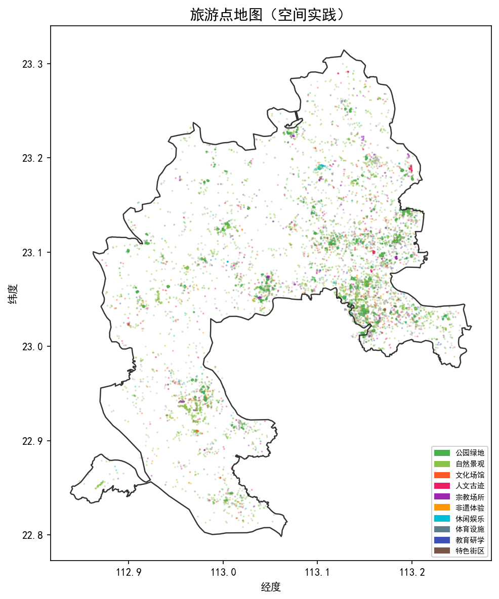
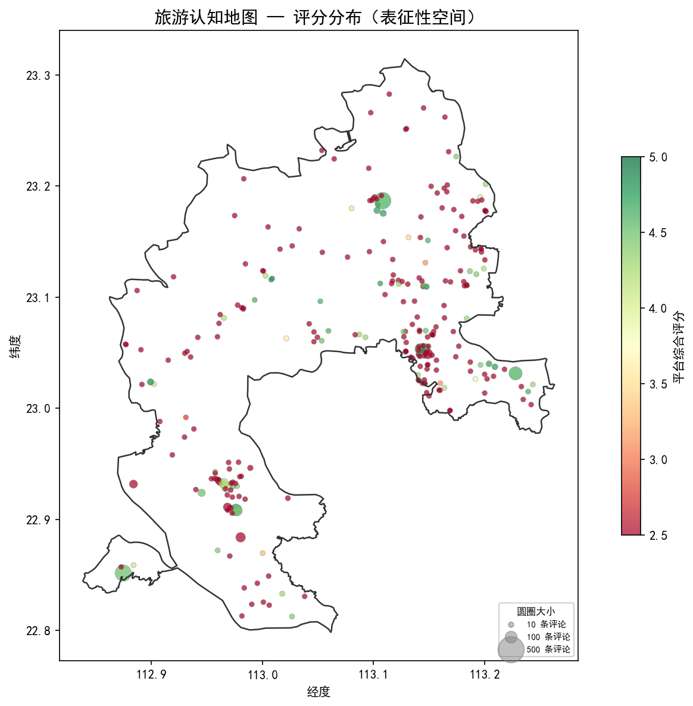
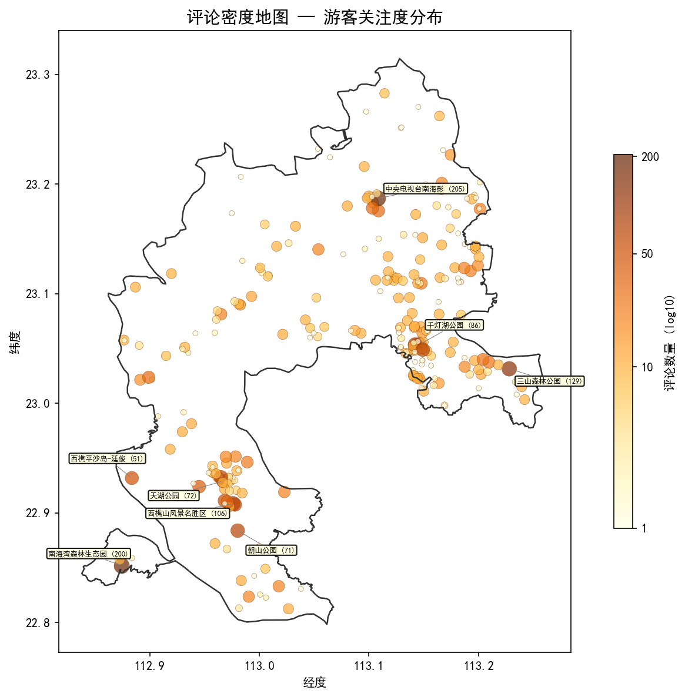
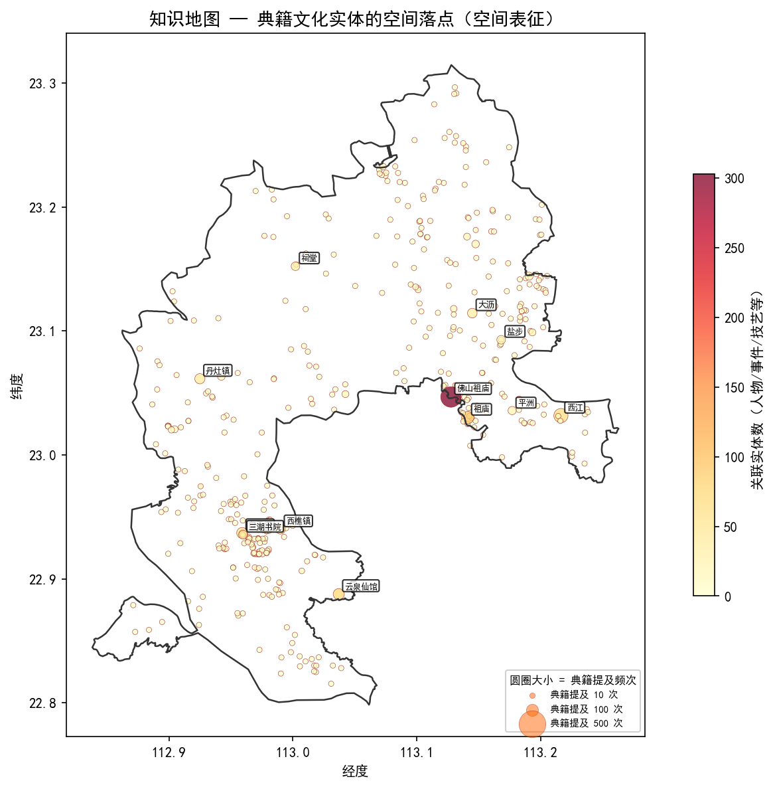

# 三张地图的空间数据构建

## 一、数据概况

本阶段围绕文旅融合潜力识别，完成了空间数据链路搭建，输出三张地图与一张评论密度图。

数据来源：POI（13512条）、知识图谱实体（8048个）与关系（19382条）、政府普查文化载体（165条）、游客评论汇总（265个有效POI）。

- 知识图谱实体空间定位率：575/2395 = **24.0%**
- 地点关系反向索引覆盖：**469个地名**
- 三层数据齐全的点位：**50个**

## 二、旅游点地图（空间实践）

呈现南海区 13512 个 POI 的类型分布，按十类业态着色，可直观看出**各镇街旅游资源密度差异**。



桂城、大沥、狮山三镇 POI 密度最高，文化场馆和人文古迹多集中在桂城—西樵一线。

## 三、旅游认知地图（表征性空间）

颜色 = 平台综合评分（2.5~5.0分），圆圈大小 = 评论数量。用于反映**游客实际感知与口碑评价的空间格局**。



整体评分中位数约 3.5 分，西樵山片区和南海湾周边评分较高（绿色），部分城区景点评分偏低（红色），暗示这些点位存在**体验提升的潜力空间**。

下图单独展示评论数量的空间分布（对数尺度），标注了评论量前 8 的 POI。评论集中在南海影视城（205条）、南海湾森林生态园（200条）、三山森林公园（129条）、西樵山（106条）等头部景区，多数 POI 评论不足 10 条，**关注度呈长尾分布**。



## 四、知识地图（空间表征）

来自典籍的文化实体经空间定位后落入地图。颜色 = 该地点关联的实体数（人物、事件、技艺等），圆圈大小 = 在典籍中被提及的频次。



佛山祖庙、南海城区、云泉仙馆周边关联实体最密集，康有为故居、松塘村等节点清晰可见。这些是**典籍文化资源与空间的对应关系**，为后续耦合分析提供了"文化侧"的空间基底。

---

## 五、各地图数据来源与处理方法详细说明

全部地图由同一个脚本 `code/analysis/build_triple_map.py` 统一生成，输出为 GeoJSON/Shapefile（`output/gis/`）和 matplotlib 预览 PNG（`output/figures/`）。

### 5.1 旅游点地图（空间实践）

**数据来源：**

| 数据 | 路径 | 说明 |
|------|------|------|
| POI 点位数据 | `data/poi/poi_cleaned.json` | 13512 条，包含名称、经纬度、类别、评分、镇街等字段 |
| 南海区界 | `data/gis/nanhai_boundary.geojson` | matplotlib 底图绘制 |
| 镇街边界 | `data/gis/nanhai_towns.geojson` | matplotlib 底图绘制 |

**POI 数据获取流程：**

1. **多源爬取**：通过 `code/collection/amap_poi_crawler.py`（高德地图 API）和 `code/collection/baidu_poi_crawler.py`（百度地图 API）分别按旅游相关关键词和 POI 类型码，在南海区范围内批量检索 POI
2. **Shapefile 补充**：从佛山市 POI shapefile 数据中筛选南海区部分（`data/poi/poi_shapefile.json`）
3. **多源融合清洗**：`code/processing/poi_cleaner.py` 将以上三个来源合并去重，统一字段格式（名称、经纬度、类别、镇街归属），输出 `data/poi/poi_cleaned.json`

**地图处理方法：**

- 遍历全部 13512 个 POI，按十类业态（公园绿地、自然景观、文化场馆、人文古迹、宗教场所、非遗体验、休闲娱乐、体育设施、教育研学、特色街区）分配颜色
- 每个 POI 生成一个 GeoJSON 点要素，属性含 id、名称、镇街、类别、评分、非遗匹配信息
- matplotlib 散点图以经纬度定位，点大小统一（s=3），透明度 0.4，按类别着色
- 输出：`output/gis/map_tourism.geojson`、`output/gis/map_tourism.shp`、`output/figures/map_tourism_preview.png`

### 5.2 旅游认知地图（表征性空间）

**数据来源：**

| 数据 | 路径 | 说明 |
|------|------|------|
| 评论汇总 | `data/reviews/review_summary_merged.json` | 265 个有效景点，含评论数量、平均评分、正负面情感计数 |
| 评论-POI 链接表 | `output/tables/review_poi_link.csv` | 将评论景点名称匹配到 POI 的 id 和坐标 |
| POI 点位数据 | `data/poi/poi_cleaned.json` | 提供坐标和镇街归属 |

**评论数据获取流程：**

1. **评论爬取**：`code/collection/review_crawler_real.py` 从携程、美团、大众点评等平台爬取南海区景点评论，输出 `data/reviews/nanhai_reviews_real.json` 和 `review_summary_real.json`
2. **辅助数据补充**：`code/collection/parse_supplementary_data.py` 解析补充的 Excel 表格数据，输出 `data/reviews/merged_reviews_supp.json`
3. **评论合并**：`code/processing/export_csv.py` 中的 `build_and_export_review_summary_merged()` 将爬取评论与补充评论合并，输出 `data/reviews/review_summary_merged.json`
4. **空间挂载**：`code/data_processing/match_review_to_poi.py` 通过名称模糊匹配，将每个评论景点关联到最近的 POI（id、坐标），输出 `output/tables/review_poi_link.csv`

**地图处理方法：**

- 通过 `review_poi_link.csv` 将评论景点映射到 POI 坐标；对同一 POI 的多条评论进行聚合（累加评论数、取评分均值、累加情感计数）
- 计算正面率（positive_rate）和负面率（negative_rate）
- matplotlib 散点图中：**颜色** = 平台综合评分（RdYlGn 色带，2.5~5.0 分，绿高红低）；**圆圈大小** = 评论数量（线性映射，最大 180px）
- 输出：`output/gis/map_cognition.geojson`、`output/gis/map_cognition.shp`、`output/figures/map_cognition_preview.png`

### 5.3 评论密度地图（游客关注度分布）

**数据来源：**

与认知地图完全相同，共用同一批评论-POI 空间挂载结果。

**地图处理方法：**

- 对评论数量取**对数尺度**（log10），避免头部景区与长尾之间的视觉差异被压缩
- 上限截断：超过 P99 分位数 2 倍的评论量被 cap 处理
- matplotlib 散点图中：**颜色** = 评论数量 log10 值（YlOrBr 色带）；**圆圈大小** = log10 线性映射（最大 160px）
- 标注评论量前 8 的 POI 名称和评论数，标注间距 > 0.015° 避免重叠
- 输出：`output/gis/map_review_density.geojson`、`output/gis/map_review_density.shp`、`output/figures/map_review_density.png`

### 5.4 知识地图（空间表征）

**数据来源：**

| 数据 | 路径 | 说明 |
|------|------|------|
| 知识图谱实体 | `output/qwen_extraction/merged_entities.json` | 8048 个实体，含名称、AI 小类、提及频次、来源数 |
| 知识图谱关系 | `output/qwen_extraction/merged_relations.json` | 19382 条关系，含源、目标、关系文本、证据 |
| 文化锚点 | `data/anchors/cultural_anchors.json` | 165 个政府文化普查载体，含坐标 |
| POI 点位数据 | `data/poi/poi_cleaned.json` | 辅助坐标匹配 |

**知识图谱构建流程：**

1. **语料来源**：51 部南海地方典籍（县志、文史资料、非遗专辑等），经 OCR 或数字化后存入 `data/corpus/`
2. **LLM 抽取**：`code/processing/qwen_ner_multithread.py` 等脚本调用通义千问大模型，对每部典籍进行命名实体识别和关系抽取，按六大类 28 小类（A 非遗文化、B 物质遗产、C 传承主体、D 文化空间、E 文献记忆、F 历史时序）分类输出
3. **合并去重**：抽取结果经合并，输出 `merged_entities.json`（8048 实体）和 `merged_relations.json`（19382 关系）

**文化锚点获取：**

`code/collection/parse_supplementary_data.py` 解析南海区官方文化资源普查数据（2019 年三镇 Shapefile），提取 165 个文化载体的名称、类型、经纬度，输出 `data/anchors/cultural_anchors.json`

**实体空间定位方法（脚本任务 1）：**

1. 筛选 D 类（文化空间）和 B 类（物质遗产）实体共 2395 个，作为"地名+建筑遗迹"候选
2. **精确匹配**：实体名 == POI 名称 → 取 POI 坐标；实体名 == 锚点名称 → 取锚点坐标
3. **包含匹配**：实体名是 POI 名的子串，或 POI 名是实体名的子串 → 取最长匹配的 POI 坐标；锚点同理
4. 坐标合理性校验：经度 > 100°、纬度 > 20°
5. 结果：575 个实体成功定位（定位率 24.0%），输出 `output/tables/located_entities.csv`

**地点关系反向索引（脚本任务 2）：**

- 遍历 19382 条关系，若关系的 source 或 target 为已定位地点，则将对端实体（人物、事件、技艺等）挂载到该地点
- 空间类关系优先识别："位于""活动于""出生于""始建于""盛产""发生于"等
- 去重后按提及频次排序，输出 `output/tables/place_entity_index.json`（469 个地名被索引）

**地图处理方法：**

- 每个已定位地点生成一个 GeoJSON 点要素，属性含实体名、类型、提及频次、关联实体数、前 3 关联实体
- 对于匹配到锚点（非 POI）的实体，尝试在 0.005° 范围内就近关联到最近的 POI；若无则作为独立点加入
- matplotlib 散点图中：**颜色** = 该地点关联的实体数量（YlOrRd 色带，关联越多越红）；**圆圈大小** = 典籍提及频次（线性映射，最大 220px）
- 标注提及频次前 12 的地点名称
- 输出：`output/gis/map_knowledge.geojson`、`output/gis/map_knowledge.shp`、`output/figures/map_knowledge_preview.png`

### 5.5 数据流总结

```
高德/百度 API ──爬取──→ poi_cleaned.json ─────────────────→ 旅游点地图
                                    │
携程/美团/大众点评 ──爬取──→ review_summary_merged.json ──→ ┬─ 认知地图
                              ↓ match_review_to_poi        └─ 评论密度地图
                        review_poi_link.csv ─────────────→ (空间挂载)

51部南海典籍 ──LLM抽取──→ merged_entities.json ─┐
                          merged_relations.json ─┤
官方文化普查 ──解析──→ cultural_anchors.json ────┤
                                                 ↓
                                          空间定位 + 反向索引 → 知识地图
```
