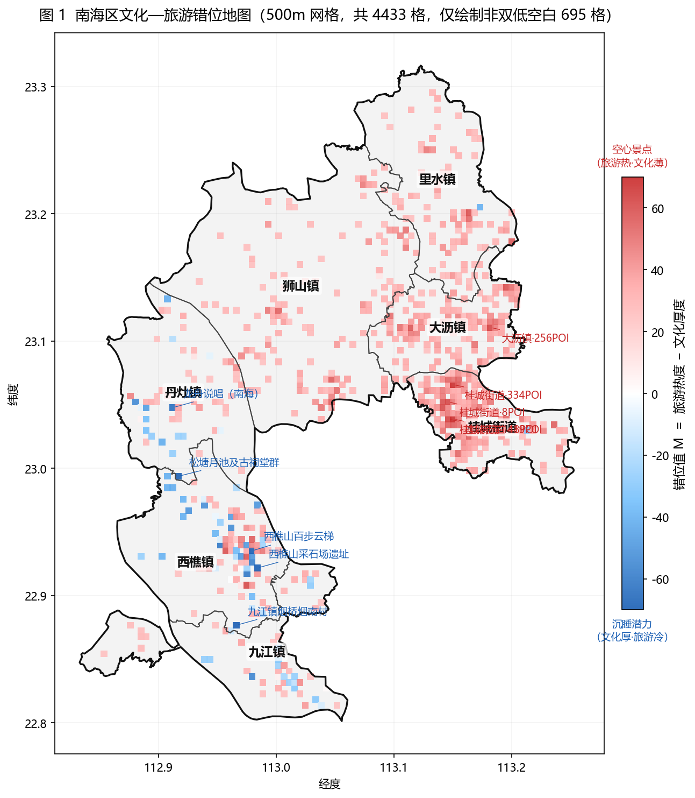
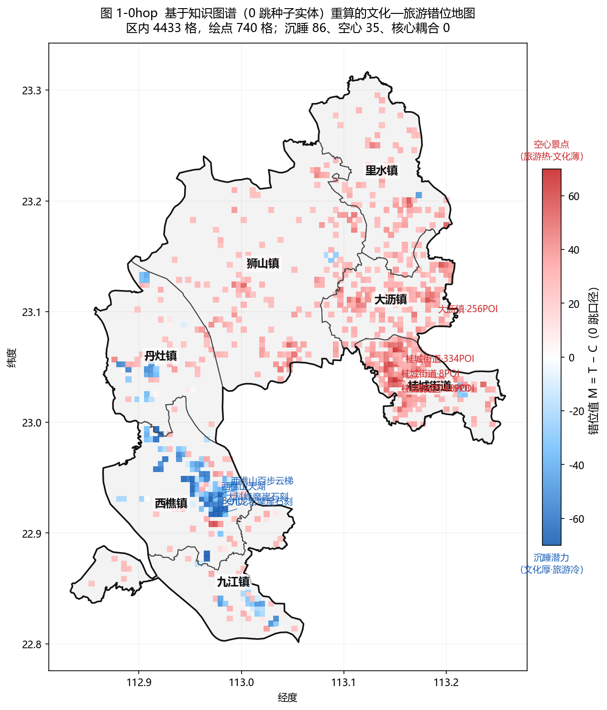
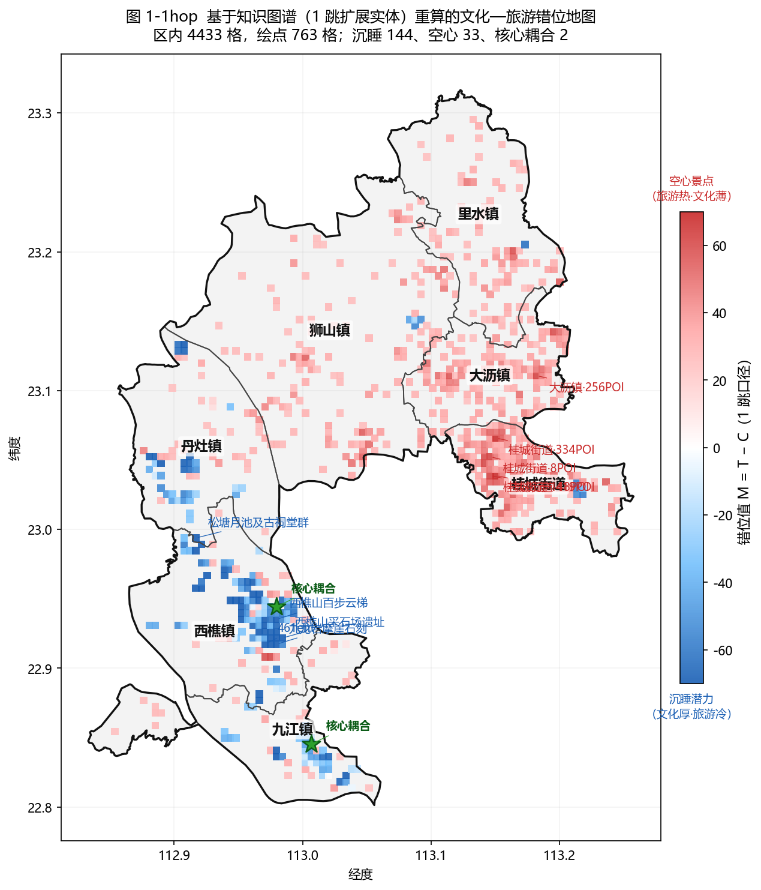
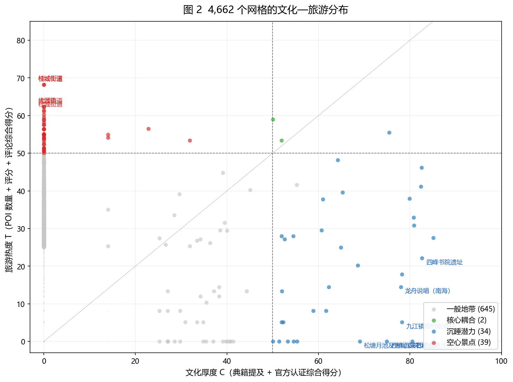
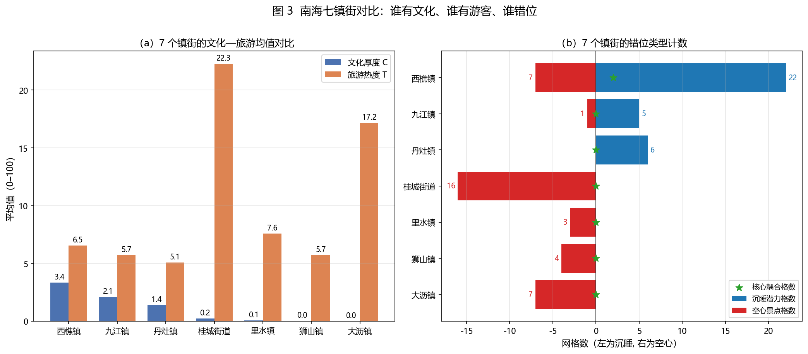
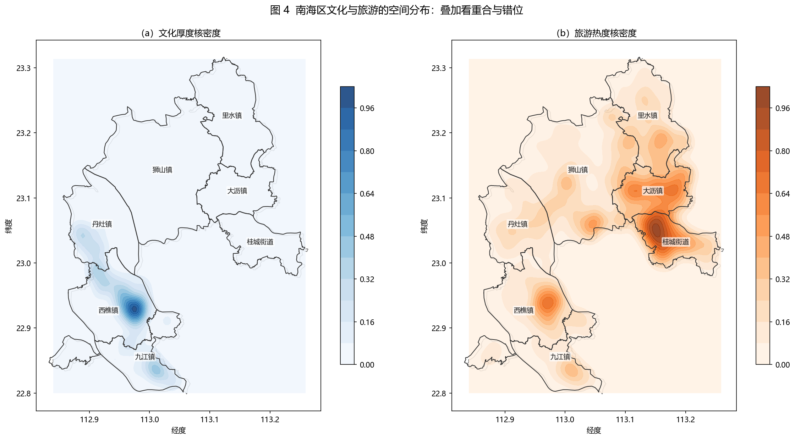
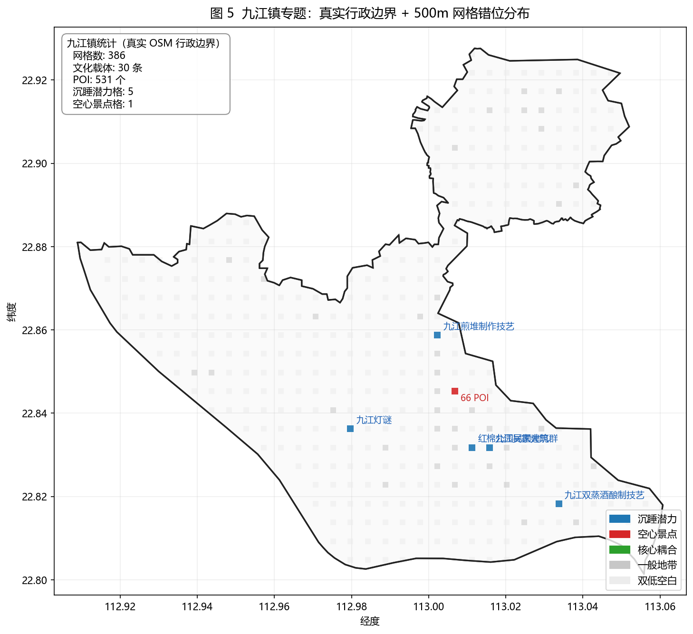

# 南海区文化载体与旅游热度的网格化错位分析

## 一、本阶段工作

针对 4.15 例会反馈（样本量过小、结论"本地人也能说出来"），本阶段将分析单元由 165 条文化载体与 7 个镇街下沉到 500 m × 500 m 的空间网格。使用南海区外边界（`nanhai_boundary.geojson`）过滤落入区内的 4,662 个网格，对每个网格独立计算文化厚度、旅游热度与两者的错位值，并据此输出 5 张核心图。

对应脚本：`code/analysis/grid_indices.py`（指标计算）、`code/analysis/make_figures.py`（出图）。

### 1.1 桥梁口径说明

本轮不再把"非遗"单独作为唯一桥梁，而是改为分层处理。主桥梁是 165 条具备明确空间位置的文化载体，包括不可移动文物、历史文化名村与传统村落、文化景观、圩市街区，以及能够落实到具体地点的非遗空间锚点；这些对象可以直接落到地图上，与 POI、网格和镇街对应。

非遗仍然重要，但作用有所区分。凡是能够明确依附到村落、街区、建筑、作坊、庙会场所等具体空间的非遗项目，可以作为补充桥梁挂接到主桥梁中；如果某项非遗只有传承人登记地，缺少稳定空间载体，则不直接参与空间匹配，只保留在文化记忆和文本解释层面。

这样处理的原因在于，本研究要连接的是"典籍知识"与"旅游空间"。桥梁如果没有稳定空间位置，就难以与旅游 POI 形成可靠对应；先用有形载体搭桥，再把能落地的非遗挂接上去，概念和数据口径就统一了。

## 二、数据口径

| 输入 | 文件 | 数量 | 本阶段用途 |
|------|------|-----:|------------|
| 文化载体 | `data/anchors/cultural_anchors.json` | 165 | 每条按经纬度落入网格，贡献典籍提及数与官方认证等级；作为 POI 关联文化实体的桥接节点 |
| 典籍实体（本轮改用） | `data/entities_relations/merged_entities.json` | 8,048 | 含 `name / ai_grade_label / ai_grade_type / ai_layer / official_label / mentions / source_count` 等字段；替代旧的 `data/entities/entities.json`（7,354 条） |
| 典籍关系 | `data/entities_relations/merged_relations.json` | 19,382 条关系 / 7,337 节点 | 源—目标—关系类型三元组，用于构建文化实体图，支持 1 跳 / 2 跳扩展 |
| POI | `data/poi/poi_cleaned.json` | 13,512 | 字段 `cultural_anchors` 记录该 POI 已匹配到的 anchor 名字列表（共 1,074 POI 挂 147 个 anchor）|
| 评论统计 | `data/reviews/review_summary_merged.json` | 3,879 | 每个 POI 对应的总评论数（来源：OTA 聚合） |
| 南海区外边界 | `data/gis/nanhai_boundary.geojson` | 1 条多边形 | 网格是否在区内的判定 |
| 7 个镇街行政边界 | `data/gis/nanhai_towns_real.geojson` | 7 条多边形（OSM） | 每个网格的镇街归属判定、图 1 / 图 5 的边界绘制 |

区内 4,662 个网格中，含文化载体 102 个（2.2%），含 POI 2,156 个（46.3%）。

### 2.1 POI 与文化实体的连接方式

POI 与文化实体不是通过坐标 / 空间叠加匹配的，而是通过名称链路：

```text
POI --(名称/地址匹配)--> anchor --(包含式名称匹配)--> entity --(关系图)--> 1 跳 / 2 跳邻居 entity
```

**第 1 步：POI → anchor**。`data/poi/poi_cleaned.json` 在数据清洗阶段（上一阶段工作）已为每条 POI 写入 `cultural_anchors` 字段：如果 POI 名称或地址中出现某 anchor 名字，即登记该 anchor 名到列表。本阶段仅读取该字段，不重新做匹配。结果：1,074 POI 挂到 147 个独立 anchor；147 个 tag 全部能在 `cultural_anchors.json` 的 `name` 精确匹配回去。

**第 2 步：anchor → entity**。anchor 多为长全称（如"九江双蒸酒制作技艺"），而 `merged_entities` 更偏主题词（如"九江双蒸"），直接 name 精确匹配只能覆盖 26/165 个 anchor。本阶段改为**包含式匹配**：若 entity 名字是 anchor 名字的子串且长度 ≥ 2，或 anchor 名字是 entity 名字的子串且长度 ≥ 3，判为匹配；并剔除一组语义过泛的停用词（"清代 / 民国 / 南海 / 佛山 / 文物 / 非遗"等），避免"清代 × 所有清代建筑"的假阳性。结果：124/165 anchor 匹配到至少 1 个 entity，合计 235 条 anchor-entity 映射。

**第 3 步：entity → 邻居**。基于 `merged_relations.json` 的 19,382 条关系构建**无向邻接图** G = (V, E)，|V| = 7,337。对每个 POI 的种子 entity 集合 `S`，用 BFS 扩展：

- 0 跳：`E_0 = S`
- 1 跳（含种子）：`E_1 = S ∪ N(S)`
- 2 跳（含前两层）：`E_2 = E_1 ∪ N(E_1)`

其中 `N(·)` 为邻接算子。这样每个 POI 都可以获得一张带 0/1/2 跳实体集合的"文化档案"。

### 2.2 0 跳 / 1 跳 / 2 跳的实体覆盖统计

全区聚合（去重）：

| 跳数 | 独立 entity 数 | 相对 0 跳扩展倍数 | 占全图 7,337 节点的比例 |
|-----:|-----:|-----:|-----:|
| 0 跳（种子） | 114 | 1.0× | 1.6% |
| 1 跳以内 | 1,240 | 10.9× | 16.9% |
| 2 跳以内 | 4,806 | 42.2× | 65.5% |

按镇街（`output/tables/town_entity_linkage.csv`）：

| 镇街 | POI 数 | 0 跳 entity | 1 跳以内 | 2 跳以内 | 2 跳 mentions 合计 |
|------|-----:|-----:|-----:|-----:|-----:|
| 西樵镇 | 1,314 | 83 | 1,119 | 4,622 | 30,945 |
| 九江镇 | 533 | 25 | 180 | 2,612 | 23,320 |
| 丹灶镇 | 718 | 17 | 173 | 2,418 | 22,314 |
| 桂城街道 | 3,987 | 1 | 27 | 762 | 11,627 |
| 狮山镇 | 2,548 | 2 | 13 | 478 | 9,062 |
| 大沥镇 | 2,641 | 0 | 0 | 0 | 0 |
| 里水镇 | 1,189 | 0 | 0 | 0 | 0 |

该表反映的结构：西樵—九江—丹灶即便扩到 2 跳仍然稳定领先（西樵 2 跳覆盖 4,622 entity），桂城、狮山虽然 POI 数量最大但能链接到的文化实体数量仍很少，大沥、里水在 2 跳内没有任何 entity 可链——与图 1、图 4 的空间错位结论完全一致，且这次的证据来源不是"anchor 名字在典籍里出现多少次"（旧口径的同义反复），而是"POI 在知识图谱上能走到多少实体 / 多少 mentions"（新口径，来源独立）。

对应脚本：`code/analysis/poi_entity_linkage.py`；输出：`output/tables/poi_entity_linkage.csv`（POI 行级 13,215 行）、`grid_entity_linkage.csv`（2,097 个有 POI 的 500 m 网格行）、`town_entity_linkage.csv`（8 个镇街行）、`poi_entity_linkage_overview.json`（总览）。

为什么选 500 m 网格：① 文化载体密度较稀（165/1,073 km² ≈ 0.15/km²），2 km 以上的网格会让大多数格只含 1 条载体，失去统计意义；② POI 密度较高，500 m 粒度下每格平均 2.9 个 POI，兼顾空间分辨率与稳定性；③ 0.0045° 的经纬步长约对应 500 m（北纬 23° 处 1° ≈ 111 km × 103 km）。

## 三、指标计算方法

所有原始量纲变量先做 `ln(1+x)` 压缩（削弱长尾），再对全体 4,662 个网格做 Min-Max 归一化到 0–100 区间，最后按固定权重线性加权。Min-Max 的定义：

$$
x' = \frac{x - \min(x)}{\max(x) - \min(x)} \times 100
$$

### 3.1 文化厚度 C

记第 `i` 个网格内部的量：

- `M_i` = 格内全部文化载体在典籍中的被提及次数之和
- `O_i` = 格内全部文化载体的官方认证加权和（国家级 4 / 省级 3 / 市级 2 / 区级 1 / 其他 1）

则文化厚度：

$$
C_i = 0.6 \cdot \text{MinMax}(\ln(1 + M_i)) + 0.4 \cdot \text{MinMax}(\ln(1 + O_i))
$$

两个分项分别衡量"被典籍记录的厚度"与"被官方保护的厚度"，权重 0.6 : 0.4 沿用论文前期 AHP 结果（典籍层的重要性高于行政认定）。两项均作对数压缩，避免"一个高频词（如西樵山 337 次提及）把分数拉到单点饱和"。

### 3.2 旅游热度 T

记第 `i` 个网格内部的量：

- `P_i` = POI 计数
- `R_i` = POI 平均评分（无评分 POI 记 0；若格内无任何有评分 POI 则 `R_i = 0`）
- `V_i` = 格内全部 POI 的总评论数

则旅游热度：

$$
T_i = 0.45 \cdot \text{MinMax}(\ln(1 + P_i)) + 0.20 \cdot \text{MinMax}(R_i) + 0.35 \cdot \text{MinMax}(\ln(1 + V_i))
$$

三个分项分别代表"供给量—供给质—需求量"：商家密度、平均评分、评论规模。评分本身已在 0–5 区间，不做对数压缩。

### 3.3 错位值 M

$$
M_i = T_i - C_i, \quad M_i \in [-100, 100]
$$

- `M_i < 0`：文化厚但旅游冷（沉睡）
- `M_i > 0`：旅游热但文化薄（空心）
- `|M_i|` 越大，错位越严重

### 3.4 分层判定规则

结合 C、T、M 三个维度对每个网格打标：

| 类别 | 判定规则 | 业务含义 |
|------|----------|----------|
| 核心耦合 | `C ≥ 50` 且 `T ≥ 50` 且 `|M| ≤ 15` | 文化与旅游同强，是保留并放大的样本 |
| 沉睡潜力 | `C ≥ 50` 且 `M < -15` | 文化资源存量可观，旅游尚未激活 |
| 空心景点 | `T ≥ 50` 且 `M > 15` | 客流聚集但文化支撑薄弱 |
| 双低空白 | `C < 25` 且 `T < 25` | 两侧数据皆稀，多为农田、水域、绿地 |
| 一般地带 | 其余情形 | 城乡过渡区、低密度居住区 |

阈值 50 取自 Min-Max 区间中点；`±15` 作为错位缓冲区，依据为 M 分布的四分位宽度约 10–15。

### 3.5 核密度估计（用于图 4）

在全区经纬度范围上生成 120 × 120 的渲染网格。对任意渲染点 `(x, y)`，对全部 500 m 网格中心 `(x_c, y_c)` 与该格的对应分数 `s_c`（分别取 C 或 T）做高斯核叠加：

$$
\hat{f}(x, y) = \sum_{c} s_c \cdot \exp \left( - \frac{(x - x_c)^2 + (y - y_c)^2}{2 \sigma^2} \right)
$$

带宽 `σ = 2.5 × 0.0045° ≈ 1.125 km`，即每个格对周围约 2–3 个邻格有"软半径"影响，既平滑孤立噪声又保留镇街级差异。分别对文化场 `f_C` 与旅游场 `f_T` 除以自身最大值归一到 `[0, 1]`，再做等值线渲染。

## 四、分析结果

### 4.1 图 1 — 整体错位地图



**输入数据**：`output/tables/grid_indices.csv`（含 C、T、M、category 的 4,662 行网格表）+ `data/gis/nanhai_towns_real.geojson`（7 个 OSM 镇街多边形）。

**计算 / 绘制流程**：

1. 取 `town ≠ "未标注"` 的 4,433 格作为底图；
2. 对 7 个镇街多边形做 `unary_union` 得到整体南海区轮廓，用 `#f3f3f3` 浅灰填充作底色；
3. 从 4,433 格中筛出 `category ≠ "双低空白"` 的 695 格（其余 3,738 个双低空白格不单独绘点，直接由底色代表）；
4. 695 格按其 M 值用 `bwr` 风格 diverging colormap 着色（-70 深蓝 → 0 白 → +70 深红），以 `marker="s"` 的方形散点绘制，空间大小与 500 m 网格等比；
5. 绘制 7 个镇街的内部细灰分界线、7 镇 union 的外粗黑轮廓；
6. 对最极端的 5 个沉睡格和 5 个空心格加载体名/POI 数标注。

**解读**：南海区文化厚度的高值区集中于西南部的西樵—九江—丹灶一线，旅游热度的高值区集中于东北部的桂城—大沥—里水。两者在空间上近乎构成对角分布，整体呈"文化西南、旅游东北"的错位格局。

### 4.1-KG 基于知识图谱（0 跳 / 1 跳）重算的错位地图

上图（图 1）的 C 指标来源是"格内 anchor 在旧 `entities.json` 中被提及的次数"。本节采用 2.1 节定义的新链路 `POI → anchor → entity → 0/1 跳邻居` 重算 C，产出两版新图。T 指标不变。

**输入数据**：`output/tables/grid_indices_kg.csv`（脚本 `code/analysis/grid_indices_kg.py`）+ `data/gis/nanhai_towns_real.geojson`。

**计算流程**：

1. 对每个 500 m 网格 i，收集：
   - `A(i)` = 格内全部 anchor，取其包含式匹配到的 entity 并集；
   - `P(i)` = 格内全部 POI，顺着 `poi.cultural_anchors → anchor → entity` 的链路取 entity 并集；
   - 种子集合 `S_0(i) = A(i) ∪ P(i)`（以每个 anchor/POI 的自身坐标落格，不是先汇总到镇再归格）；
   - 一跳扩展 `S_1(i) = S_0(i) ∪ N(S_0(i))`，其中 `N` 为关系图邻接算子。
2. 对 `S_0` 和 `S_1` 分别求 `Σ mentions`（典籍被提及次数）与 `Σ official_flag`（带 `official_label` 的 entity 计数）。
3. 套用 3.1 节同样的 `ln(1+x) → MinMax → 0.6 / 0.4 加权` 流程得到 `C_0hop` 与 `C_1hop`；T 沿用 POI 侧的 3.2 节公式不变。
4. `M_0hop = T − C_0hop`，`M_1hop = T − C_1hop`，再用 3.4 节的同一阈值体系重新打标。
5. 图例、配色、镇界绘制与图 1 完全一致，仅标题与数据源不同，便于与原图 1 直接对照。

**图 1-0hop（0 跳口径，仅种子实体）**



**图 1-1hop（1 跳口径，种子 + 1 跳邻居）**



**三版图的分层对比**：

| 类别 | 图 1（旧 entities 口径） | 图 1-0hop（种子） | 图 1-1hop（1 跳） |
|------|-----:|-----:|-----:|
| 双低空白 | 3,738 | 3,897 | 3,874 |
| 一般地带 | 698 | 642 | 607 |
| 沉睡潜力 | 33 | **87** | **145** |
| 空心景点 | 30 | 36 | 34 |
| 核心耦合 | 2 | 0 | **2** |

**镇街层面对比（`grid_town_summary_kg.csv`）**：

| 镇街 | 旧 C 均值 | C_0hop 均值 | C_1hop 均值 | 0 跳沉睡 | 1 跳沉睡 | 1 跳核心耦合 |
|------|-----:|-----:|-----:|-----:|-----:|-----:|
| 西樵镇 | 3.35 | 8.37 | 10.55 | 62 | 82 | 1（西樵山主峰） |
| 九江镇 | 2.10 | 4.15 | 5.84 | 13 | 21 | 1（镇中心沿江） |
| 丹灶镇 | 1.42 | 2.62 | 3.91 | 11 | 31 | 0 |
| 桂城街道 | 0.22 | 0.66 | 1.02 | 0 | **5** | 0 |
| 狮山镇 | 0.02 | 0.10 | 0.17 | 0 | 4 | 0 |
| 大沥镇 | 0.00 | 0.00 | 0.00 | 0 | 0 | 0 |
| 里水镇 | 0.06 | 0.08 | 0.10 | 0 | 1 | 0 |

**解读**：

1. 从旧口径到 0 跳口径，**沉睡潜力网格数从 33 跃升到 87**（+164%）。原因是新数据源 `merged_entities.json` 的 NER 粒度更细、mentions 字段更准，很多 anchor 匹到的 entity 在典籍里的实际提及数高于旧口径的"名字子串计数"，C 被整体抬升。
2. 从 0 跳到 1 跳，**沉睡潜力再次从 87 涨到 145**（+67%）；**核心耦合格从 0 出现到 2**，分别位于西樵山主峰（西樵镇）与九江镇中心沿江一带——知识图谱的关系邻居把"风俗、历史人物、事件、文献"等延伸实体拉进格内，进一步显化了文化底座。
3. 大沥、里水 1 跳后 C 均值仍接近 0，符合 2.2 节的覆盖表（这两镇 2 跳以内都没有可链 entity），说明两镇**真实的文化空白**并非数据口径问题。
4. 桂城 1 跳后首次出现 5 格沉睡（此前 0 跳、旧口径均为 0）——这是图 1 未能捕捉的"知识图谱意义上的文化沉淀区"。

两版图建议与原图 1 并列放在论文第 5 章：图 1 给读者"直观的 anchor 层错位"；图 1-0hop 给读者"POI 能直接触达的实体层错位"；图 1-1hop 给读者"顺着关系再走一步能触达的知识网络层错位"。层层递进。

### 4.2 图 2 — 网格的文化 × 旅游分布



**输入数据**：`grid_indices.csv` 的 (C, T, category) 三列，全体 4,662 格。

**计算 / 绘制流程**：

1. 横轴 = 文化厚度 C，纵轴 = 旅游热度 T；
2. 双低空白格（3,942）先以低透明度灰点打底；
3. 一般地带、核心耦合、沉睡潜力、空心景点 4 类按 3.4 节分层颜色分别叠绘；
4. 绘制 `C = 50`、`T = 50` 虚线作为阈值基准线，`y = x` 点线作为对角参照；
5. 对最极端 6 个沉睡格、5 个空心格加文字标签。

**解读**：左上角的红色点群（`T ≥ 50`、`C ≈ 0`）来自大沥、里水、桂城的商业密集区；右下角蓝色点群（C 介于 55–85、T 低于 25）来自西樵山、丹灶松塘、九江烟桥等文化高地；同时满足 `C ≥ 50` 且 `T ≥ 50` 的核心耦合网格全区仅 2 格，均在西樵山主峰附近。

### 4.3 图 3 — 7 个镇街对比



**输入数据**：`output/tables/grid_town_summary.csv`（按镇街聚合 grid_count / C 均值 / T 均值 / 各类别格数）。

**计算 / 绘制流程**：

1. 按 `town` 字段把 `grid_indices.csv` 中 4,662 格聚合成 8 行（7 镇街 + 未标注），取每镇的：`grid_count`、`culture_mean = mean(C)`、`tourism_mean = mean(T)`、`n_dormant`、`n_hollow`、`n_core`；
2. 左图：双柱状图对比 C 均值（蓝）与 T 均值（橙），并在柱顶标注数值；均值按"镇内全部 500 m 网格算术平均（含双低空白格）"计算，因此数值偏低，但镇间排序有意义；
3. 右图：以水平条形图左右对称布置沉睡格数（蓝，左）和空心格数（红，右），核心耦合用绿色五角星叠加。

**解读（表 1）**：

| 镇街 | 网格数 | 载体数 | POI 数 | C 均值 | T 均值 | M 均值 | 沉睡 | 空心 | 耦合 |
|------|-----:|-----:|-----:|-----:|-----:|-----:|-----:|-----:|-----:|
| 狮山镇 | 1,403 | 1 | 2,567 | 0.02 | 5.72 | 5.70 | 0 | 4 | 0 |
| 西樵镇 | 715 | 91 | 1,310 | 3.35 | 6.55 | 3.20 | 22 | 7 | 2 |
| 里水镇 | 619 | 1 | 1,449 | 0.06 | 7.59 | 7.53 | 0 | 3 | 0 |
| 丹灶镇 | 580 | 30 | 715 | 1.42 | 5.07 | 3.64 | 6 | 0 | 0 |
| 大沥镇 | 397 | 0 | 2,593 | 0.00 | 17.18 | 17.18 | 0 | 7 | 0 |
| 九江镇 | 386 | 30 | 531 | 2.10 | 5.70 | 3.60 | 5 | 1 | 0 |
| 桂城街道 | 333 | 3 | 3,859 | 0.22 | 22.28 | 22.06 | 0 | 16 | 0 |

结论：① 文化厚度排序西樵 > 九江 > 丹灶，其余基本为零；② 旅游热度排序桂城 > 大沥 > 里水 > 西樵 > 九江 ≈ 狮山 > 丹灶；③ 沉睡潜力集中于西樵（22）、丹灶（6）、九江（5）；空心景点集中于桂城（16）、大沥（7）、西樵（7）、狮山（4）、里水（3）；④ 全区仅有的 2 个核心耦合网格均在西樵镇。229 个"未标注"网格位于 OSM 镇界缝隙，单列统计。

### 4.4 图 4 — 文化与旅游的空间核密度



**输入数据**：`grid_indices.csv` 中每格的中心坐标 `(clng, clat)`、文化厚度 C、旅游热度 T；`nanhai_boundary.geojson`、`nanhai_towns_real.geojson`。

**计算 / 绘制流程**：

1. 以全区网格 bbox 均匀生成 120 × 120 的渲染格；
2. 文化场：对每个 500 m 网格中心取其 C 值作权重，按 3.5 节的高斯核（`σ ≈ 1.125 km`）叠加到 120×120 渲染网，得到 `f_C(x, y)`；
3. 旅游场：同样的叠加流程但权重取 T 值，得到 `f_T(x, y)`；
4. 两个场各自除以自己的最大值归一到 [0, 1]；
5. 左右双面板：左图用蓝色调（Blues colormap）做 `f_C` 等值填充，右图用橙色调（Oranges）做 `f_T`，两图都叠加南海区外边界和 7 个 OSM 镇街实线。

**解读**：`f_C` 高值区集中在西樵山—松塘—九江沿江一带；`f_T` 高值区集中在桂城—大沥—里水组团。两者高值区在空间上几乎不重叠。该图的两个变量来源完全独立（文化侧：典籍 + 认证；旅游侧：POI 数 + 评分 + 评论），空间分离不是指标定义的同义反复，而是真实结构性特征。

### 4.5 图 5 — 九江镇专题



**输入数据**：`grid_indices.csv` 中 `town == "九江镇"` 的 386 行；`nanhai_towns_real.geojson` 的九江多边形（OSM relation 18081794，MultiPolygon：南部主体 + 北部飞地，面积 ≈ 95 km²）。

**计算 / 绘制流程**：

1. 读取九江镇真实 OSM 多边形，以浅灰填充 + 加粗黑边绘制行政边界（含北部飞地）；
2. 把 386 个九江格按 3.4 节的 `category` 上色：沉睡蓝、空心红、核心耦合绿、一般地带灰、双低空白浅灰；
3. 沉睡/空心/核心耦合格用较大方块 (s=48, α=0.9) 突出显示，一般地带与双低空白用较小方块 (s=32, α=0.55) 作为背景；
4. 重新绘一次 OSM 实线轮廓以防被网格覆盖；
5. 沉睡格标注其第一个载体名，空心格标注 "N POI"；
6. 左上角文本框汇总镇级统计（网格数 386、载体 30、POI 531、沉睡 5、空心 1）。

**解读**：文化载体集中于镇域中部沿江一线（九江煎堆制作技艺、九江灯谜、九江双蒸酒制作技艺、九江吴家大院、烟桥村等），POI 同样集中在镇中心及沿省道分布；南部大片腹地（农田、水网）与北部飞地既无 POI 也无载体入库，属于数据覆盖盲区。

**回应 4.15 提问**："九江旅游热度偏低是数据问题还是真实情况？" 本图显示：九江镇中心商圈（66 POI 格）确实表现为空心景点，周边的九江双蒸、烟桥、吴家大院等载体表现为沉睡潜力；南部腹地的"低"更多源于餐饮评论数据缺失（见研究不足第 3 条），不能单独归结为旅游真实冷清。

## 五、对上次反馈的回应

| 4.15 反馈 | 本版的处理 |
|-----------|------------|
| 样本量太小，难以支撑统计结论 | 分析单元下沉到 500 m 网格，区内有效网格 4,662 个 |
| 文化与旅游需要两套独立指数再做运算 | 给出 C、T、M 三指标及 0.6/0.4、0.45/0.20/0.35 权重与完整公式（见 3.1–3.3） |
| 希望使用对数等更稳健的处理 | 提及数、POI 数、评论数均做 `ln(1+x)` 压缩后再归一 |
| 希望"形成图" | 5 张图：错位地图、分布散点、镇街对比、双核密度、九江专题 |
| 九江镇是真冷还是数据冷 | 图 5 专题：镇中心为空心格，南部 / 北部飞地为数据盲区，餐饮评论缺失是主因 |
| 结论不能是"本地人也能说出来"的内容 | 核密度对比（图 4）给出两类资源空间分离的量化证据 |

## 六、研究不足

1. 镇街边界已改为 OpenStreetMap 提供的真实行政矢量（`data/gis/nanhai_towns_real.geojson`）。OSM 边界与民政部 2023 版区划基本一致，但仍存在毫米级缝隙，因此 229 个网格被标记为"未标注"，不影响主要结论。
2. anchor → entity 的包含式匹配仍有 41/165 anchor（约 25%）未能找到任何对应 entity（如象林塔、九江双蒸酒制作技艺的全称匹配不上主题词实体），后续拟引入别名表与语义向量匹配补全；同时，`merged_entities.json` 中 `is_anchor` 字段目前全部为 0，未启用，后续可用来做"载体—实体"的反向标注核对。
3. POI 数据不含餐饮类目，评论来源不含大众点评、美团；九江镇以美食为主要名片，其旅游热度在统计上可能被系统性低估，详见 4.5 节。
4. 本轮已修正上一版存在的自相关问题：当前所有跨维比较均来自构成指数之外的独立变量（如文化核密度 vs 旅游核密度），不再使用同一指数内部变量之间的相关性作为证据。

## 七、后续工作

- 将图 1 制作为交互式 HTML（基于 folium），便于汇报时缩放查阅 Top 10 沉睡/空心网格；
- 引入大众点评 / 美团评论数据重算 T，对九江镇的数据盲区假设做验证；
- 将交通可达性、人口密度、夜间灯光等变量挂接到网格，拟合解释 M 的空间回归模型；
- 为每个沉睡网格自动生成"文化故事卡"（从知识图谱 2 跳内取 3 条典籍片段），作为论文第 6 章活化建议的附录。

---

复现命令：

```text
python code/analysis/grid_indices.py         # 旧 C 口径（anchor 名字子串 × entities.json）
python code/analysis/grid_indices_kg.py      # 新 C 口径（0 跳 / 1 跳，基于 merged_entities + merged_relations）
python code/analysis/poi_entity_linkage.py   # POI ↔ entity 0/1/2 跳链接统计
python code/analysis/make_figures.py         # 图 1 ~ 图 5（旧口径）
python code/analysis/make_figures_kg.py      # 图 1-0hop / 图 1-1hop（新口径）
```

输出产物：

- `output/tables/grid_indices.csv`（4,662 行，旧口径 C/T/M）
- `output/tables/grid_indices_kg.csv`（4,662 行，C_0hop / C_1hop / T / M_0hop / M_1hop + 两套 category 标签）
- `output/tables/grid_town_summary.csv` / `grid_town_summary_kg.csv`（两套镇街汇总）
- `output/tables/grid_overview.json` / `grid_overview_kg.json`（两套总览）
- `output/tables/poi_entity_linkage.csv`（13,215 行 POI，0/1/2 跳实体数、mentions、官方认证数）
- `output/tables/grid_entity_linkage.csv`（2,097 个有 POI 的 500 m 网格聚合）
- `output/tables/town_entity_linkage.csv`（8 镇街，0/1/2 跳 + `ai_layer` 细分）
- `output/tables/poi_entity_linkage_overview.json`（POI-实体连接总览）
- `output/figures/fig1_mismatch_map.png` / `fig1_mismatch_0hop.png` / `fig1_mismatch_1hop.png`（三版错位地图）
- `output/figures/fig2_*.png` ~ `fig5_*.png`（其余四张图）
