<!--
=============================================================================
 本文件：本科毕业设计论文正文初稿
 模板依据：清华大学本科毕业设计（论文）撰写规范与正文模板
 格式约定（粘入 Word 时统一调整）：
   - 章标题：黑体三号，Arial 三号，居中，单倍行距，段前 24 磅，段后 18 磅
   - 一级节（x.1）：黑体四号，Arial 14pt，居左，行距固定 20 磅，段前 24 磅，段后 6 磅
   - 二级节（x.x.1）：黑体 13pt，Arial 13pt，居左，固定 20 磅，段前 12 磅，段后 6 磅
   - 三级节（x.x.x.x）：黑体小四，Arial 12pt，居左，固定 20 磅，段前 12 磅，段后 6 磅
   - 正文：宋体小四号，Times New Roman 12pt，行距固定 20 磅，首行缩进 2 字符
   - 图题：图 2.1 ...（章.序），居中
   - 表题：表 2.1 ...（章.序），居中
   - 公式编号：(1-1) 章-序
   - 参考文献：GB/T 7714—2015，正文上标 [1]
-----------------------------------------------------------------------------
 本稿已将 4.15 面谈意见、最新数据口径（53 份语料 / 8,991,098 字、POI 13,512、
 平台评论总量 16,391、165 条指数分析载体）与指数计算结果写入正文。
=============================================================================
-->

# 综 合 论 文 训 练

## 基于大数据的佛山市南海区旅游景区文旅融合潜力研究

基于大数据的佛山市南海区旅游景区文旅融合潜力研究

系　　别：【待填写：系别】
专　　业：【待填写：专业】
姓　　名：孟　帅
指导教师：【待填写：指导教师】

二○二六年六月

---

## 关于论文使用授权的说明

本人完全了解【待填写：学校名称】有关保留、使用综合论文训练论文的规定，即：学校有权保留论文的复印件，允许论文被查阅和借阅；学校可以公布论文的全部或部分内容，可以采用影印、缩印或其他复制手段保存论文。

作者签名：　　　　　　导师签名：

日　　期：　　　　　　日　　期：

---

## 摘　　要

佛山市南海区具有较为丰厚的历史文化资源和旅游开发基础，但在实际的旅游景区建设中，文献记载、遗产名录中的文化记忆与游客能够接触到的旅游产品之间仍存在一定错位。如何识别这种错位，并进一步判断哪些文化资源具有转化为旅游吸引物的潜力，是区县尺度文旅融合研究中需要回应的问题。基于这一背景，本文以南海区为研究对象，尝试从数据化、空间化的角度分析旅游景区文旅融合的现状与潜力。

本文建立“文化—旅游”双谱系对照框架。文化侧以地方典籍和相关文献为基础，通过文本整理、实体关系抽取和知识图谱构建，刻画南海区的文化记忆结构；旅游侧以多源 POI、平台评论和景区等级等数据为基础，分析现有旅游供给与游客体验情况。在两者之间，本文以官方认定且具有明确空间位置的物质文化载体作为主要耦合桥梁，并将非遗作为动态补充，进一步构建文化记忆指数、官方认证指数、旅游热度指数和文化—旅游错位指数，对不同载体、片区和镇街的融合状态进行比较。

研究发现，南海区旅游景区的文旅融合并不是简单的资源多少问题，而是文化资源、空间载体和旅游产品之间是否形成有效衔接的问题。一些文化记忆较深、官方认证较强的地区仍未充分转化为旅游热度，表现出较为明显的“沉睡潜力”；也有部分旅游热度较高的现代景点，存在本土文化叙事不足的情况。整体来看，以物质文化载体作为耦合桥梁，能够较好地连接文献中的文化内容和现实中的旅游产品；景区评级、展示解说、交通联系和片区化组织等因素，则可以作为后续潜力释放的重要抓手。本文据此提出分层级、分片区的文旅融合提升建议，为南海区及同类区县的文化资源活化和旅游景区优化提供参考。

**关键词**：文旅融合；错位指数；物质文化遗产；知识图谱；南海区

---

## Abstract

Nanhai District in Foshan City possesses rich historical and cultural resources and a solid foundation for tourism development. However, in the actual construction of tourist attractions, a certain mismatch persists between the cultural memory recorded in written documents and heritage inventories and the tourism products accessible to visitors. Identifying this mismatch and determining which cultural resources have the potential to be transformed into tourist attractions is a question that needs to be addressed in research on culture–tourism integration at the district or county scale. Against this background, this paper takes Nanhai District as the research object and attempts to analyze the current status and potential of culture–tourism integration in tourist attractions from a data-driven and spatial perspective.

This paper establishes a dual-spectrum comparative framework of “culture” and “tourism.” On the culture side, based on local chronicles and relevant literature, the structure of cultural memory in Nanhai District is characterized through text collation, entity-relationship extraction, and knowledge graph construction. On the tourism side, existing tourism supply and visitor experience are analyzed using data from multi-source points of interest (POI), online platform reviews, and attraction ratings. Between the two, officially recognized tangible cultural carriers with clear spatial locations serve as the main coupling bridge, while intangible cultural heritage is used as a dynamic supplement. Based on these, the study further constructs a cultural memory index, an official recognition index, a tourism popularity index, and a culture–tourism mismatch index, thereby comparing the integration status across different carriers, zones, and sub-districts or towns.

The findings reveal that culture–tourism integration in Nanhai’s tourist attractions is not simply a matter of how many resources exist, but rather whether an effective connection has been formed among cultural resources, spatial carriers, and tourism products. Some areas with deep cultural memory and strong official recognition have not yet been fully transformed into tourism popularity, exhibiting a pronounced “dormant potential.” There are also modern attractions with high tourism popularity that lack sufficient local cultural narratives. Overall, using tangible cultural carriers as the coupling bridge can effectively connect the cultural content in literature with real-world tourism products. Factors such as attraction ratings, interpretation and exhibition, transport connectivity, and zonal organization can serve as important levers for unlocking future potential. Based on these findings, this paper puts forward tiered and area-specific recommendations for enhancing culture–tourism integration.

**Keywords:** culture–tourism integration; culture–tourism mismatch index; tangible cultural heritage; knowledge graph; Nanhai District

---

## 目　　录

- 第 1 章　引言
    - 1.1 研究背景与意义
    - 1.2 研究目标与内容
    - 1.3 技术路线与论文结构
- 第 2 章　文献综述与相关研究述评
    - 2.1 区域尺度文旅融合与“文化—旅游”衔接研究
    - 2.2 大数据、文本挖掘与知识图谱在文旅研究中的应用
    - 2.3 物质遗产、非遗与旅游产品耦合的研究进展
    - 2.4 佛山市、珠三角及同尺度区域的相关研究
    - 2.5 研究述评与本研究定位
- 第 3 章　研究区域与数据基础
    - 3.1 研究区域概况
    - 3.2 数据来源与处理
    - 3.3 数据覆盖与局限性
- 第 4 章　文化知识体系构建：知识图谱的实现
    - 4.1 实体与关系的定义
    - 4.2 基于大语言模型的抽取过程
    - 4.3 图数据库的构建与可视化
- 第 5 章　旅游产品体系刻画与耦合分析
    - 5.1 旅游产品体系的结构
    - 5.2 文化—旅游耦合桥梁：物质遗产为主、非遗为补充
    - 5.3 文化—旅游量化指数与错位指数
    - 5.4 景区等级与游客体验的关联分析
- 第 6 章　空间格局与潜力释放条件分析
    - 6.1 空间分析方法
    - 6.2 空间格局结果
    - 6.3 潜力释放条件的相关性分析
    - 6.4 九江片区的专题讨论
- 第 7 章　结论与建议
    - 7.1 主要研究结论
    - 7.2 文旅融合潜力释放与提升建议
    - 7.3 研究不足与展望
- 参考文献
- 附录 A　实体分类体系简表
- 附录 B　165 条文化载体样本分类与镇街分布统计
- 附录 C　载体级指数与错位分类样例
- 附录 D　潜力释放条件相关矩阵
- 致　　谢
- 声　　明
- 在学期间参加课题的研究成果

---

## 插图清单

- 图 3.1　南海区文旅资源的多源数据采集与清洗流程
- 图 4.1　实体—关系抽取的分块与并发处理流程
- 图 4.2　知识图谱全局网络与典型人物子图
- 图 5.1　13,512 条 POI 的类型构成与镇街分布
- 图 5.2　500 m 网格文化—旅游分布与错位分层
- 图 5.3　景区评级与评论热度、评分的关系
- 图 6.1　500 m 网格错位识别：基础口径与知识图谱口径对比
- 图 6.2　文化载体核密度图与 POI 核密度图叠加
- 图 6.3　镇街尺度文化厚度、旅游热度与错位类型对比
- 图 6.4　载体级相关矩阵热图（7 变量 × 7 变量）
- 图 6.5　九江片区错位专题图
- 图 6.6　官方资源扩展空间化图
- 图 6.7　500 m 网格官方资源覆盖图
- 图 6.8　典籍—官方—旅游诊断拆分图

## 附表清单

- 表 3.1　南海区主要文旅资源家底（按类别与层级）
- 表 3.2　评论平台来源与覆盖构成
- 表 3.3　165 条文化载体样本按类型分布
- 表 5.1　13,512 条 POI 按 11 大类的构成
- 表 5.2　错位分层四象限的载体计数
- 表 5.3　沉睡潜力区典型载体
- 表 5.4　空心景点区典型载体
- 表 5.5　核心耦合区典型载体
- 表 5.6　A 级景区相关系数（n = 16）
- 表 6.1　镇街尺度的 POI、核心文化载体与指数均值对比
- 表 6.2　500 m 网格 0 跳 / 1 跳错位分类对比
- 表 6.3　镇街尺度 1 跳知识图谱口径摘要
- 表 6.4　载体级指标相关矩阵（n = 165）
- 表 6.5　镇街级指标相关矩阵（n = 7）
- 表 6.6　政策可干预条件与基础约束条件的划分
- 表 6.7　官方资源扩展与去重统计
- 表 6.8　镇街典籍—官方—旅游诊断拆分摘要

---

## 符号和缩略语说明

| 符号 / 缩略语 | 含义 |
|:-------------|:-----|
| POI | 兴趣点（Point of Interest） |
| LLM | 大语言模型（Large Language Model） |
| NER | 命名实体识别（Named Entity Recognition） |
| KDE | 核密度估计（Kernel Density Estimation） |
| DBSCAN | 基于密度的带噪声空间聚类（Density-Based Spatial Clustering of Applications with Noise） |
| CMI | 文化记忆指数（Cultural Memory Index） |
| OAI | 官方认证指数（Official Accreditation Index） |
| THI | 旅游热度指数（Tourism Heat Index） |
| MI | 文化—旅游错位指数（Culture–Tourism Mismatch Index） |
| C / T / M | 网格尺度文化厚度、旅游热度与错位值 |
| 0 跳 / 1 跳 | 知识图谱中从种子实体出发的直接触达层与一步邻居扩展层 |
| GB/T 7714 | 国家标准《信息与文献 参考文献著录规则》 |
| Neo4j | 开源图数据库（Native Graph Database） |

---

# 第 1 章　引言

## 1.1 研究背景与意义

### 1.1.1 研究背景

近年来，国家层面持续推动文化和旅游深度融合。2018 年文化和旅游部组建后，“以文塑旅、以旅彰文”逐渐成为文旅融合工作的指导性表述；《“十四五”文化发展规划》《“十四五”旅游业发展规划》也对非物质文化遗产、历史文化名城名镇名村、风景名胜区与旅游景区体系的协同利用提出了要求。在这一政策背景下，区县尺度如何将文化资源家底转化为游客可感知、可参与、可体验的旅游产品，成为规划实践中需要回应的问题。

佛山市南海区位于广东省中部，是广佛同城化发展的重要区域。区内文化资源类型较为丰富：本研究整理的非遗名录共包含国家、省、市、区四级非物质文化遗产 90 项；进入核心指数计算的文化载体样本共 165 条，其中包括不可移动文物保护单位 80 处、历史文化名镇名村与传统村落 12 项、文化景观 19 项、圩市街区 18 项及非遗空间锚点 36 项。不可移动文物保护单位中，全国重点文物保护单位 2 处、省级文物保护单位 19 处、市级文物保护单位 59 处。除上述核心分析样本外，官方资源扩展底表另纳入 484 处普查口径不可移动文物，用于补充诊断与空间覆盖校验，不直接替代 165 条核心指数样本。

但是，文化资源的丰富并不必然转化为旅游体验的充分供给。在南海区现有文旅开发中，部分文化资源仍主要停留在典籍记载、保护名录或地方记忆层面，尚未稳定转化为可识别、可到达、可体验的旅游产品。文化资源与旅游活动之间的错位，在区县尺度上仍缺少可量化、可复核的识别方法，因而影响后续的资源整合、产品策划与空间治理。本研究尝试结合多源数据、大语言模型和知识图谱方法，构建面向区县文旅融合潜力识别的分析框架。

### 1.1.2 研究意义

**实践意义**。研究面向南海区政府及相关规划部门，在 165 条核心文化载体样本层面给出可复核的错位诊断清单，支撑文旅资源梳理、产品策划与空间布局；并按镇街与等级提出分层级、分片区的潜力释放建议。

**方法意义**。本研究探索将大语言模型、知识图谱、多源 POI 与评论数据结合，形成一套区县级文旅融合分析流程。其核心环节包括文化记忆指数、官方认证指数、旅游热度指数与错位指数，具有一定可迁移性，可为同类尺度的区县个案提供参考，同时也可以扩展到更大区域范围内。

## 1.2 研究目标与内容

### 1.2.1 研究目标

建立以“物质遗产为主桥梁、非遗为动态补充”的双谱系对照框架，对南海区文旅融合现状进行量化识别，并对错位的结构性来源与可干预条件作出解释，最终服务于规划层面的决策建议。

### 1.2.2 研究内容

本研究包含六项主要工作：（1）整理典籍、POI、评论、非遗名录与政府普查文化载体等多源数据；（2）基于典籍构建文化知识图谱；（3）基于 POI 与评论刻画旅游供给与体验；（4）以 165 条文化载体样本为主桥梁，构造文化记忆指数（CMI）、官方认证指数（OAI）、旅游热度指数（THI）与错位指数（MI）；（5）在 500 m 网格尺度引入知识图谱 0/1 跳路径复核，结合相关矩阵识别潜力释放条件；（6）给出分片区、分层级的规划建议。

## 1.3 技术路线与论文结构

### 1.3.1 技术路线

研究按“数据采集 → 清洗与结构化 → 知识图谱构建 → 桥梁匹配 → 量化指数与错位指数 → 空间分析与潜力条件识别 → 建议输出”的链条推进。采集层包括 OCR（典籍）、API 抓取（POI 与评论）、官方 Shapefile 与名录整理；清洗层包括三源 POI 去重、坐标统一与类目纠正；建图层使用大语言模型抽取后导入 Neo4j；匹配层以 165 条文化载体样本为核心桥梁，非遗作为动态补充；量化层产出四个指数与错位分类；空间层开展核密度估计、DBSCAN 聚类与相关矩阵分析；输出层形成建议与附录表单。

### 1.3.2 论文结构

第 2 章为文献综述与相关研究述评；第 3 章介绍研究区域与数据基础；第 4 章说明知识图谱的构建方法与成果；第 5 章阐述耦合桥梁的主—补结构、量化指数与错位指数；第 6 章讨论空间格局与潜力释放条件；第 7 章给出结论与建议。

---

# 第 2 章　文献综述与相关研究述评

## 2.1 区域尺度文旅融合与“文化—旅游”衔接研究

现有文旅融合研究首先形成了以测度评价、空间分异和驱动因素识别为主的区域分析路径。相关成果通常将文化产业与旅游产业视为两个相互作用的系统，通过耦合协调度、效率测度、空间自相关、空间网络和地理探测器等方法，判断融合水平的高低、区域差异及其形成原因[1,11-14]。这类研究的价值在于把“文旅融合”从政策表述转化为可以比较、可以检验的分析对象，也说明经济基础、交通条件、政策供给和产业结构等因素会影响融合结果。

但是，从本文的问题意识来看，区域尺度研究也存在一定局限。已有研究的空间单元多为省域、城市群或跨区域单元，重点常落在整体协调水平和区域差异上，对区县与镇街层面“文化资源如何被旅游产品承接”“文化记忆与景区供给在哪里发生错位”的解释还不够充分。近年的研究开始强调文化系统与旅游系统之间的适配关系、数智化赋能和旅游资源创新开发，提示文旅融合不能只看产业指标是否接近，还需要观察文化资源经过识别、转译、空间组织和运营传播后，是否真正进入游客可体验的产品体系[2,15-18]。因此，本文将研究尺度聚焦到佛山市南海区，把分析重点从一般意义上的“融合程度评价”转向“错位结构识别与潜力释放条件”。

## 2.2 大数据、文本挖掘与知识图谱在文旅研究中的应用

随着开放平台数据和空间计算方法的发展，POI、游客评论和网络文本逐渐成为旅游空间研究的重要数据来源。已有研究常利用 POI 数据识别旅游要素类型、测度空间集聚特征，并结合核密度估计、最邻近指数、空间自相关等方法分析旅游供给的分布格局[3-4]。这一路径适合刻画景区、场馆、公园、古迹等对象的现状分布，也为县域或区县尺度的旅游供给分析提供了较清晰的数据基础。

不过，POI 本身主要反映现实旅游供给，难以直接说明景区背后的历史文化来源和地方叙事。为弥补这一问题，知识图谱与文本挖掘方法开始被引入旅游研究，用于整合多源文本、空间对象和旅游服务信息，并支持检索、推荐、语义关联和知识组织[7-10]。从现有成果看，知识图谱在旅游领域的应用多集中于信息服务和营销场景，对地方典籍、历史记忆与现实景区供给之间关系的分析还相对不足。本文由此尝试把典籍文本中的文化记忆转化为知识图谱，再与 POI 和游客评论构成的旅游供给体系进行对照。

## 2.3 物质遗产、非遗与旅游产品耦合的研究进展

遗产资源是文旅融合中最容易被识别、也最需要谨慎转译的一类文化资源。既有研究通常以非遗名录、旅游发展指标或区域旅游数据为基础，通过耦合协调度、熵值法、核密度分析和影响因素识别等方法，讨论遗产资源与旅游系统之间的协同关系[5-6]。这类研究说明，遗产并不是天然等同于旅游产品，它需要经过空间承载、展示转化、服务配套和品牌传播，才可能形成稳定的游客体验。

对于区县和镇街尺度的研究而言，遗产—旅游耦合不能只停留在区域总量比较，还需要回到具体载体层面，判断文化资源是否有明确空间位置，是否具有官方认定等级，是否已经与景区、场馆、街区或线路发生联系。基于这一考虑，本文将官方认定的物质文化载体作为主要“耦合桥梁”，包括不可移动文物、风景名胜区、历史文化名镇名村与传统村落等。这类载体空间坐标相对明确，认证等级和品牌标识也较为稳定，能够向上承接典籍中的文化记忆，向下衔接现实旅游产品。非遗则作为动态补充进入分析：依托具体物质空间的非遗项目并入核心桥梁讨论，以传承人分布为主、缺少稳定空间载体的项目作为软性加权项。

## 2.4 佛山市、珠三角及同尺度区域的相关研究

与“南海区文旅融合潜力”高度对应的实证研究仍相对有限。已整理文献中，可直接参照的成果主要集中在三个方向：一是省域或城市群层面的文旅融合测度与空间效应研究[1-2,11-18]；二是基于 POI 的旅游要素分类与空间格局分析[3-4]；三是非遗或遗产资源与旅游系统之间的耦合关系研究[5-6]。这些研究能够提供概念、指标和方法基础，但还不能直接回答南海区内部七个镇街之间的文化资源差异、旅游供给差异及其错位关系。

因此，本文不直接套用省域文旅融合评价模型，而是采用“对象下沉、方法衔接”的策略：对象层面回到南海区及其七个镇街，方法层面连接区域文旅融合评价、POI 空间分析和遗产—旅游耦合研究。这样处理的目的，是在保持研究可比性的同时，让分析结果能够回到具体片区、具体载体和具体旅游产品上。

## 2.5 研究述评与本研究定位

总体来看，已有研究已经在三个方面为本文提供了基础：一是形成了文旅融合水平测度和空间差异分析的方法框架；二是证明了 POI、评论和知识图谱等数据方法可以用于刻画旅游供给和组织文化信息；三是从遗产与旅游耦合角度提示文化资源需要经过空间承载和产品转化，才能进入游客体验。

与此同时，现有研究也留下了本文需要回应的不足。第一，研究尺度仍偏宏观，对区县和镇街尺度的空间差异关注不足；第二，文化系统与旅游系统之间的“桥梁”常被概括为产业关系或资源关系，缺少对具体文化载体的量化对位；第三，研究结果多用于判断融合程度高低，对“文化资源丰富但旅游承接不足”这类潜力型问题讨论不够。

基于上述述评，本文的研究定位可以概括为三个方面。第一，在尺度上由省域和城市群下沉到南海区及七个镇街，使研究结果能够回应地方规划与项目策划需求。第二，在框架上以典籍知识图谱表征“文化记忆”，以 POI 与评论表征“旅游供给”，并以 165 条核心文化载体分析样本为主桥梁、90 项区级以上非遗全量名录为动态补充，进行文化谱系与旅游供给的对照。第三，在结果导向上，本文不以区域文旅融合水平排名为主要目的，而是通过文化记忆指数、官方认证指数、旅游热度指数和错位指数，识别耦合、错位与潜力沉睡的不同状态，并进一步讨论潜力释放的空间条件和政策可干预条件。

由此，第二章的综述并不是为了简单罗列文献，而是为后续研究建立一个基本判断：南海区文旅融合潜力的关键，不只在于文化资源或旅游产品各自有多少，还在于二者是否通过可识别的空间载体发生连接。后续章节将围绕这一判断展开数据构建、指标计算和空间分析。

---

# 第 3 章　研究区域与数据基础

## 3.1 研究区域概况

### 3.1.1 地理位置与行政区划

佛山市南海区位于广东省中部、珠江三角洲腹地，是广佛都市圈的重要组成部分。区位上，南海东部与广州市相接，中部邻接佛山市禅城区，西部与三水区、高明区相连，南部与顺德区毗邻。全区现辖桂城街道、大沥镇、里水镇、狮山镇、丹灶镇、西樵镇、九江镇，共 1 街 6 镇，陆域面积约 1,072 平方公里。

从空间结构看，南海区内部并不是单一类型的旅游目的地。桂城街道与大沥镇较早承接广佛中心城区功能外溢，现代商业、公园休闲和城市服务型空间较为集中；狮山镇依托佛山国家高新区形成较强的产业社区特征；西樵、九江、丹灶等镇则在本研究样本中保留了较多物质文化载体与非遗线索。正是这种差异，使南海区适合作为观察“文化资源—旅游供给”是否匹配的区县样本。

### 3.1.2 文旅资源家底

| 类别 | 国家级 | 省级 | 市级 | 区级 / 地方清单 | 合计 |
|:----|------:|----:|----:|--------------:|----:|
| 非物质文化遗产 | 2 | 14 | 26 | 48 | 90 |
| 不可移动文物保护单位（核心指数样本） | 2 | 19 | 59 | — | 80 |
| 历史文化名村 / 传统村落 | 4 | 8 | — | — | 12 |
| 文化景观 | — | — | — | 19 | 19 |
| 圩市街区 | — | — | — | 18 | 18 |
| **核心载体分析样本（用于指数计算）** | **6** | **32** | **74** | **53** | **165** |

**表 3.1　南海区主要文旅资源家底（按类别与层级）**

表 3.1 汇总了本研究涉及的南海区主要文旅资源家底。需要说明的是，表中“核心载体分析样本”是后续指数计算使用的分析口径，并不等同于全部资源名录的简单相加。它的作用是为文化记忆、官方认证与旅游供给之间的量化对照提供统一对象。

数据来源：南海区文化广电旅游体育局公开名录、各级人民政府公布的文物保护单位名单、住建系统历史文化名镇名村和传统村落名录，以及本研究整理的文化载体清单。注：本研究整理的文化锚点总库为 219 条，含 129 条物质 / 空间类载体与 90 项非遗；进入指数计算的核心载体分析样本为 165 条，系 129 条物质 / 空间类载体与 36 项具备明确空间锚点的非遗项目合并后形成。“区级 / 地方清单”列包含区级非遗，以及未设行政保护等级但纳入本研究的文化景观、圩市街区等地方清单型载体，最终样本清单见附录 B。

## 3.2 数据来源与处理

本研究的数据体系由典籍文献、旅游 POI、用户评论、非遗名录和政府普查文化载体五部分构成。数据采集与清洗流程如图 3.1 所示。

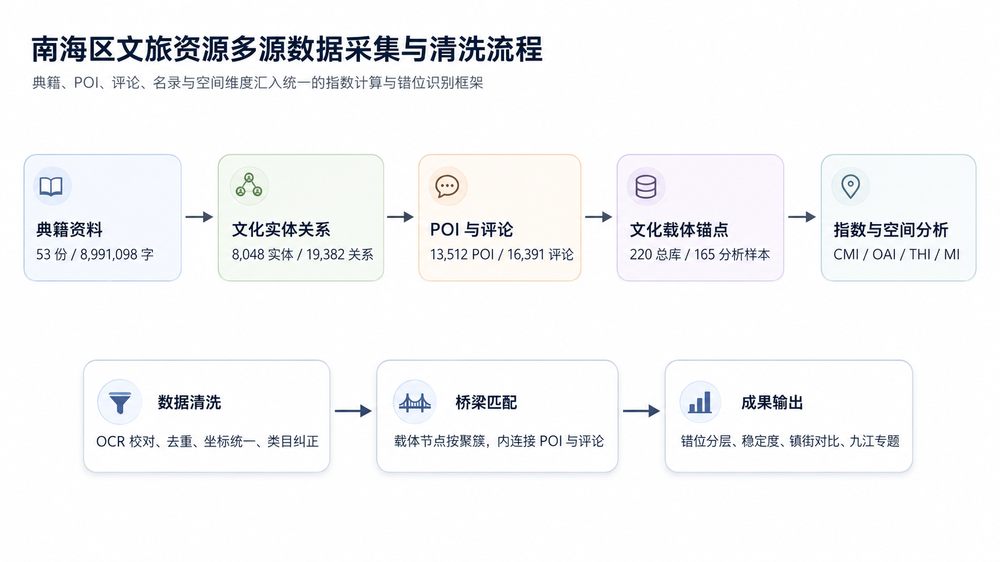

**图 3.1　南海区文旅资源的多源数据采集与清洗流程**

### 3.2.1 典籍文献数据

典籍文献数据以《南海县志》《佛山历史人物录》《南海文史资料》等地方文献为基础，涵盖县志类、文史资料类、人物录类与专题志类。原始材料多为扫描文本或电子文档，本研究先进行文字识别与格式整理，再进行人工校对和分篇标准化处理。最终整理得到 53 份标准化语料，合计 8,991,098 个字符，约 899 万字。

这一部分数据主要服务于文化记忆侧的构建。也就是说，典籍并不直接代表现实旅游供给，而是用于识别南海区历史人物、地名空间、非遗技艺、文物建筑、地方事件和文献记忆等文化要素，并在后续章节中转化为知识图谱和文化记忆指数。

### 3.2.2 旅游 POI 数据

旅游 POI 数据来自高德地图、百度地图和佛山市公开空间数据三类来源。采集完成后，本研究对三源数据进行去重、坐标统一、镇街归属判断和类目校正，形成 13,512 条 POI 主库。分类口径覆盖公园绿地、自然景观、文化场馆、人文古迹、宗教场所、非遗体验、休闲娱乐、体育设施、教育研学、特色街区及其他共 11 大类。

POI 数据主要用于表征现实旅游供给。在后续分析中，13,512 条 POI 一方面用于描述南海区旅游产品的总体结构，另一方面用于与 165 条文化载体样本进行 500 m 范围匹配。其中，166 条 POI 由关键词匹配带有非遗标签，1,074 条 POI 在 500 m 范围内挂接了物质文化载体锚点。

### 3.2.3 用户评论数据

用户评论数据来自携程、高德、去哪儿、马蜂窝四个平台。平台评论总量为 16,391 条，其中可展开文本评论为 15,474 条，聚合至 3,879 个景点名称。为了将评论数据纳入空间分析，本研究建立景点名称与南海区 POI 的匹配关系，匹配过程包括精确匹配、关键词匹配、同义词匹配、地理邻近匹配与模糊匹配五个步骤。

评论数据主要用于补充旅游热度和游客体验侧的信息。需要说明的是，部分平台记录只有评分或摘要，平台汇总表与文本匹配明细之间存在少量口径差异。因此，后续分析中对评论数量、文本内容和景点匹配关系分别使用对应口径，不将所有评论都简单视为可展开文本。

| 平台 | 覆盖景点名数 | 占比 |
|:----|------:|----:|
| 携程 | 2,967 | 76.5 % |
| 高德 | 865 | 22.3 % |
| 去哪儿 | 171 | 4.4 % |
| 马蜂窝 | 13 | 0.3 % |
| **合计（去重后聚合）** | **3,879** | — |

**表 3.2　评论平台来源与覆盖构成**

*说明：单个景点可能被多个平台覆盖，故表中比例和不为 100%。*

### 3.2.4 非遗名录数据

非遗名录数据以南海区 90 项非物质文化遗产名录为依据。按等级看，全量非遗包括国家级 2 项、省级 14 项、市级 26 项、区级 48 项。需要说明的是，藤编项目在大沥、里水均有传承和分布线索，本文按唯一项目计为 1 项；涉及镇街统计时，则按覆盖关系说明其跨镇属性。由于非遗项目的空间属性差异较大，本文根据空间锚点的可得性，将 90 项非遗进一步分为两类：一类是有明确空间锚点的项目，如传习所、博物馆、村落、训练基地等，共 36 项，纳入核心桥梁；另一类主要依靠传承人登记地或行政归属地识别，共 54 项，作为文化记忆侧的软性加权项，不直接与 POI 做一一对应。

### 3.2.5 政府普查文化载体（核心桥梁清单）

为建立文化侧与旅游侧之间的对照桥梁，本文进一步整理政府普查文化载体和官方认定资源，形成文化锚点总库。总库共 219 条记录，包含 129 条物质 / 空间类文化载体与 90 项非遗。进入指数计算的分析样本为 165 条：129 条物质 / 空间类载体加上 36 条具备明确空间锚点的非遗项目。其余 54 项非遗作为软性注入因素进入讨论，不直接参与 500 m POI 匹配。

| 类型 | 数量 | 占比 |
|:----|------:|----:|
| 不可移动文物保护单位 / 空间锚点 | 80 | 48.5 % |
| 非遗空间锚点 | 36 | 21.8 % |
| 文化景观 | 19 | 11.5 % |
| 圩市街区 | 18 | 10.9 % |
| 历史文化名村 / 传统村落 | 12 | 7.3 % |
| **合计** | **165** | **100 %** |

**表 3.3　165 条文化载体样本按类型分布**

其中 159 条落在南海区有效经纬度范围内，少数载体存在坐标缺失或异常值，需要在后续制图中保留待校正状态。这一清单来自两条数据线：一是文旅系统下的文物保护单位、非遗项目与相关文化空间，二是住建系统下的风景名胜区、历史文化名镇名村和传统村落。两类数据在载体层面汇流为统一清单，用于后续指数计算、500 m 范围匹配和空间错位识别。

在补充资料整理阶段，本研究另行建立官方资源扩展底表，将 484 处不可移动文物、11 家博物馆和 98 条历史文化资源名录统一空间化，并与既有文化锚点总库做名称去重。该扩展表不替代 165 条指数计算样本，而是用于检查官方资源在镇街和 500 m 网格中的覆盖缺口，并服务于“典籍—官方—旅游”的诊断拆分。

## 3.3 数据覆盖与局限性

需要提前说明的数据口径问题有三：

**其一，POI 体系覆盖范围**。本研究 POI 以景区、公园、场馆、古迹等为主要采集目标，未系统采集普通餐饮门店。这会导致以美食为标志的文旅片区在供给侧呈现系统性低估，最典型的是九江镇。

**其二，评论平台覆盖范围**。本轮评论数据不含大众点评、美团等餐饮评价平台，也不含百度地图的评论，同样会对九江等餐饮主导片区造成系统性低估。

**其三，文化载体坐标精度**。核心载体分析样本中仍有少数记录存在坐标缺失或异常值，主要影响精细制图与 500 m 范围匹配。本文在指数统计中保留这些载体的文化与认证信息，在空间分析中则以有效坐标记录为准。

上述限制将在第 6 章九江专题讨论与第 7 章研究不足中再次说明，并作为后续研究的补充方向。总体来看，第三章所建立的数据基础能够支撑本文的主要分析，但它仍然是一套面向文旅空间研究的工作口径，而不是南海区全部文化与旅游资源的穷尽性清单。

---

# 第 4 章　文化知识体系构建：知识图谱的实现

## 4.1 实体与关系的定义

### 4.1.1 实体分类

知识图谱的核心任务，是把典籍文本中分散出现的人物、空间、技艺、文献和历史事件转化为可计算、可追溯的结构化对象。为此，本文首先建立实体分类体系。研究分类层面，实体分为非遗文化、物质遗产、传承主体、文化空间、文献记忆、历史时序六大类，并进一步细分为 28 小类。管理口径层面，对于能够对应官方非遗或文物分类的实体，再补充民间文学、传统音乐、传统舞蹈、传统戏剧、曲艺、传统体育游艺与杂技、传统美术、传统技艺等官方标签。

这种双重分类的目的，是避免典籍抽取结果只停留在文本层面。一方面，它能够保留地方文献中的文化叙事和历史记忆；另一方面，也能够与后续的非遗名录、文物保护单位和旅游 POI 发生连接。附录 A 给出实体分类体系简表。

### 4.1.2 关系分类

在实体之外，本文进一步定义关系类型，用于表达不同文化要素之间的联系。关系分为九大语义组：

1. **空间关联**：位于、坐落于、发源于；
2. **人物关联**：出生于、任职于、交游；
3. **传承延续**：师承、传承、传授；
4. **营建创造**：始建于、创建、重建；
5. **时序归属**：形成于、兴盛于、活动于；
6. **社群组织**：属于、包含、隶属；
7. **文献记载**：记载、收录、著述；
8. **从属分类**：归入、属于、代表；
9. **文化表征**：体现、象征、承载。

关系抽取坚持开放原则，不强行把所有关系压缩为少数固定谓词，而是保留原始关系短语、关系组和证据句。这样处理可以减少语义损失，也便于后续人工复核。例如，“位于”“坐落于”均归入空间关联，“记载”“收录”均归入文献记载，但原始关系短语仍然保留，以便追溯具体语义。

## 4.2 基于大语言模型的抽取过程

### 4.2.1 模型与分块

实体—关系抽取使用阿里云通义千问 qwen3.5-plus 作为主要模型。由于典籍文本篇幅较长，本文将 53 份标准化语料按约 800 字一段切分，再分批送入模型处理。每一段文本进入模型后，按照预设的实体分类和关系分类输出结构化结果，内容包括实体名称、实体类别、关系短语、关系组、置信度、来源文献和原文证据句。

分块处理的目的有两点：其一，可以避免长文本一次性输入造成上下文丢失；其二，可以让每条抽取结果保留相对明确的原文出处，便于后续校验。图 4.1 展示了从文本切块、模型抽取、质量控制到合并入库的基本流程。

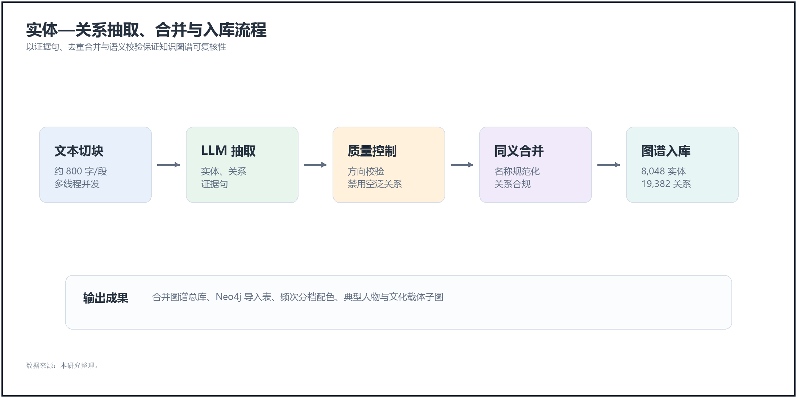

**图 4.1　实体—关系抽取的分块与并发处理流程**

### 4.2.2 质量控制

抽取过程设置了以下质量控制环节：

- **方向校验**：避免主宾颠倒，如“师从 A”与“A 传于”在方向上不能混用；
- **禁用空泛关系**：“相关”“有关”等无信息关系被丢弃；
- **双重标签**：每个实体保留研究分类标签，能够对接官方口径的实体再补充官方分类标签；
- **证据句保留**：每一条关系附带原文摘录，便于人工复核；
- **置信度标记**：对抽取结果保留置信度信息，用于后续筛选和人工核查。

这些控制并不能完全消除大语言模型抽取的不确定性，但能够把错误控制在可检查的范围内。对于本文而言，知识图谱不是直接替代人工判断，而是为文化记忆量化提供一套可追溯的中间层。

### 4.2.3 合并与入库

原始抽取共得到实体记录 61,218 条、关系记录 42,024 条。由于同一人物、地点或技艺可能在不同文献中以不同写法出现，本文进一步进行实体对齐、名称规范化、同义合并和规则筛选。合并后，知识图谱总库包含 8,048 个实体、19,382 条关系。其中，能够通过地名、建筑实体或文化锚点直接落到空间坐标的实体为 575 个。

在可视化阶段，本文按 28 个小类的语料提及频次对节点进行分级，并映射为六组高对比度颜色。这样处理并不是为了追求复杂的视觉效果，而是为了在全局网络中快速识别高频实体类型与关键节点，为后续的典型子图分析提供基础。

## 4.3 图数据库的构建与可视化

### 4.3.1 构建过程

图数据库构建以合并后的实体和关系总库为基础。本文将节点与关系导入 Neo4j，并完成索引建立、节点着色和层次划分。需要说明的是，本文的实体数量、关系数量和后续指数计算均以合并后的知识图谱总库为准；Neo4j 主要用于检查网络结构、观察局部关系和导出典型子图。

通过这一过程，典籍中的空间、人物、技艺与文献记忆被组织为一个可查询、可追溯的关系网络。它并不直接给出文旅融合结论，而是为后续“文化记忆指数”的计算提供基础材料。

### 4.3.2 典型子图展示

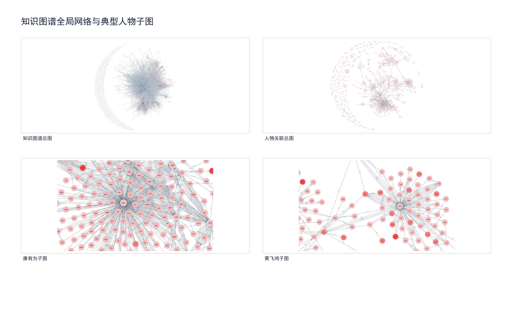

**图 4.2　知识图谱全局网络与典型人物子图**

图 4.2 汇总展示了知识图谱全局网络与人物关联子图。由于全局网络节点较多，图中全局图主要用于观察整体结构和高频节点的位置，不承担逐一识读节点标签的功能；人物子图则用于说明典籍记忆如何通过人物、地点、技艺与事件向外扩展。

本文进一步选取若干典型子图用于解释文化记忆来源。康有为子图以康有为为中心，向外辐射梁启超、万木草堂、南海九江、丹灶苏村等关联；黄飞鸿子图串联洪拳、十字拳、狮舞—醒狮、广东十虎、佛山精武体育会等实体；桑园围子图涉及西樵山、九江、保安围、围堤、龙舟等地名与活动；西樵山子图则连接云泉仙馆、三湖书院、白云洞、理学、书院文化等实体。

这些子图为第 5 章的耦合分析提供了语义基础。当研究某个物质文化载体时，可以从知识图谱侧反向追溯与其关联的人物、事件、典籍与技艺实体，并将相关提及频次和关系证据转化为文化记忆指数的原始量值。需要注意的是，知识图谱结果仍然依赖文字识别质量、模型抽取稳定性和后续规则筛选，因此本文在使用图谱指标时保留证据句和来源文献，便于人工核查。

---

# 第 5 章　旅游产品体系刻画与耦合分析

## 5.1 旅游产品体系的结构

### 5.1.1 类型构成

基于清洗后的 13,512 条 POI，南海区旅游产品可归入 11 个类型（表 5.1）。其中，“公园绿地”和“自然景观”合计占 70.8%，说明当前旅游供给首先表现为绿色开放空间和自然游憩空间的集中；而“非遗体验”“文化场馆”和“特色街区”合计仅占 3.8%，反映出可直接转化为文化体验的产品供给仍然偏少。“其他”类占 14.9%，主要作为分类口径中的补充项，本文在后续解释中不对其作过度文化化判断。

| 类型 | 数量 | 占比 |
|:----|------:|----:|
| 公园绿地 | 5,441 | 40.3 % |
| 自然景观 | 4,123 | 30.5 % |
| 其他 | 2,018 | 14.9 % |
| 宗教场所 | 481 | 3.6 % |
| 人文古迹 | 420 | 3.1 % |
| 文化场馆 | 318 | 2.4 % |
| 休闲娱乐 | 242 | 1.8 % |
| 体育设施 | 175 | 1.3 % |
| 非遗体验 | 137 | 1.0 % |
| 教育研学 | 104 | 0.8 % |
| 特色街区 | 53 | 0.4 % |
| **合计** | **13,512** | **100 %** |

**表 5.1　13,512 条 POI 按 11 大类的构成**

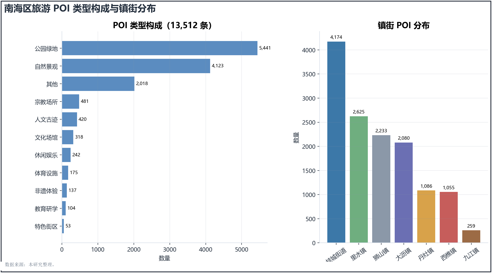

**图 5.1　13,512 条 POI 的类型构成与镇街分布**

### 5.1.2 镇街分布

从镇街分布看，桂城街道（4,174）、里水镇（2,625）、狮山镇（2,233）和大沥镇（2,080）合计占全区 POI 的 82.2%，形成以东部和东北部城镇化片区为主的供给集中格局。相较之下，丹灶镇（1,086）、西樵镇（1,055）和九江镇（259）的 POI 数量相对偏低，其中九江镇仅占全区 1.92%，为七个镇街中最低。这一结果说明，南海区旅游产品数量分布与文化资源分布并不完全重合，也为第 6 章关于“东旅西文”空间错位的讨论提供了基础。

## 5.2 文化—旅游耦合桥梁：物质遗产为主、非遗为补充

### 5.2.1 桥梁的操作化设计

本研究将文化记忆与旅游供给区分为两条分析线：知识图谱主要用于表征文化记忆侧的语义联系，POI 与评论数据主要用于表征旅游供给侧的现实热度。二者之间不能直接等同，因此需要设置一组可被复核的“耦合桥梁”。在本研究中，桥梁指具有明确名称、较稳定空间指向，并能够同时进入文化叙事和旅游空间分析的文化载体。

桥梁的核心样本由 165 条文化载体组成，其类型构成见表 3.3。选择这些载体作为主样本，主要基于三点考虑：其一，多数载体具有较明确的空间位置，能够与 POI 及后续空间网格进行对应；其二，文物保护单位、历史文化名村、风景名胜区以及非遗项目等载体具有不同层级的官方认定，可作为官方认证指数的依据；其三，载体名称相对稳定，有利于与知识图谱中的实体进行名称匹配。

### 5.2.2 动态补充：依托空间的非遗项目

90 项非遗项目中，有 36 项能够对应到较明确的空间载体，例如九江双蒸博物馆、西樵醒狮训练基地和松塘龙舟训练场等。这一部分非遗项目并入 165 条核心载体，参与空间匹配与旅游热度计算。其余 54 项主要依托传承人登记地或镇街信息，空间边界较弱，因此不直接与单个 POI 作一一对应，而是作为文化记忆侧的补充信息进入指数计算和后续规划判断。

### 5.2.3 两条数据线的汇流

从管理条线看，文旅系统中的文物保护单位、遗址公园和非遗项目，住建系统中的风景名胜区、历史文化名镇名村与传统村落，虽然来源不同，但都可以在地方文化记忆与旅游空间之间形成连接。本文将其统一整理为文化载体样本，并不是把所有资源简单并列，而是将其放入同一套“文化记忆—官方认证—旅游热度”的比较框架中。这样可以减少单一依赖非遗或单一依赖景点名单带来的偏差，也更符合南海区文化资源多条线并存的实际情况。

### 5.2.4 匹配规则

匹配过程分为两个方向。第一，向文化记忆侧匹配，即以载体名称为入口，在知识图谱中检索相关实体，并结合名称简化和实体类型约束提高准确性。例如，“九江双蒸酒酿制技艺”可通过“双蒸酒”等核心词汇与图谱实体建立联系。第二，向旅游供给侧匹配，即以载体位置为中心，结合名称匹配与 500 m 缓冲范围内的 POI 进行对应。前者用于衡量文化记忆的可见度，后者用于衡量旅游供给的覆盖度。对于无法明确空间定位的项目，本文只将其纳入文化记忆侧，不将其强行转化为 POI 周边热度。

## 5.3 文化—旅游量化指数与错位指数

本节构造文化记忆指数、官方认证指数、旅游热度指数和错位指数四个指标，用于替代单纯的定性判断。需要说明的是，这些指标并不试图完整评价某一文化载体的价值，而是服务于本研究的核心问题：识别文化资源与旅游产品之间是否存在转化不足或文化支撑不足的现象。

### 5.3.1 文化记忆指数（CMI）

对每一条载体 c，按名称匹配得到知识图谱实体集合 Ec，并汇总相关实体的提及频次。设实体 e 的提及频次为 Me，则载体 c 的原始文化记忆量定义为：

$$
m_c = \sum_{e \in E_c} M_e
$$

为降低少数高频实体对结果的拉动，本文先取对数，再按 Min-Max 方法归一到 [0, 100]：

$$
CMI_c = 100 \times \frac{\log(1 + m_c) - \min(\log(1 + m))}{\max(\log(1 + m)) - \min(\log(1 + m))}
$$

对仅能定位到传承人登记地或镇街层面的非遗项目，本文按其图谱提及频次的 0.5 倍折算为文化记忆侧补充值。这一处理保留了非遗项目的文本记忆信息，但避免将其误认为具有明确边界的旅游空间节点。

### 5.3.2 官方认证指数（OAI）

官方认证指数用于表达文化载体在保护名录、非遗名录或历史文化资源名录中的制度性位置。赋分规则如下：

- 全国重点文物保护单位、国家级非遗、中国历史文化名镇赋值为 100；
- 省级文物保护单位、省级非遗、广东省历史文化名村和省级传统村落赋值为 75；
- 市级文物保护单位和市级非遗赋值为 50；
- 区级认定资源赋值为 25；
- 未进入上述官方认定体系的资源赋值为 0。

同一载体若同时具备多重认证，取其最高等级作为 OAI 值。这样处理可以避免重复计分，同时保留最高保护层级对资源识别的影响。

### 5.3.3 旅游热度指数（THI）

旅游热度指数由 500 m 缓冲范围内的 POI 数量 Nc、相关 POI 平均评分 Rc 和评论总量 Vc 共同构成。三项指标分别归一到 [0, 100]，其中评论总量先取 log(1 + Vc)，以削弱极端高评论点的影响。综合指数按 40%、20%、40% 加权：

$$
THI_c = 0.4 \times \widehat{N_c} + 0.2 \times \widehat{R_c} + 0.4 \times \widehat{\log(1 + V_c)}
$$

（5-2）

500 m 缓冲半径与后续网格分析保持一致，大致对应步行可达范围内的周边旅游供给。评分和评论量来自平台数据，能够反映游客侧的可见热度，但也会受到平台覆盖、评论习惯和 POI 拆分方式的影响，因此本文只将其作为相对比较指标。

### 5.3.4 错位指数（MI）

错位指数用于比较旅游热度与文化家底之间的相对差异，其形式为：

$$
MI_c = THI_c - \alpha \cdot CMI_c - \beta \cdot OAI_c, \quad \alpha = \beta = 0.5
$$

（5-3）

MI 为正，表示旅游热度相对强于文化记忆和官方认证，可能出现“旅游强、文化解释弱”的空心景点倾向；MI 为负，表示文化记忆和官方认证较强，但尚未转化为相应旅游热度，可视为沉睡潜力倾向。本文采用 alpha = beta = 0.5 的等权设定，是为了在文化记忆和官方认证之间保持基本平衡。第 6.3 节将进一步通过相关分析讨论该设定的解释边界。

### 5.3.5 结果分层

根据 CMI、THI 与 MI 的组合关系，本文将 165 条文化载体划分为四类（表 5.2）。其中，核心耦合区强调文化记忆与旅游热度的双高重合；沉睡潜力区强调文化资源较强但旅游转化不足；空心景点区强调旅游热度较高但文化支撑相对不足；其余样本归入一般耦合区，用作过渡性类型。

| 类别 | 判别规则 | 载体数 | 占比 |
|:----|:----|------:|----:|
| 核心耦合区 | MI 的绝对值 <= 10，且 CMI >= 50、THI >= 50 | 10 | 6.1 % |
| 一般耦合区 | 未达到核心耦合、沉睡潜力或空心景点判别阈值 | 55 | 33.3 % |
| 沉睡潜力区 | MI < -10，且 CMI > THI | 47 | 28.5 % |
| 空心景点区 | MI > 10，且 THI > CMI | 53 | 32.1 % |
| **合计** | — | **165** | **100 %** |

**表 5.2　错位分层四象限的载体计数**

165 条载体的 MI 最小值为 −80.17，第一四分位数为 −19.37，中位数为 0.84，第三四分位数为 18.91，最大值为 61.00。整体上，沉睡潜力区和空心景点区合计占 60.6%，说明南海区文化资源与旅游产品之间存在较明显的结构性不均衡。

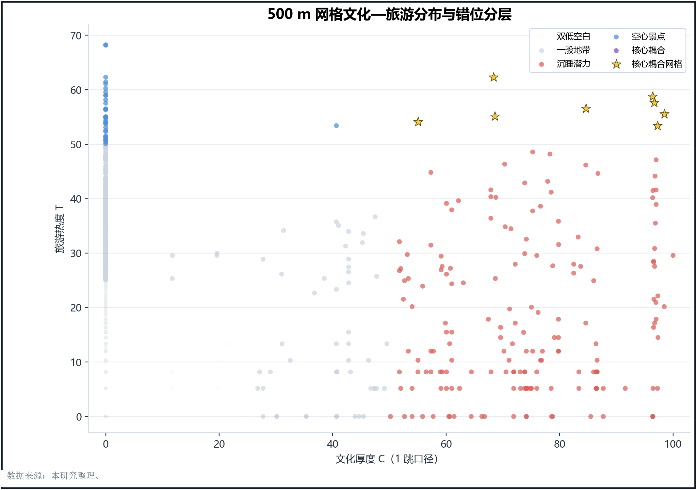

**图 5.2　500 m 网格文化—旅游分布与错位分层**

图 5.2 中，横轴表示文化厚度，纵轴表示旅游热度。黄色星标标出 1 跳知识图谱口径下的核心耦合网格，用于区分一般高值点与已经形成“文化厚度—旅游热度”双高重叠的重点节点。该图的价值不在于替代空间分布图，而在于把不同错位类型放到同一坐标系中进行比较。

### 5.3.6 典型案例

为了避免仅停留在类型数量层面，本文进一步列出三类典型样本。表 5.3 至表 5.5 均按 MI 的方向和绝对值选取代表案例，用于说明不同类型的形成机制。

| 载体名称 | 所属片区 | CMI | OAI | THI | MI |
|:----|:----|----:|----:|----:|----:|
| 西樵镇松塘村 | 西樵 | 71.81 | 100.0 | 5.73 | −80.17 |
| 九江镇烟桥烟南村 | 九江 | 77.57 | 100.0 | 9.09 | −79.70 |
| 丹灶镇仙岗社区 | 丹灶 | 57.28 | 100.0 | 5.73 | −72.91 |
| 西樵山仙姑亭 | 西樵 | 91.60 | 50.0 | 0.00 | −70.80 |
| 九江镇烟桥村 | 九江 | 77.76 | 75.0 | 9.09 | −67.29 |

**表 5.3　沉睡潜力区典型载体**

沉睡潜力区的共同特征是文化记忆和官方认证较强，但缓冲范围内 POI、评分和评论量较低。以松塘村、烟桥村等历史村落为例，其文化价值并不低，问题主要在于旅游产品组织、到达条件和可体验内容尚未充分转化。

| 载体名称 | 所属片区 | CMI | OAI | THI | MI |
|:----|:----|----:|----:|----:|----:|
| 大伸市 | 未标注 | 0.00 | 0.0 | 61.00 | 61.00 |
| 光分亭 | 未标注 | 0.00 | 50.0 | 77.74 | 52.74 |
| 西联村神诞 | 丹灶 | 0.00 | 25.0 | 57.88 | 45.38 |
| 唢呐制作技艺 | 桂城 | 0.00 | 50.0 | 68.81 | 43.81 |
| 南海农谚 | 西樵 | 69.39 | 25.0 | 90.88 | 43.68 |

**表 5.4　空心景点区典型载体**

空心景点区并不等同于“没有文化价值”。它更准确地说明：旅游热度已经高于当前可识别的文化记忆和官方认证支撑。部分样本的 CMI 接近 0，说明其文化叙事尚未在典籍文本或知识图谱中形成较强可见度；也有样本如南海农谚，文化记忆并不低，但周边旅游热度更高，仍然表现出文化解释与旅游消费之间的不均衡。

| 载体名称 | 所属片区 | CMI | OAI | THI | MI |
|:----|:----|----:|----:|----:|----:|
| 丹灶葛洪炼丹传说 | 丹灶 | 54.02 | 50.0 | 52.84 | 0.83 |
| 西樵山传说 | 西樵 | 91.60 | 25.0 | 60.05 | 1.75 |
| 云泉仙馆 | 西樵 | 82.09 | 75.0 | 75.26 | −3.29 |
| 西樵山百步云梯 | 西樵 | 91.63 | 50.0 | 65.56 | −5.25 |
| 龙舟说唱（南海） | 丹灶 | 74.65 | 50.0 | 56.90 | −5.42 |

**表 5.5　核心耦合区典型载体**

核心耦合区的样本数量较少，仅占 6.1%。这些载体的文化记忆、官方认证和旅游热度较为接近，说明其已初步形成可识别、可到达、可体验的文旅转化关系。它们可以作为后续产品组织和线路设计的基础节点，但不宜简单复制其模式，因为不同镇街的交通条件、周边业态和文化载体类型存在差异。

### 5.3.7 层级层面观察

从层级和类型看，历史文化名村与传统村落在样本中全部落入沉睡潜力区，说明村落类文化资源在文化识别上较强，但旅游转化仍明显不足。非遗项目内部也呈现差异：省级非遗的 MI 中位值为 −34.82，市级非遗为 −6.78，区级非遗为 9.72，说明等级越高并不必然对应更高旅游热度。不可移动文物中，市级文物在空心景点区数量较多，提示部分文物周边已有较强旅游活动，但文化阐释和保护展示之间仍需进一步衔接。由此可见，官方等级应作为筛选和解释变量，而不宜被直接等同于旅游开发优先级。

## 5.4 景区等级与游客体验的关联分析

### 5.4.1 数据说明

为进一步观察旅游品牌等级与游客体验之间的关系，本文选取南海区 16 处已知 A 级旅游景区作为校准样本，其中包括 1 处 5A、5 处 4A、8 处 3A 和 2 处 2A。由于 A 级景区标签并不直接包含在 POI 原始分类中，本文依据公开资料整理景区名单，并将其与平台 POI 进行名称和位置匹配。需要注意的是，部分景区在平台中存在拆分点位、评分缺失或评论量偏低等情况，因此本节结果只用于提示性分析，不作强因果判断。

### 5.4.2 相关性观察

| 指标对 | Pearson | Spearman |
|:----|----:|----:|
| level_score ~ rating | 0.319 | 0.522 |
| level_score ~ review_count | 0.546 | 0.554 |
| level_score ~ positive_rate | 0.206 | 0.230 |
| rating ~ review_count | 0.270 | 0.392 |

**表 5.6　A 级景区相关系数（n = 16）**

表 5.6 显示，景区等级分数与评论量存在中等正相关（Pearson r = 0.546，Spearman r = 0.554），与平台评分的 Spearman 相关系数为 0.522；与正向率的相关性则较弱。由于样本量仅为 16，且部分平台评价存在缺失，上述结果只能说明评级等级与评论关注度、游客评分之间存在可观察联系，不能直接证明评级会导致游客满意度提高。

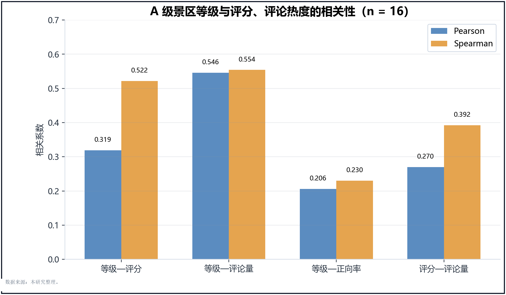

**图 5.3　景区评级与评论热度、评分的关系**

### 5.4.3 对规划的启示

从规划角度看，A 级景区申报可以作为文旅转化的一种制度工具，尤其适用于文化记忆较强、空间载体明确、但品牌识别不足的资源。但评级本身并不能替代内容建设。对于沉睡潜力区，应优先完善交通接驳、游线组织和解说系统；对于空心景点区，则需要补足地方文化叙事和体验内容。也就是说，评级可以提高资源的可见度，但游客体验的改善仍取决于具体产品是否能够把文化内容转化为可感知、可停留、可传播的游览过程。

---

# 第 6 章　空间格局与潜力释放条件分析

## 6.1 空间分析方法

### 6.1.1 核密度估计

在前文载体级指数计算的基础上，本章进一步从空间尺度观察文化资源与旅游供给的错位。首先，本文采用核密度估计（Kernel Density Estimation, KDE）分别计算 POI 与文化载体的空间热点。带宽统一设为 3.0 km，用于反映区县尺度下较为稳定的片区性集聚，而不是识别单个地块层面的微小差异。

### 6.1.2 DBSCAN 聚类

其次，本文以 POI 为样本点，使用 DBSCAN 聚类方法识别旅游供给的集聚边界。参数设置为 $\varepsilon = 0.5$ km，最小样本数为 30。该参数能够较清楚地区分桂城、大沥、狮山等城镇化片区中的 POI 高密度集聚，同时避免将零散点位误判为连续旅游片区。

### 6.1.3 空间错位图叠加

最后，本文将文化厚度与旅游热度在 500 m 网格尺度上进行归一化比较，并据此划分为四类空间状态：文化强而旅游弱的“沉睡潜力”、文化弱而旅游强的“空心景点”、文化与旅游均较强的“核心耦合”，以及两侧均较弱的“双低空白”。这一处理的目的，不是简单画出热点，而是进一步说明文化资源和旅游产品在空间上是否真正发生对应。

## 6.2 空间格局结果

### 6.2.1 POI 与文化载体的热点错位

从核密度结果看，POI 高值区主要出现在桂城—大沥—狮山构成的东北部都市圈，并与广佛交界带、佛山国家高新区等现代城市功能空间较为重合。相较之下，文化载体高值区主要集中在西樵—九江—丹灶一带，与南海区传统农业、水利社会、古村落和非遗活动的历史地理基础更为接近。也就是说，旅游供给和文化资源并非简单同向集聚，而是呈现出较稳定的方向性分离。

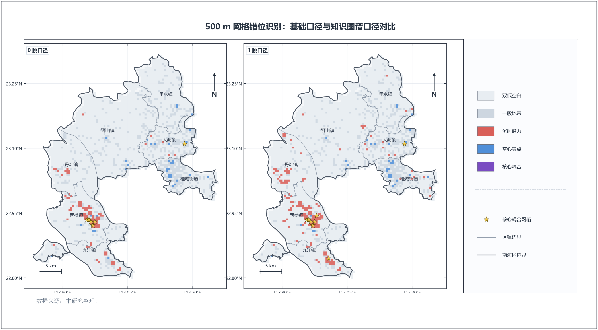

**图 6.1　500 m 网格错位识别：基础口径与知识图谱口径对比**

图 6.1 比较了 0 跳与 1 跳知识图谱口径下的网格错位结果。0 跳口径识别出 6 个核心耦合网格，1 跳口径识别出 8 个核心耦合网格。图中黄色星标用于标出核心耦合网格，其空间位置主要集中在西樵及少量东北部节点，说明文化厚度与旅游热度真正重叠的区域仍然有限。

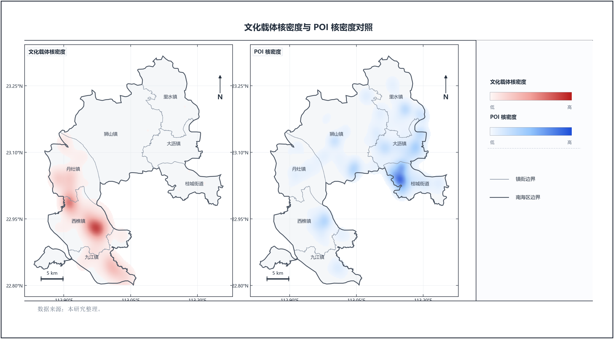

**图 6.2　文化载体核密度图与 POI 核密度图对照**

图 6.2 进一步说明，文化载体核密度在西南片区形成连续高值，而 POI 核密度在桂城、大沥、狮山等片区更为突出。这个结果与第 5 章中 POI 镇街分布的统计结果相互印证，也为后文提出差异化提升策略提供空间依据。

### 6.2.2 镇街对比

| 镇街 | POI 总量 | 核心文化载体数 | CMI 均值 | OAI 均值 | THI 均值 | MI 均值 |
|:----|------:|------:|----:|----:|----:|----:|
| 桂城街道 | 4,174 | 3 | 17.03 | 50.00 | 54.63 | 21.12 |
| 里水镇 | 2,625 | 1 | 53.21 | 25.00 | 0.00 | −39.11 |
| 狮山镇 | 2,233 | 3 | 22.62 | 41.67 | 15.41 | −16.74 |
| 大沥镇 | 2,080 | 0 | — | — | — | — |
| 丹灶镇 | 1,086 | 11 | 39.84 | 29.55 | 37.96 | 3.27 |
| 西樵镇 | 1,055 | 26 | 52.71 | 27.88 | 34.95 | −5.35 |
| 九江镇 | 259 | 15 | 36.71 | 35.00 | 35.85 | 0.00 |

**表 6.1　镇街尺度的 POI、核心文化载体与指数均值对比**

表 6.1 显示，桂城街道的 POI 总量最高，MI 均值为正，说明其旅游供给较强，但文化记忆和载体支撑相对不足。西樵镇的核心文化载体数最多，CMI 均值也较高，但 THI 均值低于桂城和大沥，表现出“文化较厚、旅游转化不足”的特征。九江镇的核心文化载体数不少，但 POI 数量仅 259 条，说明其旅游供给规模偏小。大沥镇在核心指数样本中缺少可用于计算 CMI、OAI 和 THI 的明确文化载体，因此本表不对其指数均值作判断，后文通过官方资源扩展层再作补充诊断。

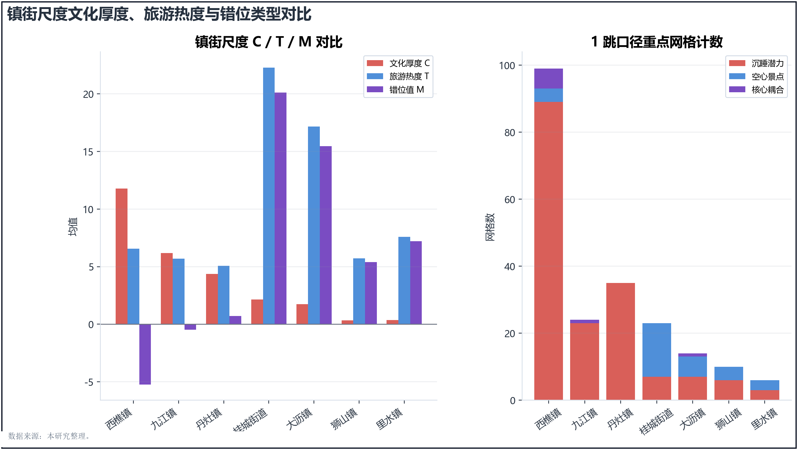

**图 6.3　镇街尺度文化厚度、旅游热度与错位类型对比**

### 6.2.3 知识图谱 0 跳 / 1 跳口径复核

为避免空间判断仅停留在 POI 与载体坐标叠加层面，本文进一步在 500 m 网格尺度上引入知识图谱路径复核。0 跳口径表示文化载体直接命中的图谱实体集合；1 跳口径则在此基础上纳入与这些实体直接相邻的人物、事件、地点、文献和技艺等信息。旅游热度仍由 POI 密度、平均评分与评论量构成，来源独立于文化侧；错位值仍表示旅游热度相对于文化厚度的差异。

| 口径 | 双低空白 | 一般地带 | 沉睡潜力 | 空心景点 | 核心耦合 |
|:----|------:|------:|------:|------:|------:|
| 0 跳 | 3,870 | 651 | 99 | 36 | 6 |
| 1 跳 | 3,841 | 609 | 170 | 34 | 8 |

**表 6.2　500 m 网格 0 跳 / 1 跳错位分类对比**

南海区有效网格共 4,662 个。表 6.2 显示，知识图谱从 0 跳扩展到 1 跳后，沉睡潜力网格由 99 个增加到 170 个，核心耦合网格由 6 个增加到 8 个，空心景点网格则略降为 34 个。这个变化说明，部分地点虽然没有直接命中文化载体名称，但可以通过图谱关系连接到相关人物、事件、技艺和文献，从而显化出原先被低估的文化厚度。

| 镇街 | 网格数 | 文化载体数 | POI 数 | C（1 跳）均值 | T 均值 | M（1 跳）均值 | 1 跳沉睡 | 1 跳空心 | 1 跳核心 |
|:----|------:|------:|------:|----:|----:|----:|------:|------:|------:|
| 西樵镇 | 715 | 95 | 1,310 | 11.78 | 6.55 | −5.23 | 89 | 4 | 6 |
| 九江镇 | 386 | 34 | 531 | 6.17 | 5.70 | −0.47 | 23 | 0 | 1 |
| 丹灶镇 | 580 | 32 | 715 | 4.36 | 5.07 | 0.71 | 35 | 0 | 0 |
| 桂城街道 | 333 | 29 | 3,859 | 2.15 | 22.28 | 20.13 | 7 | 16 | 0 |
| 大沥镇 | 397 | 14 | 2,593 | 1.73 | 17.18 | 15.45 | 7 | 6 | 1 |
| 狮山镇 | 1,403 | 3 | 2,567 | 0.32 | 5.72 | 5.40 | 6 | 4 | 0 |
| 里水镇 | 619 | 4 | 1,449 | 0.37 | 7.59 | 7.22 | 3 | 3 | 0 |

**表 6.3　镇街尺度 1 跳知识图谱口径摘要**

表 6.3 进一步说明，西樵—九江—丹灶仍是 1 跳沉睡潜力的主体，三镇合计 147 个沉睡潜力网格，占全区 1 跳沉睡潜力网格的 86.5%。其中，西樵镇同时拥有 6 个核心耦合网格，说明其既是文化潜力集中区，也是少数已经形成文化与旅游高值重叠的片区。桂城街道虽然旅游热度最高，但 1 跳口径下仍有 16 个空心景点网格，说明其问题不是“没有旅游”，而是现代旅游供给与本土文化叙事之间仍缺少稳定连接。

## 6.3 潜力释放条件的相关性分析

### 6.3.1 载体级相关矩阵（n = 165）

| 指标 | CMI | OAI | THI | MI | POI（500 m） | 评分（500 m） | 评论（500 m） |
|:----|----:|----:|----:|----:|----:|----:|----:|
| CMI | 1.000 | 0.173 | 0.086 | **−0.495** | −0.031 | 0.048 | 0.114 |
| OAI | 0.173 | 1.000 | 0.165 | **−0.440** | 0.069 | 0.145 | 0.041 |
| THI | 0.086 | 0.165 | 1.000 | **0.682** | 0.693 | 0.859 | 0.506 |
| MI | −0.495 | −0.440 | 0.682 | 1.000 | 0.538 | 0.597 | 0.332 |
| POI（500 m） | −0.031 | 0.069 | 0.693 | 0.538 | 1.000 | 0.423 | 0.360 |
| 评分（500 m） | 0.048 | 0.145 | 0.859 | 0.597 | 0.423 | 1.000 | 0.266 |
| 评论（500 m） | 0.114 | 0.041 | 0.506 | 0.332 | 0.360 | 0.266 | 1.000 |

**表 6.4　载体级指标相关矩阵（Pearson, n = 165）**

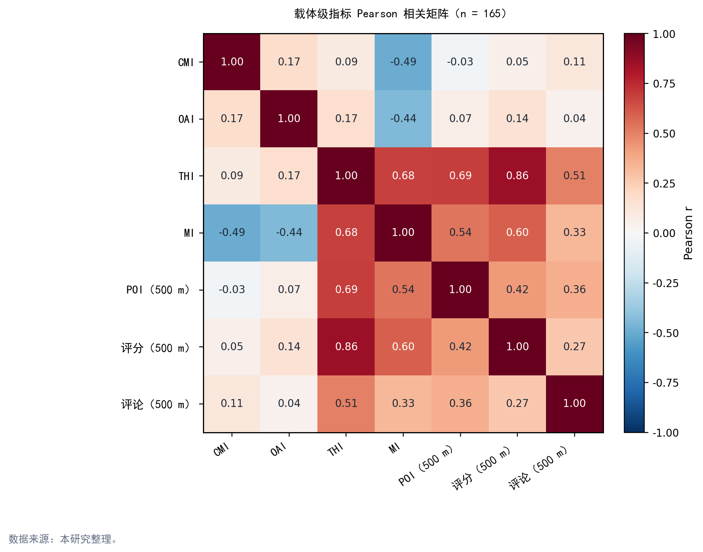

**图 6.4　载体级相关矩阵热图（7 变量 × 7 变量）**

载体级相关矩阵给出三点观察。第一，CMI 与 MI 呈中等负相关（r = −0.495），OAI 与 MI 也呈中等负相关（r = −0.440）。这说明在本研究样本中，文化记忆越深、官方认证越高的载体，越容易表现为旅游热度相对不足。第二，500 m 范围内 POI 数量与 CMI、OAI 的相关系数分别为 −0.031 和 0.069，几乎不相关，说明 POI 的空间密度并没有自然跟随文化家底分布。第三，THI 与评分、POI 数量和评论量的相关性较高，这与 THI 本身由这几类变量构成有关。因此，该结果可以说明指标构成基本符合预期，但不能被理解为外部独立验证。

### 6.3.2 镇街级相关矩阵（n = 7）

| 指标 | POI 总量 | 物质载体数 | 非遗覆盖项次 | CMI 均值 | OAI 均值 | THI 均值 | MI 均值 |
|:----|----:|----:|----:|----:|----:|----:|----:|
| POI 总量 | 1.000 | **−0.475** | 0.372 | 0.040 | 0.693 | 0.314 | 0.037 |
| 物质载体数 | −0.475 | 1.000 | 0.065 | 0.584 | 0.029 | 0.426 | 0.157 |
| 非遗覆盖项次 | 0.372 | 0.065 | 1.000 | −0.323 | 0.289 | 0.660 | **0.782** |
| CMI 均值 | 0.040 | 0.584 | −0.323 | 1.000 | 0.227 | 0.113 | −0.493 |
| OAI 均值 | 0.693 | 0.029 | 0.289 | 0.227 | 1.000 | 0.702 | 0.242 |
| THI 均值 | 0.314 | 0.426 | 0.660 | 0.113 | 0.702 | 1.000 | 0.758 |
| MI 均值 | 0.037 | 0.157 | 0.782 | −0.493 | 0.242 | 0.758 | 1.000 |

**表 6.5　镇街级指标相关矩阵（Pearson, n = 7）**

镇街级样本只有 7 个，相关系数只能作为提示性结果，不作统计显著性解释。结合空间格局来看，物质载体数与 POI 总量呈中等负相关（r = −0.475），再次说明西南部文化资源和东北部旅游供给之间存在方向性分离。本表中的非遗覆盖项次按镇街归属统计，跨镇项目会在相关镇街中同时体现，因此不同于第 3 章的 90 项唯一项目口径。非遗覆盖项次与 THI 均值、MI 均值呈正相关，可能与西樵、九江等非遗较多镇街同时具有部分景区或文化场馆有关。OAI 均值与 POI 总量、THI 均值呈正相关，提示官方认定和旅游可见度之间存在一定联系，但这一结果不能直接解释为“评级导致热度提升”。

### 6.3.3 政策可干预条件与基础约束条件

根据上述相关分析，本文将潜力释放条件分为政策可干预条件与基础约束条件两类（表 6.6）。前者可以通过规划、运营和公共投入进行改善，后者更适合作为筛选依据和差异化设计背景。

| 条件类型 | 典型变量或环节 | 数据指向 | 建议着力方向 |
|:----|:----|:----|:----|
| 政策可干预 | 评级申报与名录完善 | OAI 与 POI 总量、THI 均值存在正相关 | 优先支持条件成熟的沉睡潜力载体完善申报和服务标准 |
| 政策可干预 | 解说系统与体验内容 | 评分与 THI 关系较强 | 在空心景点区补足地方文化叙事和互动体验 |
| 政策可干预 | 游线组织与交通接驳 | POI 数量与 THI 关系较强 | 强化西南片区节点串联和公共交通可达性 |
| 政策可干预 | 活态传习与活动运营 | 评论量与 THI 关系较强 | 在历史村落、非遗空间和文化场馆中组织可停留活动 |
| 基础约束 | 文化记忆深度 | CMI 相对稳定，难以短期改变 | 作为识别潜力资源的依据 |
| 基础约束 | 城镇化和市场规模 | 东北部 POI 供给更集中 | 作为解释旅游热度差异的背景变量 |
| 基础约束 | 山水本底与历史空间格局 | 西南部文化资源更集中 | 作为片区化设计和游线组织依据 |

**表 6.6　政策可干预条件与基础约束条件的划分**

这一划分说明，沉睡潜力区的重点不是简单增加景点数量，而是补足可到达、可停留、可解释的条件；空心景点区的重点也不是降低旅游热度，而是把已有客流和场地转化为更有地方文化内容的体验。

## 6.4 九江片区的专题讨论

### 6.4.1 反差概况

九江镇拥有 13 项非遗，并分布有中国历史文化名镇、历史文化名村和多处文物保护单位，是南海区文化资源较为集中的镇街之一。但从旅游供给侧看，九江镇 POI 仅 259 条，占全区 1.92%，在七个镇街中最低；在当前平台评论口径下，其相关评论量也明显偏低。因此，九江呈现出较典型的“文化线索较密、旅游转化不足”的现象。

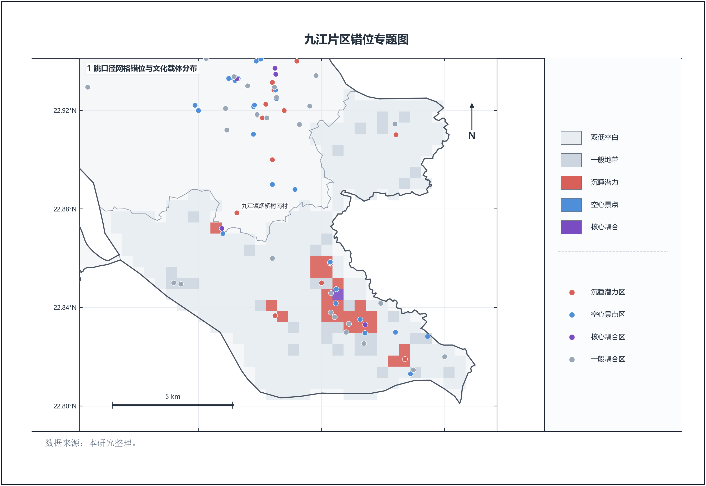

**图 6.5　九江片区错位专题图**

### 6.4.2 反差的两重来源

九江的反差不能只从单一角度解释。一方面，它确实存在旅游转化不足的问题。九江镇位于南海西南部，对外交通和景区化程度相对弱于桂城、大沥等片区，烟桥烟南村等载体的 MI 值明显为负，说明文化记忆和官方认证尚未充分转化为可见旅游热度。

另一方面，数据口径也会放大九江的低估。九江的文化符号中有相当一部分与美食、龙舟和日常节庆相关，如九江双蒸酒、煎堆、鱼花和龙舟宴等；而本文的 POI 体系没有纳入普通餐饮门店，评论数据也主要来自旅游平台，缺少大众点评、美团等餐饮评价数据。对于九江这类餐饮和民俗体验占比较高的片区，当前数据口径会低估其实际生活热度和消费热度。

### 6.4.3 对规划与研究的启示

因此，本文不将九江简单定义为“旅游洼地”，而是将其视为“实质性转化不足”和“数据口径低估”共同作用的复合案例。规划上，九江仍需要补足游线组织、展示空间、公共交通和游客服务；研究上，后续也应优先补充餐饮评论、夜间热力和节庆活动数据，以更准确地识别其真实旅游活力。

## 6.5 官方资源扩展与诊断拆分

### 6.5.1 官方资源空间化与去重

在 165 条核心指数样本之外，本文进一步建立官方资源扩展层，用于检验核心样本是否遗漏了重要文化资源。扩展层共包含 593 条记录，其中不可移动文物 484 处、博物馆 11 家，历史建筑名录、传统村落、历史文化名村、历史文化街区等历史文化资源共 98 条。空间化时，能够定位到具体点位的资源采用点位表达；缺少精确边界的历史文化名镇、名村和传统村落，则使用地名中心或镇街面作为规划分析代理。

| 统计项 | 数量 | 说明 |
|:----|------:|:----|
| 官方资源扩展记录 | 593 | 484 处不可移动文物、11 家博物馆、98 条历史文化资源 |
| 与既有文化锚点重名 | 96 | 不重复计入扩展锚点 |
| 仅匹配到 POI 的资源 | 73 | 可作为后续人工复核对象 |
| 纯新增候选资源 | 424 | 与既有锚点和 POI 均未重名 |
| 扩展库新增锚点 | 490 | 未与既有锚点重名的官方资源合并后计入 |
| 扩展锚点库总量 | 709 | 原 219 条锚点与 490 条新增锚点合计 |
| 镇街代表点兜底 | 148 | 空间精度较低，需在后续规划中复核 |

**表 6.7　官方资源扩展与去重统计**

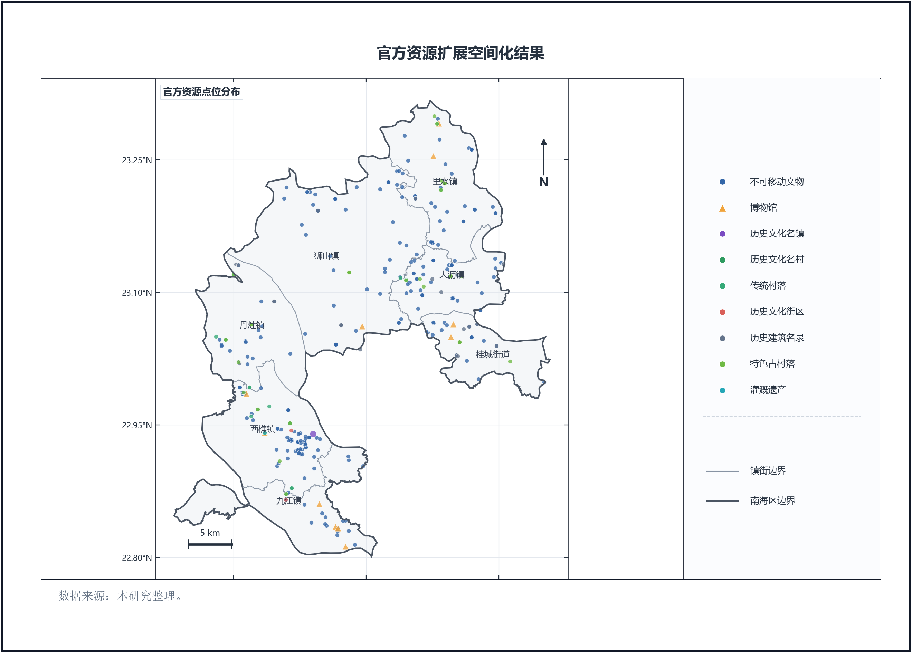

**图 6.6　官方资源扩展空间化图**

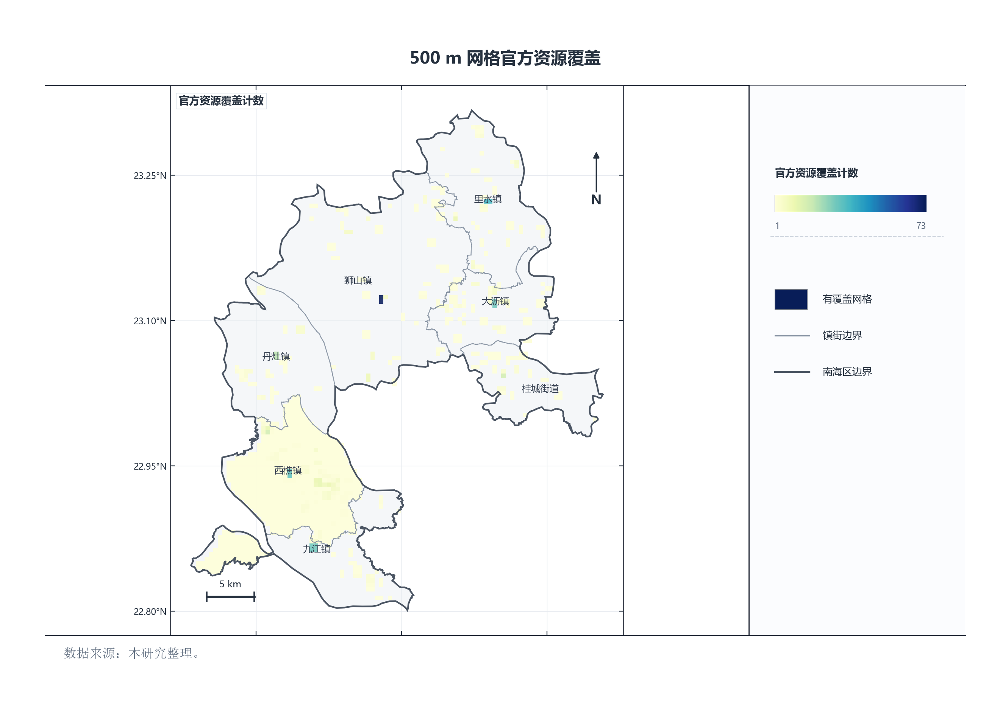

**图 6.7　500 m 网格官方资源覆盖图**

图 6.6 和图 6.7 显示，官方资源扩展后，狮山、西樵、大沥、里水等镇街的不可移动文物和历史建筑数量得到补充。其中，西樵镇因中国历史文化名镇采用镇街面表达，官方覆盖网格数较多。这个结果适合作为官方认定范围的上限判断，但不能直接等同于每个网格都具备同等强度的旅游开发条件。

### 6.5.2 典籍—官方—旅游三维诊断

为了进一步解释错位来源，本文按镇街拆分典籍/图谱文化厚度、官方资源覆盖和旅游热度三类指标。该拆分不改变前文错位指数的核心模型，而是用于判断某一片区的短板主要来自文本叙事不足、官方资源覆盖不足，还是旅游转化不足。

| 镇街 | C 典籍/图谱均值 | O 官方资源均值 | T 旅游热度均值 | 修正错位均值 | 官方覆盖网格 |
|:----|------:|------:|------:|------:|------:|
| 桂城街道 | 2.15 | 2.60 | 22.28 | 19.95 | 40 |
| 大沥镇 | 1.73 | 4.01 | 17.18 | 14.54 | 67 |
| 里水镇 | 0.37 | 2.09 | 7.59 | 6.53 | 54 |
| 狮山镇 | 0.32 | 1.36 | 5.72 | 4.98 | 86 |
| 丹灶镇 | 4.36 | 1.84 | 5.07 | 1.71 | 44 |
| 西樵镇 | 11.78 | 18.29 | 6.55 | −7.83 | 715 |
| 九江镇 | 6.17 | 2.46 | 5.70 | 1.01 | 35 |

**表 6.8　镇街典籍—官方—旅游诊断拆分摘要**

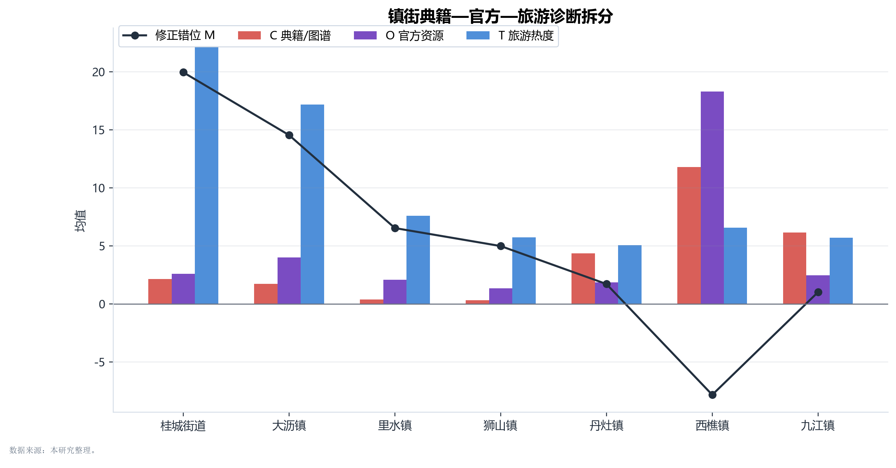

**图 6.8　典籍—官方—旅游诊断拆分图**

表 6.8 和图 6.8 强化了前文判断：桂城、大沥的旅游热度明显高于典籍/图谱和官方资源厚度，属于“旅游先行、文化注入不足”的片区；西樵的典籍/图谱和官方资源均较高，但旅游热度相对偏低，仍是“文化厚、转化不足”的重点片区；九江的典籍/图谱均值高于官方资源覆盖值，说明其问题不仅在旅游转化，也在于部分地方文化线索尚未充分进入可空间化、可体验的资源体系。由此，核心模型用于识别错位强度，三维拆分用于解释错位来源，两者可以互相补充。

---

# 第 7 章　结论与建议

## 7.1 主要研究结论

本研究以佛山市南海区为对象，构建了“文化—旅游”双谱系对照框架，并以文化记忆指数、官方认证指数、旅游热度指数和文化—旅游错位指数为主要工具，分析了 165 条文化载体和 500 m 网格尺度下的空间格局。主要结论如下。

**结论一：南海区文化资源与旅游产品之间存在较明显的错位。**

在载体尺度上，165 条文化载体中，沉睡潜力区 47 条，占 28.5%；空心景点区 53 条，占 32.1%；核心耦合区仅 10 条，占 6.1%。在网格尺度上，1 跳知识图谱口径识别出 170 个沉睡潜力网格、34 个空心景点网格和 8 个核心耦合网格。这说明南海区文旅融合的关键问题并不是文化资源或旅游产品单方面不足，而是二者在空间载体和体验转化上尚未形成充分对应。

**结论二：“东旅西文”的空间结构较为稳定。**

POI 高值区主要集中在桂城、大沥、狮山等东北部城镇化片区，而文化载体与文化厚度高值更多出现在西樵、九江、丹灶等西南部片区。镇街级相关结果也显示，物质载体数与 POI 总量呈中等负相关。由此可以看到，南海区并不是简单的“哪里文化多、哪里旅游就强”，而是存在较清楚的空间方向性错位。

**结论三：物质文化载体适合作为主桥梁，非遗更适合作为动态补充。**

物质文化载体通常具备较明确的空间位置和官方认定信息，便于与知识图谱、POI 和网格分析相连接，因此适合作为本研究的主操作化桥梁。非遗项目中有一部分能够依托场馆、训练基地、村落或节庆空间参与空间匹配，但也有相当一部分只能定位到传承人或镇街层面。对于后者，更适合在规划建议中以活动植入、展示转译和线路组织的方式发挥作用，而不宜强行视为固定景点。

**结论四：相关分析支持错位判断，但不能作因果解释。**

载体级相关矩阵显示，CMI 与 MI 呈中等负相关（r = −0.495），OAI 与 MI 呈中等负相关（r = −0.440），而 500 m 范围内 POI 数量与 CMI、OAI 的相关性接近于零。这一结果从量化层面支持了“文化高、旅游低”和“旅游高、文化支撑不足”并存的判断。与此同时，镇街级样本只有 7 个，A 级景区样本只有 16 个，相关系数只适合提示关系，不应被解释为严格因果。

**结论五：西南廊道是潜力释放重点，东北都市圈更需要文化内容补强。**

1 跳知识图谱口径下，西樵、九江、丹灶三镇合计 147 个沉睡潜力网格，占全区 1 跳沉睡潜力网格的 86.5%，说明西南片区具备集中释放文化潜力的空间基础。相对而言，桂城、大沥等东北部片区旅游热度较高，但文化厚度相对不足，更需要通过非遗活动、文化市集、解说系统和主题事件补足地方文化内容。

**结论六：九江镇需要同时考虑真实转化不足与数据口径低估。**

九江镇文化线索较密，但 POI 数量和平台评论热度偏低。这一结果一方面反映其交通联系、景区化程度和旅游产品组织仍有不足；另一方面也受到本文未纳入餐饮门店和餐饮评价平台数据的影响。对于九江这样的美食和民俗体验型片区，后续研究和规划判断需要把“数据低估”和“实质短板”区分开来。

## 7.2 文旅融合潜力释放与提升建议

从风景园林和城乡规划的角度看，文旅融合潜力释放不能只停留在资源宣传层面，而需要落实到载体、游线、场地和运营机制上。本文据此提出以下建议。

### 7.2.1 载体层面：按错位类型分级干预

对于沉睡潜力区，应优先改善可达性、展示空间和解说系统。松塘村、烟桥古村、仙岗村等历史村落已经具备一定文化识别基础，下一步更需要完善游线入口、公共服务、导览标识和停留节点，使文化记忆能够转化为游客可以感知的游览过程。

对于空心景点区，应重点补足本土文化叙事。桂城、大沥等现代公园、商业休闲空间和城市开放空间已经具备较强人流基础，但地方文化内容不足。可以通过非遗快闪、周末文化市集、主题展陈和临时性公共艺术等方式，把文化内容嵌入日常休闲空间。

对于核心耦合区，应将其作为线路组织和品牌塑造的基础节点，而不是孤立展示。西樵山、云泉仙馆、丹灶葛洪炼丹传说等已具备一定文化和旅游双重基础，适合进一步承担片区线路的起点、转换点或主题节点。

### 7.2.2 片区层面：形成西南廊道与东北都市圈的差异化策略

西南廊道应以“文化资源转化”为重点。西樵—松塘—烟桥—九江—丹灶一线可围绕理学文化、古村落、龙舟、美食非遗和水乡景观组织复合游线，在烟桥、松塘、仙岗等 MI 负值较大的节点周边优先布设小型展示空间、活态传习点和研学停留点。

九江镇应突出“美食非遗 + 龙舟研学 + 古村游线”的组合。九江双蒸博物馆、吴家大院、烟桥古村、龙舟训练和水乡餐饮空间可以共同构成片区骨架。对于当前模型识别出的沉睡潜力网格，可优先补充文化故事卡、步行导览、餐饮体验挂接和节庆活动节点，同时在后续数据工作中补充餐饮评价和夜间活力数据。

东北都市圈应以“文化内容注入”为重点。桂城、大沥、狮山和里水已经拥有较强 POI 密度和日常消费基础，适合把非遗展示、地方历史叙事和公共活动嵌入公园、湖区、商圈和社区开放空间，使现代旅游供给不只停留在环境消费和休闲消费层面。

### 7.2.3 管理层面：将错位指数纳入动态监测

建议将 CMI、OAI、THI 和 MI 作为南海区文旅融合潜力的动态监测指标，定期更新载体级和网格级结果。载体级结果可用于形成项目清单和优先级排序，网格级结果可用于识别连续片区、游线节点和公共服务短板。监测时应保持指标口径相对稳定，同时补充餐饮评论、客流热力和活动数据，以便观察干预措施是否真正改变了文化资源与旅游供给之间的对应关系。

## 7.3 研究不足与展望

### 7.3.1 数据层面

本研究仍存在若干数据限制。第一，典籍 OCR 和实体抽取仍可能存在识别误差，部分古地名、人物名和官职名需要后续人工校核。第二，评论数据是单一时点截面，且未纳入大众点评、美团、百度地图等平台，对九江等餐饮和生活体验主导的片区可能存在低估。第三，54 项主要依托传承人登记地的非遗项目空间边界较弱，尚不能像物质载体一样完整参与主桥梁匹配。第四，镇街边界和网格划分仍存在少量空间误差，部分网格被标记为未标注，但从整体结果看并未改变主要空间格局。

### 7.3.2 方法层面

方法上，错位指数中的 CMI 与 OAI 采用等权设置，THI 中 POI 数量、评分和评论量也采用预设权重。这种处理有利于保持本科论文阶段的透明性和可复核性，但仍然具有简化性。后续可通过专家打分、游客问卷或多元回归等方法进一步校准权重。同时，镇街级相关分析样本量仅为 7，A 级景区样本量仅为 16，相关结果只能作为提示，不宜作强因果解释。

### 7.3.3 展望

后续研究可以从三个方向继续推进。第一，补充餐饮评价、夜间热度、节庆活动和客流数据，以更准确地识别九江等片区的真实旅游活力。第二，深化知识图谱的路径分析，从“主题—地点—关联实体”的角度筛选文旅 IP 和潜力项目组合。第三，将本研究框架拓展到更细的街区和地块尺度，并在佛山其他区县或珠三角同尺度区县中进行比较，以检验方法的适用性和可迁移性。

---

## 参考文献

[1] 吴丽, 梁皓, 虞华君, 等. 中国文化和旅游融合发展空间分异及驱动因素[J]. 经济地理, 2021, 41(2): 214-221. DOI:10.15957/j.cnki.jjdl.2021.02.023.

[2] 章坤, 朱海, 谢朝武. 中国文化和旅游产业高质量融合发展的适配关系与政策启示[J]. 自然资源学报, 2025, 40(4): 1084-1106. DOI:10.31497/zrzyxb.20250413.

[3] 郭艳萍, 刘敏. 基于 POI 数据的山西省旅游景区分类及空间分布特征[J]. 地理科学, 2021, 41(7): 1246-1255. DOI:10.13249/j.cnki.sgs.2021.07.015.

[4] 田志馥, 于亚娟, 黄辰宇. 基于 POI 数据挖掘的内蒙古县域旅游要素空间分布特征及影响因素[J]. 干旱区地理, 2025, 48(7): 1255-1266. DOI:10.12118/j.issn.1000-6060.2024.601.

[5] 王邵军, 李晓冰. 黄河流域高质量发展目标下非物质文化遗产与旅游业耦合协调发展研究：以山东省沿黄九市为例[J]. 东岳论丛, 2023, 44(11): 132-147. DOI:10.15981/j.cnki.dongyueluncong.2023.11.015.

[6] 王公为. 文旅融合背景下非物质文化遗产与旅游业的耦合发展研究：以内蒙古为例[J/OL]. (2020-03)[2026-04-14]. http://ycfytsk.jx.chaoxing.com/info/2611.

[7] FENSEL A, AKBAR Z, KARLE E, et al. Knowledge Graphs for Online Marketing and Sales of Touristic Services[J]. Information, 2020, 11(5): 253. DOI:10.3390/info11050253.

[8] SONG S, YANG C, XU L, et al. TravelRAG: A Tourist Attraction Retrieval Framework Based on Multi-Layer Knowledge Graph[J]. ISPRS International Journal of Geo-Information, 2024, 13(11): 414. DOI:10.3390/ijgi13110414.

[9] CADEDDU A, CHESSA A, DE LEO V, et al. Optimizing Tourism Accommodation Offers by Integrating Language Models and Knowledge Graph Technologies[J]. Information, 2024, 15(7): 398. DOI:10.3390/info15070398.

[10] XIAO D, WANG N, YU J, et al. A Practice of Tourism Knowledge Graph Construction based on Heterogeneous Information[C]//Proceedings of the 19th China National Conference on Computational Linguistics (CCL 2020). Haikou: Chinese Information Processing Society of China, 2020: 939-949. https://aclanthology.org/2020.ccl-1.87.pdf.

[11] 翁钢民, 李凌雁. 中国旅游与文化产业融合发展的耦合协调度及空间相关分析[J/OL]. 经济地理, 2016[2026-05-09]. https://www.jjdl.com.cn/CN/abstract/article/1000-8462/32296.

[12] 王兆峰, 谢佳亮. 中国文化和旅游融合发展效率时空动态演化及其驱动机制[J/OL]. 旅游学刊, 2024[2026-05-09]. http://www.qikan.com.cn/article/lyxk20240111.html.

[13] 何静, 冯学钢. 中国省际文旅融合空间关联网络结构演化及形成机制[J/OL]. 地理研究, 2025[2026-05-09]. https://www.dlyj.ac.cn/CN/10.11821/dlyj020241213.

[14] 朱媛媛, 等. 长江中游城市群“文—旅”产业融合发展的空间效应及驱动机制研究[J/OL]. 地理科学进展, 2022[2026-05-09]. https://www.progressingeography.com/CN/10.18306/dlkxjz.2022.05.004.

[15] 周海霞, 等. 长征沿线文化—旅游系统适配驱动文旅融合发展的时空演变与机理[J/OL]. 地理科学进展, 2025[2026-05-09]. https://www.progressingeography.com/CN/10.18306/dlkxjz.2025.09.009.

[16] 陆文镔, 等. 数智时代文旅融合的耦合机理研究：基于数字产业与旅游产业协同集聚视角[J/OL]. 自然资源学报, 2025[2026-05-09]. https://www.jnr.ac.cn/CN/10.31497/zrzyxb.20251207.

[17] 许春晓, 等. 文旅深度融合与资源创新利用：热现象与冷思考[J/OL]. 自然资源学报, 2025[2026-05-09]. https://www.jnr.ac.cn/CN/top_access.

[18] 张宏磊, 等. 中国现代旅游业体系建设中的旅游资源创新开发：理论认知与应用创新[J/OL]. 自然资源学报, 2025[2026-05-09]. https://www.jnr.ac.cn/CN/top_access.

---

## 附录 A　实体分类体系简表

本研究在实体抽取阶段采用“双重标签”体系：第一层为面向地方文化记忆识别的 AI 分级标签，分为 6 个一级体系、28 个二级类型；第二层为便于同官方资源名录衔接的官方分类标签。前者用于保证典籍文本中的人物、空间、技艺、文献和历史时序能够被完整识别，后者用于和非遗名录、文物保护单位、历史文化名镇名村、公共文化资源等管理口径发生对应。

| 一级体系 | 二级类型 | 主要识别对象示例 | 可对应的官方分类口径 |
|:----|:----|:----|:----|
| A 非遗文化体系 | A1 表演艺术类非遗 | 醒狮、粤剧、龙舟说唱、十番音乐 | 非物质文化遗产：传统舞蹈、传统戏剧、曲艺、传统音乐等 |
| A 非遗文化体系 | A2 传统技艺类非遗 | 灰塑、藤编、木雕、砖雕、陶塑 | 非物质文化遗产：传统技艺、传统美术 |
| A 非遗文化体系 | A3 民俗节庆类非遗 | 生菜会、龙舟竞渡、庙会、花灯会 | 非物质文化遗产：民俗 |
| A 非遗文化体系 | A4 信俗礼仪类非遗 | 民间信仰、龙母诞、地方礼俗 | 非物质文化遗产：民俗 |
| A 非遗文化体系 | A5 传统体育游艺类非遗 | 洪拳、咏春、龙舟竞技、狮艺 | 非物质文化遗产：传统体育、游艺与杂技 |
| A 非遗文化体系 | A6 饮食酿造类非遗及文化物产 | 九江双蒸酒、西樵大饼 | 非物质文化遗产：传统技艺 |
| B 物质文化遗产体系 | B1 古建筑类 | 书院、祠堂、庙宇、楼阁、塔桥 | 不可移动文物：古建筑 |
| B 物质文化遗产体系 | B2 宗教建筑类 | 宝峰寺、南海观音寺、云泉仙馆 | 不可移动文物：古建筑 |
| B 物质文化遗产体系 | B3 纪念性建筑与名人故居类 | 康有为故居、黄飞鸿纪念馆 | 不可移动文物：近现代重要史迹及代表性建筑 |
| B 物质文化遗产体系 | B4 古遗址与生产遗存类 | 古窑址、聚落遗存 | 不可移动文物：古文化遗址 |
| B 物质文化遗产体系 | B5 石刻碑记类 | 碑刻、摩崖石刻、匾额题记 | 不可移动文物：石窟寺及石刻；可移动文物 |
| B 物质文化遗产体系 | B6 古村落与聚落遗产类 | 松塘村、烟桥村、仙岗村 | 历史文化名城名镇名村：历史文化名村、传统村落、历史建筑等 |
| C 传承主体体系 | C1 历史文化人物 | 康有为、湛若水、黄飞鸿 | 无直接官方管理分类，作为文化记忆实体保留 |
| C 传承主体体系 | C2 非遗传承人及技艺人物 | 工匠、艺师、传承人 | 非遗传承主体：传承人 |
| C 传承主体体系 | C3 文物营建与守护人物 | 创建者、修建者、捐建者、守护者 | 无直接官方管理分类，作为营建与保护关系实体保留 |
| C 传承主体体系 | C4 宗族姓氏与地方社群 | 九江关氏、松塘区氏、地方社群 | 非遗传承主体：传承群体 |
| D 文化空间体系 | D1 山川水系空间 | 西樵山、西江、北江 | 自然保护地：自然公园等 |
| D 文化空间体系 | D2 镇街圩市空间 | 九江镇、丹灶镇、西樵镇、传统圩市 | 历史文化名城名镇名村：历史文化名镇等 |
| D 文化空间体系 | D3 历史街区与传统片区 | 历史街区、传统片区、老街区 | 历史文化名城名镇名村：历史文化街区、历史建筑 |
| D 文化空间体系 | D4 传承场所与活动场地 | 传习所、武馆、训练场、活动场地 | 公共文化资源：公共文化设施、公共文化活动 |
| E 文献记忆体系 | E1 地方志类 | 《南海县志》《大德南海志》等 | 可移动文物：古代文物、近代现代文物 |
| E 文献记忆体系 | E2 族谱家乘类 | 族谱、家乘 | 可移动文物：古代文物、近代现代文物 |
| E 文献记忆体系 | E3 碑记题咏类 | 碑记、诗文题刻 | 不可移动文物；可移动文物 |
| E 文献记忆体系 | E4 文集著述类 | 文集、学术著作、地方著述 | 可移动文物：古代文物、近代现代文物 |
| E 文献记忆体系 | E5 口述史与地方记忆材料 | 口述史、传说、地方记忆材料 | 非物质文化遗产：民间文学 |
| F 历史时序体系 | F1 朝代年号类 | 明代、清代、民国、光绪二十四年 | 无直接官方管理分类，作为时序标注实体保留 |
| F 历史时序体系 | F2 历史事件类 | 公车上书、戊戌变法、地方历史事件 | 无直接官方管理分类，作为事件实体保留 |
| F 历史时序体系 | F3 发展阶段类 | 形成期、兴盛期、转型期等阶段表述 | 无直接官方管理分类，作为阶段判断实体保留 |

*注：官方分类只在实体能够与管理名录发生合理对应时填写；C1、C3 和 F 类实体主要承担文化记忆、人物关系和历史时序标注功能，不强行映射到官方资源类型。*

---

## 附录 B　165 条文化载体样本分类与镇街分布统计

按类型：不可移动文物保护单位 / 空间锚点 80、非遗空间锚点 36、文化景观 19、圩市街区 18、历史文化名村/传统村落 12。

按镇街（含明确 town 字段）：西樵镇 26、九江镇 15、丹灶镇 11、狮山镇 3、桂城街道 3、里水镇 1，其余 80 条不可移动文物在原始锚点库中镇街字段缺失，另有 18 条为村级单位（松塘村、烟桥村、仙岗村、棋盘村等）。

完整清单作为载体级指数附表留存，正文仅摘录类型分布、镇街分布和典型样本。

官方资源扩展候选库总量为 709 条，其中保留原锚点 219 条，新增去重后的官方候选锚点 490 条。该库用于附加诊断和后续人工校核，不直接替代本论文 165 条指数计算样本。

---

## 附录 C　载体级指数与错位分类样例

（全量 165 条载体级指数结果作为补充附表留存；下表仅列出每一象限的代表样本。）

**C.1 沉睡潜力区（MI 最负 Top 10）**

| 名称 | 镇街 | CMI | OAI | THI | MI |
|:----|:----|----:|----:|----:|----:|
| 西樵镇松塘村 | 松塘村 | 71.81 | 100.0 | 5.73 | −80.17 |
| 九江镇烟桥烟南村 | 九江（无 town 字段） | 77.57 | 100.0 | 9.09 | −79.70 |
| 丹灶镇仙岗社区 | 仙岗社区 | 57.28 | 100.0 | 5.73 | −72.91 |
| 西樵山仙姑亭 | 西樵（无 town 字段） | 91.60 | 50.0 | 0.00 | −70.80 |
| 九江镇烟桥村 | 九江（无 town 字段） | 77.76 | 75.0 | 9.09 | −67.29 |
| 丹灶镇南沙棋盘村 | 棋盘村 | 58.47 | 75.0 | 0.00 | −66.74 |
| 丹灶镇棋盘村 | 棋盘村（无 town 字段） | 58.09 | 75.0 | 0.00 | −66.54 |
| 西樵镇百西村头村 | 村头村 | 69.39 | 75.0 | 9.09 | −63.11 |
| 丹灶镇仙岗村 | 仙岗村 | 57.69 | 75.0 | 5.73 | −60.61 |
| 南海竹编 | 西樵镇 | 69.39 | 50.0 | 0.00 | −59.70 |

**C.2 空心景点区（MI 最正 Top 10）**

| 名称 | 镇街 | CMI | OAI | THI | MI |
|:----|:----|----:|----:|----:|----:|
| 大伸市 | 未标注 | 0.00 | 0.0 | 61.00 | 61.00 |
| 光分亭 | 未标注 | 0.00 | 50.0 | 77.74 | 52.74 |
| 西联村神诞 | 丹灶镇 | 0.00 | 25.0 | 57.88 | 45.38 |
| 唢呐制作技艺 | 桂城街道 | 0.00 | 50.0 | 68.81 | 43.81 |
| 南海农谚 | 西樵镇 | 69.39 | 25.0 | 90.88 | 43.68 |
| 沙基圩 | 未标注 | 9.48 | 0.0 | 46.77 | 42.03 |
| 枕流亭 | 未标注 | 18.95 | 50.0 | 74.96 | 40.48 |
| 象林塔 | 未标注 | 0.00 | 75.0 | 77.53 | 40.03 |
| 湖山胜迹门楼 | 未标注 | 24.50 | 50.0 | 75.88 | 38.63 |
| 小云亭 | 未标注 | 26.61 | 50.0 | 75.26 | 36.95 |

**C.3 核心耦合区（|MI| 最小 Top 10）**

| 名称 | 镇街 | CMI | OAI | THI | MI |
|:----|:----|----:|----:|----:|----:|
| 风水百足桥 | 九江镇 | 0.00 | 0.0 | 0.00 | 0.00 |
| 四峰书院遗址 | 未标注 | 37.91 | 75.0 | 56.72 | 0.26 |
| 慈悲宫牌坊 | 未标注 | 30.04 | 75.0 | 53.36 | 0.83 |
| 丹灶葛洪炼丹传说 | 丹灶镇 | 54.02 | 50.0 | 52.84 | 0.83 |
| 火石迳遗址 | 未标注 | 0.00 | 75.0 | 38.34 | 0.84 |
| 沙水翰林步头 | 未标注 | 0.00 | 50.0 | 23.91 | −1.09 |
| 西樵山传说 | 西樵镇 | 91.60 | 25.0 | 60.05 | 1.75 |
| 绮亭陈公祠 | 未标注 | 35.07 | 75.0 | 56.78 | 1.75 |
| 西城市 | 未标注 | 32.79 | 0.0 | 18.17 | 1.78 |
| 九龙岩摩崖石刻 | 未标注 | 15.02 | 50.0 | 34.68 | 2.17 |

---

## 附录 D　潜力释放条件相关矩阵

**D.1 载体级 Pearson 矩阵（n = 165）** 见第 6.3.1 节表 6.4。

**D.2 镇街级 Pearson 矩阵（n = 7）** 见第 6.3.2 节表 6.5。

**D.3 载体级 Spearman 矩阵与镇街级 Spearman 矩阵** 见补充附表。

**D.4 关键双变量对比**

- 物质载体数 × POI 总量（镇街级）: Pearson r = −0.475；
- 非遗覆盖项次 × POI 总量（镇街级）: Pearson r = 0.372；
- CMI × MI（载体级）: Pearson r = −0.495（正文核心发现）；
- OAI × MI（载体级）: Pearson r = −0.440（正文核心发现）；
- OAI_mean × THI_mean（镇街级）: Pearson r = 0.702（评级对 THI 的带动）。

---

## 致　　谢

衷心感谢【待填写：指导教师】在选题、数据方法与论文写作全过程中的悉心指导。从开题到中期，再到本轮论文修订，老师一次次地将研究方向拉回“问题—潜力—对策”的主线，既避免了研究在空间生产理论等高阶议题上的过度拔高，也避免了研究停留在“当地人也知道”的浅层描述上。对桥梁选择、数据口径、错位指数、九江专题等具体环节的意见，几乎构成了本稿每一个章节的骨架。

感谢【待填写：院系或研究室】的各位老师和同学，在典籍 OCR、POI 采集与清洗、知识图谱建构以及论文汇报材料整理等阶段提供了许多技术支持与讨论意见。感谢【待填写：基金或项目名称】对本研究的数据与计算资源支持。

感谢家人一直以来的理解与支持，使得在本科毕设的这段时光里，能够相对专注地完成这项研究。

---

## 声　　明

本人郑重声明：所呈交的综合论文训练论文，是本人在导师指导下，独立进行研究工作所取得的成果。尽我所知，除文中已经注明引用的内容外，本论文的研究成果不包含任何他人享有著作权的内容。对本论文所涉及的研究工作做出贡献的其他个人和集体，均已在文中以明确方式标明。

签  名：____________

日  期：____________

---

## 在学期间参加课题的研究成果

本科阶段参与课题的研究成果如下。若学校要求填写正式科研成果，可在本节补入已发表论文、专利或项目证明材料。

参与项目：

- 本科毕业设计：基于大数据的佛山市南海区旅游景区文旅融合潜力研究（本人）
- 指导教师主持的与本研究相关的【待填写：课题组或项目名称】工作讨论（2025–2026）

产出：

- 开题与中期阶段汇报材料；
- 南海区文化载体与文旅耦合分析支撑数据；
- 载体级与镇街级指数计算、相关分析和空间诊断附表。

---

<!-- END OF THESIS DRAFT -->
